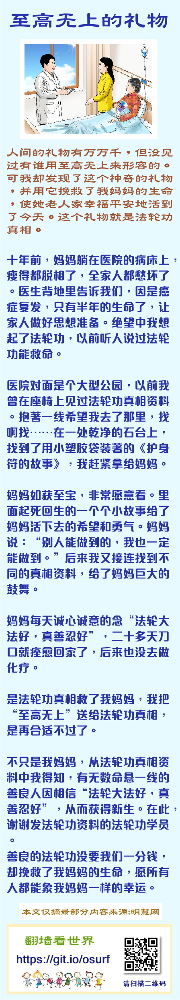
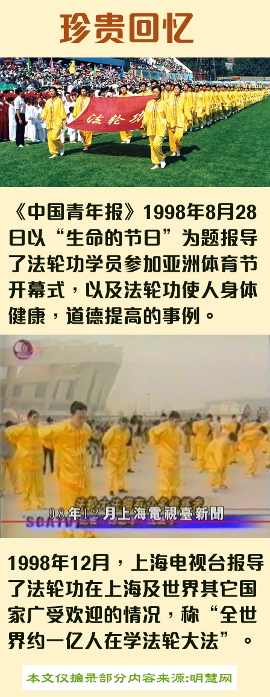
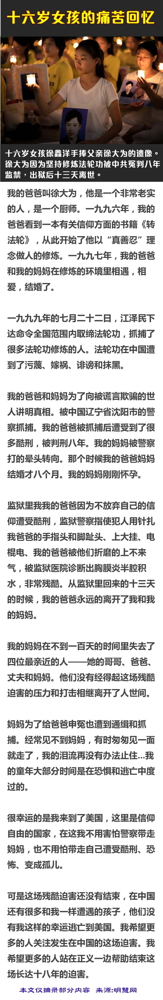

<TABLE border="1">

	
<TR>
	<TD></TD>
</TR>
<TR>
<TD><b>《共产主义的终极目的》序言</b>  

从第一个共产政权苏俄出现到今天，整整一百年过去了。在短短一个世纪的时间里，共产主义造成了上亿人的死亡。共产党从一开始就亮出了与神争夺人类的旗帜，喊出“从来就没有什么救世主”，要把“旧世界打个落花流水”。

共产主义来自何处？为什么宇宙中会冒出个共产党？共产主义的本质究竟是什么？结局又会怎样？对这些根本问题的答案，人们众说纷纭，现在是揭开谜底的时候了。

共产主义的本质是一个“邪灵”，它由“恨”及低层宇宙中的败物所构成，它仇恨且想毁灭人类。它并不以杀死人的肉身为满足，因为人肉身的死亡并非生命的真正死亡，元神（灵魂）还会轮回转生；但当一个人道德败坏到无可救药的地步，元神就会在无尽的痛苦中被彻底销毁，那才是最可怕的、生命真正的死亡。“共产邪灵”就是要使全人类都跌入这样万劫不复的深渊中。

1989年柏林墙倒塌，随后苏联及东欧共产主义阵营迅速解体，似乎全世界都认为“冷战”已经结束，共产主义意识形态溃不成军；连残余的共产国家自身都感到危如累卵。而实际情况是，原教旨的和改头换面的共产主义思想及因素依然肆虐全球。这里有仍公开承认是社会主义的国家，如中、朝、古、越，也有打着民主或共和旗号实行社会主义的诸多非洲和南美国家，更有被共产主义因素严重侵蚀而不自知的很多欧洲和北美民主国家。

无论是暴力扩张还是悄然渗透，“共产邪灵”彻底毁灭人的方法就是破坏创世主为最后救人所奠定的文化。人类失去了这种文化，就失去人之为人的标准，在神的眼中成为徒具人形的兽，不仅道德上失去约束、急剧堕落，更无法理解创世主下世救人所开示的天机，也就失去了大难来时被救的机会。这是生命最大的劫数——被永远销毁，也是“共产邪灵”的终极目的。

本着对神造生命的无比珍视，本着对人类的深切关怀，我们写下这本书——《共产主义的终极目的》，向世人系统分析和揭示“共产邪灵”通过破坏文化、败坏道德而毁灭人类的天大阴谋。

在不同的民族中，都流传着最后神会来拯救人的传说。人类已经走到了宇宙历史的转折关头，而共产邪教就是人类此时获得拯救的最大障碍。因此，我们迫切地以为，必须彻底揭示其终极的邪恶目的和手段，让人类能凭良知本性的判断抛弃共产邪教、和平解体共产组织并系统清理共产主义邪恶因素，迎接人类的新纪元。

本书分上下两部：上部《共产主义的终极目的（中国篇）》，下部《共产主义的终极目的（世界篇）》。大纪元将首先发表上部《中国篇》，下部将在不久以后推出，敬请关注。

谨以此书献给所有真心希望中华民族文明善良、繁荣富强的人！

谨以此书献给所有关心人类命运的人！

《九评》编辑部
2017年11月18日</TD>
</TR>
<TR>
<TD>下载全书：<a href="https://github.com/pkey5/dj/blob/master/download/JPN-S-V2-171216.pdf?raw=true">PDF简体版</a>，<a href="https://github.com/pkey5/dj/blob/master/download/JPN-T-V2-171216.pdf?raw=true">PDF正体版，<a href="https://github.com/pkey5/dj/blob/master/download/JPN-S-V2-171216D.docx?raw=true">WORD简体版</a>，<a href="https://github.com/pkey5/dj/blob/master/download/JPN-T-V2-171216D.docx?raw=true">WORD正体版</a>，<a href="https://github.com/pkey5/dj/blob/master/download/Tekan_V24_P32_GB.pdf?raw=true">PDF高清杂志简体版</a>，<a href="https://github.com/pkey5/dj/blob/master/download/Tekan_V24_P32_TC.pdf?raw=true">PDF高清杂志正体版</a>  </TD>
</TR>
<TR>
<TD>下载：<a href="https://github.com/pkey5/dj/blob/master/download/gbUltiGoalCm.epub?raw=true">epub简体版电子书</a>，<a href="https://github.com/pkey5/dj/blob/master/download/b5UltiGoalCm.epub?raw=true">epub正体版电子书，<a href="https://git.io/cm1">希望之声声音档(之一)，<a href="https://git.io/cm2">希望之声声音档(之二)</TD>
</TR>
<TR>
<TD>下载：<a href="https://github.com/pkey5/dj/blob/master/download/Reasily_EPUB_Reader_v17.12.01.1_apkpure.com.apk?raw=true">安卓手机epub电子书阅读器apk，安装后点击左上角那三条横杠的菜单</TD>	
</TR>

	
</TABLE>

	
	
	

	

   

