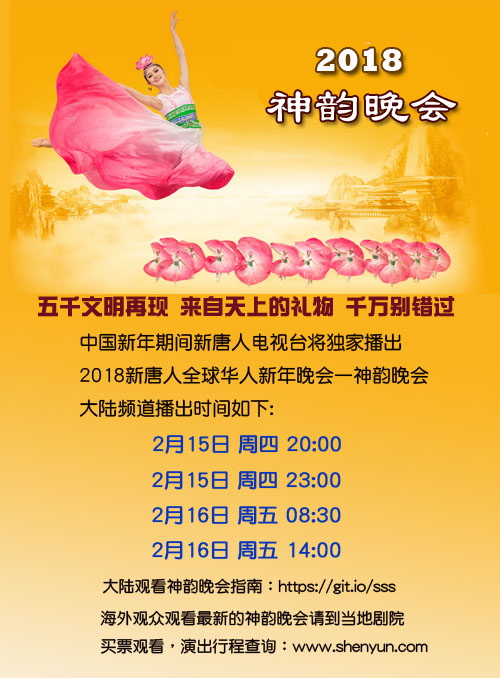
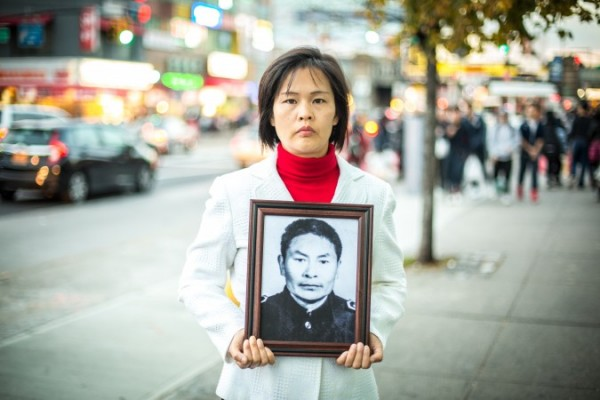
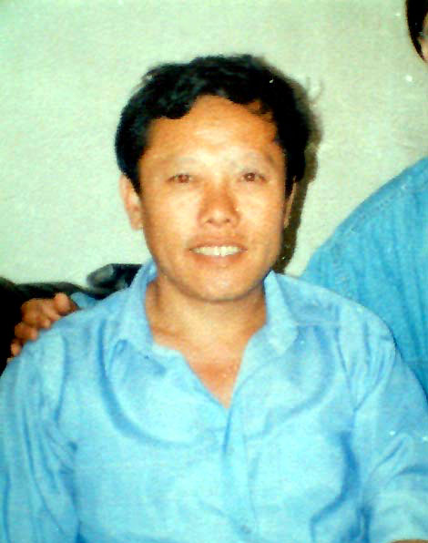
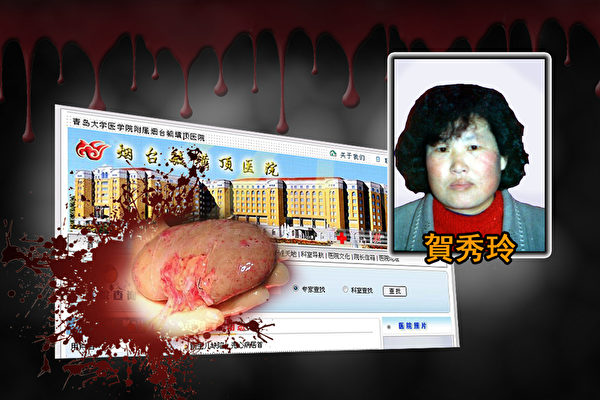
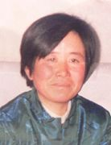
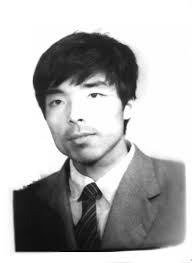
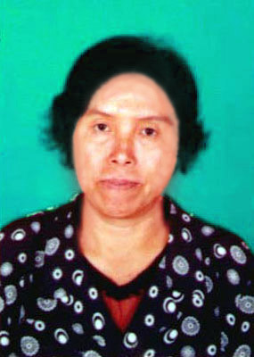
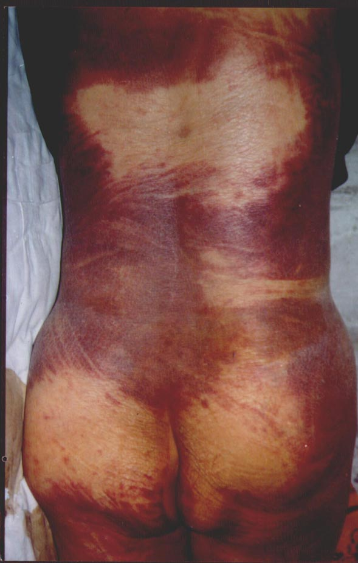
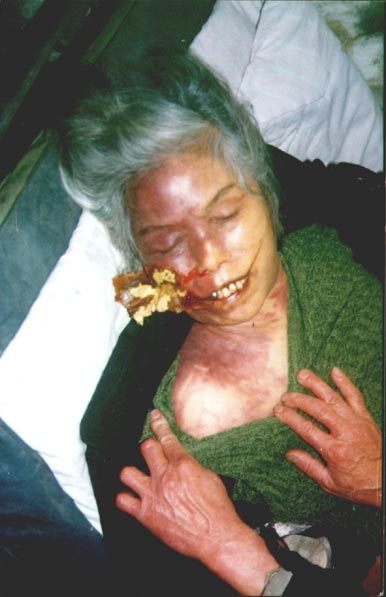

</a> 
<a href="https://git.io/sss">

<TABLE border="1">

	
<TR>
<TD align="center"><b> <a href="https://git.io/goal"><h2>《九评》编辑部新书——《共产主义的终极目的——中国篇》</a></h2>
 
共产主义来自何处？为什么宇宙中会冒出个共产党？共产主义的本质究竟是什么？结局又会怎样？对这些根本问题的答案，人们众说纷纭，现在是揭开谜底的时候了。</b></td>
</TR>
<TR>
<TD>下载全书：<a href="https://github.com/pkey5/dj/blob/master/download/JPN-S-V2-171216.pdf?raw=true">PDF简体版</a>，<a href="https://github.com/pkey5/dj/blob/master/download/JPN-T-V2-171216.pdf?raw=true">PDF正体版，<a href="https://github.com/pkey5/dj/blob/master/download/JPN-S-V2-171216D.docx?raw=true">WORD简体版</a>，<a href="https://github.com/pkey5/dj/blob/master/download/JPN-T-V2-171216D.docx?raw=true">WORD正体版</a>，<a href="https://github.com/pkey5/dj/blob/master/download/Tekan_V24_P32_GB.pdf?raw=true">PDF高清杂志简体版</a>，<a href="https://github.com/pkey5/dj/blob/master/download/Tekan_V24_P32_TC.pdf?raw=true">PDF高清杂志正体版，<a href="https://github.com/pkey5/dj/blob/master/download/JPN-S-V2-171216D_GB2312.zip?raw=true">简体字TXT文本</a>  </TD>
</TR>
<TR>
<TD>下载：<a href="https://github.com/pkey5/dj/blob/master/download/ultiGoalCmCN8k.epub?raw=true">镶崁8k mp3 epub简体版电子书</a>，<a href="https://github.com/pkey5/dj/blob/master/download/gbUltiGoalCmChina.epub?raw=true">epub简体版电子书</a>，<a href="https://github.com/pkey5/dj/blob/master/download/twUltiGoalCmChina.epub?raw=true">epub正体版电子书，<a href="https://github.com/pkey5/dj/blob/master/download/goal8K.zip?raw=true">希望之声声音档(mp3)，<a href="https://github.com/pkey5/dj/blob/master/download/goalmp4Npf.epub?raw=true">新唐人电视台视频播报版 epub 下载</a></TD>
</TR>
<TR>
<TD><a href="https://github.com/3fmd/gm/blob/master/epub.md"><b>手机、电脑打开 epub 电子书方法介绍</b></a></TD>	
</TR>

</TABLE>
	

视频：

+ <a href='https://github.com/pkey5/dj/blob/master/download/30_wu_han_da_xue_sheng.mp4?raw=true'>30名武汉大学生人间蒸发！被活摘了吗？</a>
+ <a href='https://github.com/pkey5/dj/blob/master/download/wuhan_zhong_guo_de_qi_guan_yi_zhi.mp4?raw=true'>黄洁夫说：“没有武汉就没有中国的器官移植”，和武汉大学生失踪有关吗？</a>
+ <a href='https://github.com/pkey5/dj/blob/master/download/nan_hang_kong_yun_huo_ti_qi_guan.mp4?raw=true'>【重磅新闻视频】南航自曝空运活体器官，超过500宗。器官哪里来？</a>

<table border="0" cellspacing="3" cellpadding="3">
<tbody>
<tr>
<td align="center"></td>
</tr>
<tr>
<td align="center">日前，美国参议院通过了2012年12月奥巴马签署的《马格尼茨基法案》，中国问题专家认为，这个法案通过后，将震慑那些迫害民众的中共官员。图为美国国会大厦（李莎／大纪元）</td>
</tr>
</tbody>
</table>

<h1 align="center"><b>美国343号决议案背后的血与泪 九个疑似活摘器官受害者案例</b></h1>

【大纪元2016年06月21日讯】（大纪元记者叶枫综合报导）“手术刀在胸脯，一刀下去，血是喷溅出来的。”“当心脏的血管剪动一下，她就进行抽搐……”2002年4月9日下午5点，在沈阳军区总医院15楼的一间手术室里，两个军医将一名三十多岁的法轮功女学员，在人完全清醒、没打麻药的情况下，活生生地摘取了她的器官。

以上这一幕是2009年，辽宁省锦州市，一位在现场担任持枪警卫的目击证人对海外追查迫害法轮功国际组织（追查国际）所披露。

近年来，来自国际社会的律师、医生、独立记者等第三方的调查取证，研究和欧美国家相关决议案的通过，使得越来越多的人们开始关注中共活摘法轮功学员器官这一罪行。

2016年6月13日，美国国会众议院以“呼声表决”（voice vote）的方式一致通过了343号决议案， 要求中共立即停止针对法轮功学员等良心犯的“强摘器官”行为。

早在2006年7月，加拿大发布的一份独立调查报告指出，2000～2005年6年间，中国大陆至少4万多例器官移植的供体来源不明；美国资深记者葛特曼（Ethan Gutmann）经过多年调查指出，在2000年到2008年期间，至少有6万5千名法轮功学员因遭强摘器官而死。

本文仅列举9位大陆法轮功学员疑似被强摘器官的案例，案例来源摘自明慧网报导或大纪元记者采访（见图注）。

<b>案例一：重庆检察院官员证实江锡清器官被摘除作标本</b>

法轮功学员江锡清是重庆市江津区地方税务局干部。

2008年5月14日，江锡清被绑架，非法劳教1年。在其刑满前不到4个月，当局突然通知家人江锡清“死亡”。

2009年1月28日晚上10点多，地方当局通知家人在殡仪馆看遗体，并且，规定家属只能见5分钟；只能看头部；不准带手机、照相机等摄像器材。

江锡清的女儿江莉现居住在美国纽约，她回忆了当年见父亲最后一面时的场景。父亲的遗体从冰柜里拉出后，“我们摸一下父亲的身体，是热的，当时比我们的手温还高。”

<table border="0" cellspacing="3" cellpadding="3">
<tbody>
<tr>
<td align="center"></td>
</tr>
<tr>
<td align="center">江莉手持父亲遗照。（EET）</td>
</tr>
</tbody>
</table>

家人当时都质疑父亲没有死，要求进行抢救，但是几个彪形大汉很快将她们都拉走了。

后来在家人的持续追问下，2009年3月27日中午，重庆市检察院第1分院的处长周柏林对家属表示：你父亲的整个内脏器官被提取作了标本。

当时，江莉的大姐江宏、哥哥江宏斌、小姐姐江蘋还有另外三位亲戚都在场。 他们悄悄录下一段1小时59分钟的录音。

后来，江莉将周柏林证实父亲被摘除器官的这段录音带到海外。

<b>案例二：赵姓警察说器官留做标本</b>

法轮功学员李再亟，是吉林市传染病医院（五医院）水暖维修工人。

1999年11月，李再亟被劫持到吉林市欢喜岭劳教所。2000年7月8日，李被迫害致死。

<table border="0" cellspacing="3" cellpadding="3">
<tbody>
<tr>
<td align="center"></td>
</tr>
<tr>
<td align="center">李再亟（明慧网）</td>
</tr>
</tbody>
</table>

7月8日中午，家属知道消息后赶到市第三人民医院，看到李被停放在走廊里，身上蒙着纸，有警察看守不让到跟前。下午被送到市死亡鉴定中心。

到市死亡鉴定中心，妻子祖春荣到李遗体前只停留了很短的时间，就被警察粗暴地拽走。

祖春荣看到：遗体已经化过妆；后背呈青紫色；左侧太阳穴塌陷；眼珠是后塞进去的，眼角被塞了纱布，纱布角露在外面。

2000年7月12日上午十点多，李再亟尸体在吉林市江南死亡鉴定中心尸检。在未征求家属同意，他们私自将体内器官全部摘走。

赵姓警察买了很多卫生纸 （是长卷那种卫生纸，有八卷）。

祖春荣问：“买纸干什么？”

赵姓警察说，往肚子里塞。

家属向警察要李再亟的器官，赵姓警察说：“留做标本。”

2000年7月14日上午七点钟，李再亟被火化。

当天上午，整个火化场被警方戒严，就火化李再亟一人，火化场内没有其他死亡人员家属。

<b>XXXXX</b>
案例三：山东贺秀玲遭活摘器官 丈夫欲申诉遭封口夺命

2003年8月，山东省烟台市52岁的贺秀玲因为制作法轮功真相的印刷品被非法抓捕，投入看守所。

2004年3月8日，贺秀玲被从看守所送进烟台毓璜顶医院就医，院方称其患“脑膜炎”。

3月10日，贺秀玲的丈夫徐承本接到当地“610”办公室（中共专职迫害法轮功的非法机构）李文光的电话前往医院探视妻子。

见到妻子时，徐承本惊呆了──原本健康的妻子已经变得完全面目全非，奄奄一息说不了话。

徐承本问妻子哪儿不好，她用手摸胸口，徐扶她坐起，她喊痛，她的左眼已睁不开。贺秀玲吃力地向丈夫指了指自己的后腰。

当晚，徐承本要求在医院陪护，遭拒绝。

第二天（3月11日）一早七点多，“610”的李文光再次打电话通知徐承本赶紧去医院。当徐承本带了些衣服到了医院后，李文光说贺秀玲已经死了。

<table border="0" cellspacing="3" cellpadding="3">
<tbody>
<tr>
<td align="center"></td>
</tr>
<tr>
<td align="center">（大纪元）</td>
</tr>
</tbody>
</table>

徐承本在医院的停尸房发现妻子的后腰被绷带缠绕着。而脑膜炎跟后腰伤口一点关系也没有，为何那里有伤口需要缠绷带呢？引起了家属的疑心。

贺秀玲的妹妹数年没有与其相见了，她大声哭喊：“姐姐你怎么这样了？你睁开眼看看我，你这么多年没看到我了！”

喊声未毕，贺秀玲的眼中流下两行眼泪！接着亲属发现她的脸上出现很多汗珠。

亲属们赶忙到楼上找医生来抢救。 一名男医生和两名女护士带着心电图仪器姗姗下楼来。心电图纸出来十几公分时，亲属们看到上面是跳跃的曲线。贺秀玲的妹妹大声喊道：“看啊看啊，人还有心跳你们就给送这儿来了！”

医生闻言大惊，一把撕下心电图纸，贺秀玲的亲属上前阻拦，跟医生抢那图纸，该医生带着抢到的心电图纸，夺门而逃。

贺秀玲的遗体在冰冻期间，亲属一直不允探望，只在两次尸检前让看了一眼，就赶紧撵出去，更不许碰触遗体。第一次尸检前，徐和儿子首次见到了冰棺里的亲人。 第二次尸检前，徐承本和妹妹一同见到遗体，当时贺全身赤裸，从咽喉到小腹划开一道大口子又简单缝合上。

2006年春，中共活摘法轮功学员器官的罪恶在海外曝光。

2006年4月19日，徐承本在网上发文，认为自己妻子被活摘器官致死。

4月20日，徐承本被警方突然抓捕，被关入610办公室开设的洗脑班。数月后，亲人见到徐承本时，原本体重一百七十斤只剩下一百零几斤，像一副骷髅架子，并且意识常常模糊，头脑不清醒。

2008年初，徐承本突然死亡。当亲属给他的遗体穿衣时，发现皮肤已经溃烂，所穿的衬衣和皮肤粘在一起，亲属诧异，找来法医做鉴定，鉴定结果为中毒身亡。

亲友质疑，徐承本遭“610”封口，遭药物迫害后慢性中毒而亡。

<b>案例四：李淑媛遭当场当众解剖</b>

李淑媛，女，葫芦岛市连山区台集屯镇大荒地村村民。

<table border="0" cellspacing="3" cellpadding="3">
<tbody>
<tr>
<td align="center"></td>
</tr>
<tr>
<td align="center">李淑媛（明慧网）</td>
</tr>
</tbody>
</table>

2002年7月6日晚，李淑媛与其他法轮功学员到葫芦岛市连山区台集屯镇金砬子村发法轮功真相资料。约22:30分，遭金砬子村被蹲坑的便衣追捕后遇害。7日，台集屯镇派出所通知各村法轮功家属到村边的河套认尸。

7日上午八点钟左右，李淑媛的家属赶到现场，见河套上约有200～300人围观，还有两辆写有“公安”的白色警车。外圈是围观的村民，内圈是公安、法医、台集屯派出所的人围住李淑媛的尸体。

李淑媛一丝不挂躺在地上，从胸部到小腹全被剖开，肉皮分敞着，白色的肋骨根根支露著，内脏：心、肺、肝、肠、肚等所有腹中的东西全部被摘取掏空，鲜血淌了一地。摘出的器官用四五个袋子装着放在李淑媛尸体旁。当时家人被吓得瘫在地上。法医随后把腹部刀口缝上。

解剖完毕，李淑媛的家人向公安询问，火化时是不是需要死亡证明？

警察说，我给你开一个去火化就行了。警察随手给写了一张“窒息死亡”的验尸报告证明，又说：“心脏没病，脑子没病，我们拿器官去化验。”

随后，两辆白色公安警车带上李淑媛的器官离开现场。

<b>案例五：两名法医拿走了王斌的器官</b>

<table border="0" cellspacing="3" cellpadding="3">
<tbody>
<tr>
<td align="center"></td>
</tr>
<tr>
<td align="center">王斌（明慧网）</td>
</tr>
</tbody>
</table>

王斌，男，原黑龙江大庆油田勘探开发研究院计算机软件工程师，曾获国家科技二等奖。连续三届当选研究院职工代表。

2000年6月3日，王斌准备进京为法轮功上访，刚到火车站就被抓回，8月3日被非法劳教一年。大庆男子劳教所强行转化法轮功学员，王斌因为坚决不写放弃修炼法轮功的保证书，多次被毒打。

由于中共中央“610”办公室要来人检查，劳教所要求法轮功学员100%写保证书，但是王斌就是不写。2000年9月24日晚，劳教所二大队恶警冯喜指使3名劳教犯仓双成、宋保成、刘庆辉对王斌大打出手，3犯人共毒打王斌40多分钟，直至把王斌打得奄奄一息。

当晚11点，王斌被送到医院，经值班医生李季彪检查，淋巴动脉被打断，锁骨、胸骨、肋骨被打折十几根，睾丸被打碎一个，手背被烟头重复多次烫伤，鼻孔被烟头插入烧伤，身体多处黑紫，惨不忍睹。王斌于10月4日晚死亡。

王斌被害后，内脏被野蛮摘取，两名法医王春彪、齐井福把器官拿走。

<table border="0" cellspacing="3" cellpadding="3">
<tbody>
<tr>
<td align="center"></td>
</tr>
<tr>
<td align="center">王斌遗体（明慧网）</td>
</tr>
</tbody>
</table>

王斌的妻子到太平间认尸时悄悄拍下丈夫尸体的照片，其被摘除了器官后的前胸缝合伤口令人触目惊心。

<b>案例六：牡丹江市王晓忠器官被全部摘取</b>

王晓忠，男，36岁，黑龙江牡丹江市爱民区兴平路兴平委三组居民。

2001年8月17日晚9时，王晓忠被牡丹江市阳明公安分局来人非法抓走。据说是用被子包着抓走的。抓到阳明分局桦林派出所，十三天后8月29日派出所通知家属王晓忠死亡。

在王晓忠被迫害致死的前一天，他的妻子去探视，王晓忠亲口对她说，公安用电棍打他，伙食也极差。结果第二天王晓忠便死在狱中。

据牡丹江兴隆看守所的人讲王晓忠是在看守所半夜送往医院抢救。但他们却将王晓忠的心、肝、肺等内脏拿出来冷冻，说二十天后出结果。

知情人披露，王晓忠被送到牡丹江北方医院，器官全部被摘取，肚子瘪瘪的，身体上从下颌到耻骨部位整个的一个大拉链似的长长的刀口，遗体上胳膊、腿全呈紫色。

<b>案例七：杜桂兰后背腰部有一个近一尺长的刀口</b>

杜桂兰，女，49岁，黑龙江省鹤岗市法轮功学员。

<table border="0" cellspacing="3" cellpadding="3">
<tbody>
<tr>
<td align="center"></td>
</tr>
<tr>
<td align="center">杜桂兰（明慧网）</td>
</tr>
</tbody>
</table>

2004年1月中旬，传出杜桂兰死讯。当万分震惊的家人赶到现场时，只见现场由警察看守，不许家人靠前也不许说话，更不许哭。

警察称杜桂兰从一老式二楼（很矮）跳下身亡（从二楼跳下去不可能致命）。

在没有告知家属的情况下，警察晚上八点多把尸体拉到解剖室做了解剖。

解剖之后才允许家属看，解剖后的遗体令人惨不忍睹：杜桂兰的头部剃光后头盖被揭开；全身一丝不挂，腹部有被绳子缝过的痕迹；后背腰部有一个近一尺长的刀口。

家人问：人死了为什么还要解剖？

当时在场的有警察张志朋、吕建峰和一个市公安局的人。

市公安局的那个警察说：解剖是法律程序。

<b>案例八：“这哪是在解剖死人，原来是在解剖活人啊！”</b>

杨丽荣，女，家住在河北省保定市定州市北门街。中共迫害法轮功后，她多次被绑架到洗脑班。

<table border="0" cellspacing="3" cellpadding="3">
<tbody>
<tr>
<td align="center"></td>
</tr>
<tr>
<td align="center">杨丽荣（明慧网）</td>
</tr>
</tbody>
</table>

2002年2月8日晚，警察到她家中搜查，因没搜到什么，就灰溜溜地走了。

作为计量局司机的丈夫怕丢掉工作，承受不住迫害高压，失去理智。次日凌晨，丈夫趁家中老人不在，掐住杨丽荣喉部，杨丽荣弱小的身体没了力气。

随后她丈夫立即报案，警方赶来现场，将体温尚存的杨丽荣解剖验尸，弄走了很多器官，掏出内脏时还冒着热气，鲜血哗哗地流。

定州市公安局一人说：“这哪是在解剖死人，原来是在解剖活人啊！”

<b>案例九：验尸结果显示赵春迎的心、脾、胰器官没了</b>

赵春迎，女，54岁，家住黑龙江省鸡西市恒山街。

<table border="0" cellspacing="3" cellpadding="3">
<tbody>
<tr>
<td align="center"></td>
</tr>
<tr>
<td align="center">赵春迎（明慧网）</td>
</tr>
</tbody>
</table>

2003 年4月15日，法轮功学员赵春迎被当地派出所警察于宝山等绑架，非法关押在鸡西市第二看守所，遭狱医王丽君强行灌食浓盐水。不到一个月，赵春迎于2003年5月10日被迫害致死。

2003年5月10日早上七点多钟，当赵春迎的丈夫王福仁接到妻子突然死去的噩耗，与孩子们火速赶到鸡西铁路医院。

遗体停放在鸡西殡仪馆，王福仁看到妻子痛苦的面容后迅速打开其衣服。他震惊了，妻子身上呈现了大面积的青紫瘢痕，双目微睁，面色青紫，头后部有大口子，血迹斑斑，左右肋骨均折两根，胳臂筋骨凸现。

<table border="0" cellspacing="3" cellpadding="3">
<tbody>
<tr>
<td align="center"></td>
</tr>
<tr>
<td align="center">赵春迎遗体，全身伤痕累累。（明慧网）</td>
</tr>
</tbody>
</table>

<table border="0" cellspacing="3" cellpadding="3">
<tbody>
<tr>
<td align="center"></td>
</tr>
<tr>
<td align="center">赵春迎遗体，全身伤痕累累。（明慧网）</td>
</tr>
</tbody>
</table>

事后，通过赵春迎家人的努力，鸡西市检查院对赵春迎遗体做了验尸，发现其头部有刀伤，肋骨被打折四根，全身呈紫黑色，口流血水。

2003年11月15日，黑龙江省司法鉴定委员会给赵春迎做了验尸，发现头部烂了，肋骨折断，而且遗体内的心脏、脾、胰这些器官都没有了。#

责任编辑：高静

<h1 align="center"><b>强行抽血与绿色通道背后的活摘器官罪恶</b></h1>

<table border="0" cellspacing="3" cellpadding="3">
<tbody>
<tr>
<td align="center"></td>
</tr>
<tr>
<td align="center">英国维吾尔协会负责人、外科医师安华‧托帝亮出手机内的照片，指出新疆某机场出现为特殊旅客、人体器官运输专门开辟的快速通道。（陈柏州／大纪元）</td>
</tr>
</tbody>
</table>

【大纪元2017年12月29日讯】中共宰割人民，而“宰割”竟然不是比喻。这个话题，会有多沉重？

从2000年开始，大陆器官移植呈爆炸式增长，等待供体的时间短得不可思议，在全世界绝无仅有。有些医院以促销招揽客户，还出现“包换包退”的广告词。非常迅速地，以人体器官为前提的移植手术，在中国成为带来巨大利润的新兴产业。在白色的病房内，隐藏着中共的灭绝人性和中共江泽民犯罪集团的滔天罪恶。

<b>强行抽血疑云</b>

多年来，大批法轮功学员在被关押期间经历了体检和抽血。有调查人员认为，这明显是以器官移植为目的而进行的。近几年，陆续发生了在家的法轮功学员也被强行抽血的事件。据明慧网报导，为了抽取法轮功学员的血样、口液，各地警察不择手段地上门骚扰、绑架，并且威胁家属。“追查国际”将其视为一项佐证，证实中共活摘器官至今仍然猖獗。

2017年12月14日，辽宁省锦州市义县城关乡派出所所长和警察到法轮功学员单明媛家抽血。当时单明媛不在家，结果警察抽取了她的丈夫王会华的血样，还告诉她丈夫说是好事。

12月12日，贵州安顺法轮功学员周智君被强行抽血。当天上午国保大队、派出所等人员上门，说要抽点血建档案，让周配合。周智君拒绝，但被四个人一拥而上、强行抽血并拍照。

2014年，明慧网发表了《多地警察上门逼迫法轮功学员验血》一文，报导了20多位法轮功学员被强行抽血的案例。他们来自辽宁、湖南、贵州、北京等地，包括80岁的老者。

独立调查中共活摘器官的美国记者伊森‧葛特曼透露，他在调查时发现，多个证人在中国监狱里被强行抽血和做相关的以器官移植为目的的体检。在葛特曼的著作《屠杀》中，有一位证人叫王春英。她被关押在马三家劳教所时，和其他30几个人一起被强行抽血。

王春英说，当时9个警察强行把她按在床上，“在脚脖子那里抽了5～6毫升血，我做了30年的护士，一般的肝功能、肾功能检查不用抽这么多血。这是正常血量的两三倍。这次抽血的背后一定有检查其它功能的目的。一直到我2009年11月份离开马三家，都没有把化验的结果告诉我们。”

中共在1999年7月镇压法轮功，从2000年开始，大陆器官移植迅猛增长，其发展的起点和高峰期恰与中共迫害法轮功重合。2006年，中共活摘法轮功学员器官在海外被首次曝光。此后10年，“追查迫害法轮功国际组织”和独立调查人员通过调查取证，取得了大量证据资料，证实：中共活摘器官确实存在，在中国存在着一个庞大的活体器官库，活摘器官的受害主体是法轮功学员。

<b>维族医生揭露中共</b>

维吾尔族人安华‧托帝（Enver Tohti）是目前唯一一位现身作证、实施过活摘器官的大陆医生。

1995年7月的一天早上，当时在乌鲁木齐铁路局中心医院工作的安华‧托帝，在主任的安排下，带着野外手术设备和两名助手，赶到乌鲁木齐西面的西山刑场。一名行刑后的犯人躺在地上，安华和助手快速摘除了犯人的肝脏和两个肾脏。托帝说，子弹打在犯人的右胸，他没有死，还可以活下去。可是，摘取器官终止了他的生命。主任叮嘱他说：“记住，今天什么事都没有发生。”

这个事件如噩梦般挥之不去，折磨著安华的良知。后来，他流亡英国，走上维护人权的道路、并毅然现身讲出当年在行刑场的经历。

今年10月，安华‧托帝到台湾举办讲座，揭露了中共活摘人体器官牟利的新证据——中共在新疆实施的“健民工程”。据安华‧托帝介绍，中共从2016年6月开始，以“全民健康体检”之名，只针对维族人进行大规模的全面抽血和体检。据去年9月份媒体报导，当时此项任务在新疆和田地区已经完成。今年根据伊森‧葛特曼的调查，至今有99.7%的维族人已完成抽血。

安华‧托帝质疑，这是中共为了扩大器官移植规模而建立血型配对器官库。他谈到，在中国大陆，“最便宜的东西就是人命”。中共没有道德底线，从来不把人当人看。出生在共产党统治以外的地方的人，不会了解共产党有多么邪恶。

谈到为何法轮功成为受害主体，托帝表示，“因为这群人不抽烟、不喝酒、器官品质好，因此，成为主要受难群体”。他还说，“在中国所有人、你只要把自己排除在共产主义分子之外的人，就是潜在被摘器官的目标”，因此，不只法轮功，被摘取器官的有维族、家庭教会等。他表示，如果能够在中国追踪到失踪人口，会发现，涉及器官摘取的失踪是很普遍的现象。

安华‧托帝提到，在一份中国医疗杂志里，有一篇“两例心肺移植术”的论文，其中写道：“供体入室后，按常规予以麻醉及插管”。从死人身上摘取器官为何要插管？外科医生的经验告诉托帝，“供体肯定是个活人！”他表示，这种医学案例居然公然发表在权威期刊上，“实在太恐怖了！”

<b>绿色通道 通向何处？</b>

2016年4月29日，中共国家卫生计生委、公安部、交通运输部、中国民用航空局、中国铁路总公司、中国红十字会总会六个部门联合发出《关于建立人体捐献器官转运绿色通道的通知》。随后，大陆各个航空公司争相开通“绿色通道”。

2016年5月9日，中共央视对全国首例通过“绿色通道”运送器官做了报导，当时是从700公里外的杭州转运到湖北武汉协和医院的一间移植手术室，全程仅用4个小时，“大大提高了器官成活率和手术成功率。”

据大陆媒体报导，南方航空公司自2016年5月开通“绿色通道”后，截至2017年10月，已运输活体器官超过500件，成功率达100%。

“追查国际”主席汪志远对此评论说：“中共大张旗鼓地开通‘绿色通道’并大力宣传报导，其实是要为当局宣称自2015年1月1日起公民自愿捐献器官成为移植供体的唯一来源而站台，以掩盖活体器官获得的真实来源。”

汪志远告诉记者，“绿色通道”说明“中共有庞大的器官供体库，统一调配，快速运转、使用。”“大陆各地很多城市都有活人器官库，大部分的人体器官是在当地获取。空运器官实际上比较少。尽管如此，仅南航这一个航空公司一年内就运输500多例活体器官，这是十分可怕的。”

汪志远还表示：完全有理由推测，“绿色通道”可以被中共用来运输活人，因为中共的活摘器官是按需杀人。

有关绿色通道，安华‧托帝医生在台湾时曾向记者展示他手机内的照片，显示在新疆某机场，出现为特殊旅客、人体器官运输而专门开辟的快速通道。机场地板上，可见以简体字和维吾尔字母书写的通道标示。

托帝认为，要让机场设立特殊通道，说明交通量庞大。“我觉得毛骨悚然！如果这是真的，这个交通量要有多大才能让一个机场建立这么一个专用通道？每天有多少个无辜人的生命被摘（器官被活摘）？”

<b>罪恶链条</b>

中共活摘民众器官，早有记录，并不始于法轮功学员。1978年4月，年轻女教师钟海源被执行死刑时，被活体取肾，就为了一位患肾衰竭的高干子弟。她的鲜血滴满了施行手术的军车底板。1995年，河北青年聂树斌被执行死刑，同样被指是“故意错判”，也涉及器官移植。

近几年，大陆曝光了武汉地下卖肾车间，还有江西圈养活人供取肾，听来都令人心惊不已。而这又怎能与中共政府权力运作下的大规模活体强摘器官、害命盗尸、甚至将尸体制成标本继续牟利的罪恶相提并论？

大陆网友愤然写道：“过去说共产党宰割人民，是一种比喻的说法，指它奴役、镇压人民。现在说共产党宰割人民，完全是一种叙述的说法，指它开枪血腥屠杀、活摘器官，等等。”

还有人说：“当法轮功学员的器官供体不够用的时候，普通民众就该被派上用场了。所以，那些说‘活摘器官和自己没关系的’老百姓啊，醒醒吧，在中共这台绞肉机里，每个人都可能成为那个供体。只有彻底摆脱中共从精神到肉体的控制，在中国解体中共，才是解脱之道！！！”

中共执政68年，虐杀生命、宰割肉体、禽兽不如。活摘器官被曝光，令世人看清暴政的极度邪恶。目前，美国、欧洲议会等国家和团体、全球的正义人士都严厉谴责中共活摘法轮功学员等良心犯器官的行径，要求中共立刻停止活摘罪行、释放无辜被关押的法轮功学员。

揭露中共、解体中共，就是脱离邪恶、拯救生命。只有抛弃中共、重建道德，才能杜绝发生在大陆的强摘和盗卖器官的罪恶。

责任编辑：高义

<h1 align="center"><b>“610”官员坦白的一起活摘案例</b></h1>

作者:玉清心

【大纪元2016年07月18日讯】2016年7月15日，在“追查国际”公布的最新调查报告中，有一例最新活摘案例：牡丹江市“610”官员朱家滨亲口承认活摘法轮功学员高一喜器官，器官“卖了”。

黑龙江省牡丹江市法轮功学员高一喜，男，45岁，2016年4月19日被牡丹江市公安局警察非法抓捕，仅10天就被迫害致死。

4月30日，高一喜16岁的女儿赶到火葬场。她在两米外看到父亲遗体：双目圆睁，双臂僵硬的向左右伸著，双腕铐痕明显，双拳紧握。胸背部肿胀很高，但是腹部却特别瘪。不到两分钟时间，她被警察拖走。

家属强烈质疑高一喜的器官已被活摘。为此，“追查国际”立案追查。调查员在对相关涉案人的调查取证中，获得涉案主要责任者之一，当地“610办公室”综合科科长朱家滨的录音证据。朱家滨直接承认活摘了高一喜的器官：“屠戮了，开肠破肚，就摘了，就卖了呗。”“追查吧，老子天下第一，老子怕啥，老子叫屠夫，专门干活摘的！”

高一喜被害案，是一起中共活摘法轮功学员器官的案例，在法律上完全可以认定。有犯罪的时间、地点、受害人、加害人，关键的活摘罪行，是由加害方朱家滨“坦白交代”的，他不但对活摘高一喜的犯罪事实供认不违，甚至还威胁调查员：“你现在要有胆量，站到我面前，我一样把你活摘了，老子外号叫屠夫！”

从被害人身份看，高一喜是法轮功学员，但有名有姓，有家庭有亲属。而中共已不限于报不报姓名，也不在乎有没有家属的追究，只要是法轮功学员，都是活摘目标。联想到近年大陆不少地区，警察对本地区法轮功学员强制抽血，甚至登门暴力抽血的现象。警察显然不怀好意！那又做什么用呢？警察只说是执行上面的命令。众所周知，被关押的法轮功学员被抽血，是为人体器官库做配型准备的。对未被关押、但在警方监控下的法轮功学员抽血，很可能也是为人体器官库做后续配型准备的，这是目前唯一能解释通的理由。

从案发地点看，也不限于法外飞地的劳教所、洗脑班。警察就从有登记制度的看守所里，把人拉去医院活摘，无所顾忌。

从案发的时间看，这是2016年发生的新案件。面对中共长期大量活摘器官杀人的残酷事实，从2006年的沈阳苏家屯事件开始，国际曝光已十年，中共并未收敛，仍旧无法无天。高一喜案在提醒人们，活摘法轮功学员器官的罪行始终没有停止，被杀害的人数在不断攀升，中共嗜血成性的本性没有改变。不解体罪恶的根源中共，活摘无法根除。

从犯罪证据看，这也是首例由“610”官员亲口承认的为了卖钱而活摘法轮功学员器官的案例。610官员朱家滨本人、非法抓捕高一喜夫妇的牡丹江市公安局先锋分局圆明社区警务室副队长吕洪峰等5人，在牡丹江第二看守所酷刑折磨高后送他去医院的刑警队副队长于洋等人，都是涉案人，哪个也逃不掉。

“610”官员朱家滨和调查员的对话录音中，朱家滨是一副杀人狂的变态，不禁令人毛骨悚然。江泽民创办的“610办公室”，确实是个十恶不赦的邪恶机构，正常人加入进去，会被变成魔鬼。各级“610办公室”，就是大大小小的魔窟，是中共犯反人类罪的桥头堡急先锋。今天的“610”，不但在继续“活摘”，而且公然叫嚣活摘，实在邪恶至极！

略有意外的是，过去“610办公室”在对法轮功的各种迫害中，总是藏在背后指挥操控。可以说，每一迫害实施，背后都少不了610的鬼影。而在高一喜案中，“610”骨干份子朱家滨，竟然自己跳出来，不打自招，直接了当承认活摘了，赤裸裸露出一副狰狞面孔，可谓“末日的疯狂”。

而这一反常举动，似乎也在预示，活摘的巨大黑幕不容再掩盖，暴行必须终结，真相必须公之于众。现在连主导活摘的“610”自己都迫不及待地跳出来，自曝黑幕。这或许表明，中共大限已到，活摘器官正成为压倒中共的最后一根稻草。#

责任编辑：高义

 

  <h1 align="center"><b> 中共高官青睐器官移植专家与产品的背后</b></h1>
 <table border="0" cellspacing="3" cellpadding="3">
<tbody>
<tr>
<td align="center"></td>
</tr>
<tr>
<td align="center">中国富商郭文贵曝出，江绵恒（如图）换肾三次，杀了五个人；孟建柱为母亲换肾，杀囚取器官；李友换肝，供体选了几十个。（大纪元资料室）</td>
</tr>
</tbody>
</table>
【大纪元2017年11月07日讯】在国际社会持续曝光中共强摘法轮功学员器官等滔天罪恶，以及中共原卫生部长黄洁夫明确宣布从2015年起全面禁止使用死囚器官后，中国大陆每年的器官移植数量仍远远超过其所公布的实际器官捐献量，这不能不让人高度怀疑其供体的来源，而对此中共仍讳莫如深。

事实上，中共的器官移植业随着其建政开始发展，最初的器官移植医生通过为中共高层保健服务而得到特权，并利用国家机器，特别是军队系统发展器官移植技术。中共则利用这些医生进行器官移植的培训和推广，形成共产党体系内特有的器官移植系统。

关于文革前后器官移植的案例公开的很少见到，但还是有一些透露出来。如1977年10月，301医院泌尿外科医生李炎唐进行肾移植，活体取肾，取肾车由警车开道，一路开绿灯，通过通讯兵部队架一条线，从取肾地点直接通到手术室，当肾取下可用时，立即通知手术，病人开始准备并开刀等待，两不耽误。再如1978年，江西小学教师钟海源被活体取肾，移植给高干子弟飞行员。

显然，早在文革前后，利用军队系统搞器官移植，特别是使用活体器官来提高移植品质成为了中共器官移植的特色，而罔顾伦理正是中共器官移植的罪恶所在。毫无疑问，这背后的黑幕远超人们的想像。不过，或许我们从众多中共高官青睐器官移植专家与产品，可以寻找到蛛丝马迹。

<b>中共高官多次接见肝胆移植专家吴孟超</b>

	
今年95岁，现海军医院附属东方肝胆外科医院院长、亦是福建医科大学名誉校长的吴孟超，刚刚获得“上海医学发展终身成就奖”。他先后受到邓小平、江泽民等高官的接见，2012年吴孟超的“先进事迹”被大力宣传并要求对其学习，死去的中共原军委副主席徐才厚也对其大加夸赞，坊间还有消息称，他被视为江泽民的“大功臣”。

根据官方报导，吴孟超先后完成了国内第一例肝脏外科手术和世界第一例中肝叶肿瘤切除术，创下了切除肿瘤重量最大、肝脏手术年龄最小、术后存活时间最长等多项世界纪录，开辟了肝癌基础与临床研究的新领域，因此被誉为“中国肝脏外科之父”。

2012年2月，吴孟超还获得中共央视颁布的2011感动中国人物奖。官方简历上介绍说，那时“他已亲手完成了1万4000多台肝脏肿瘤手术，其中肝癌切除手术9300多例，成功率达到98.5%……90岁高龄依然奋战在肿瘤手术第一线”。这其中有多少是肝脏移植手术？有多少供体来自法轮功学员？

不过官方不敢介绍的是，吴孟超治疗晚期肝癌，最常用的手法就是做肝移植来取代被切除的癌变肝脏，他一人就做了1.4万例，这就存在一个问题：他是从哪里得到匹配的肝脏呢？作为全军器官移植会议的首席顾问，并曾在一些医院的器官移植庆祝大会上发表贺词的吴孟超，他会不知道供体来源吗？显然不是。

同样，中共媒体不敢披露的是，他是江泽民最为关心的医生，曾被江至少四次接见。有知情人于2014年向海外《新纪元周刋》透露，江和吴的关系很特别，每次江参加医学界开会，只要江到会，必定要问一句，上海的吴孟超到了吗？这其中的潜台词大家都懂的。据说，2011年，在江濒死之际，也是吴孟超给其做器官移植手术。

而在江泽民1999年7月镇压法轮功并将活摘法轮功学员器官产业化、军事化后，吴孟超带领的东方肝胆外科研究所解决了器官移植中的某些问题，这使得江提出的活摘器官产业化成为可能，且利润丰厚。吴孟超为此得到江和军委徐才厚的多次嘉奖和奖励。

除了在东方肝胆外科医院做器官移植手术外，吴孟超还在福建医科大学开设孟超肝胆医院，在上海建吴孟超医学中心，在宁波医院建上海吴孟超医学中心分支，等等，而这些医院都涉及器官移植。哪里来的那么多供体？

<b>中共高官大赞器官移植外科主要创始人裘法祖</b>

	
说完吴孟超，不得不说说他的导师、中共器官移植外科主要创始人裘法祖。他早年留学慕尼黑大学医学院，获医学博士，抗战胜利后回国，主持创建了中国最早的器官移植机构——同济医科大学器官移植研究所。中共建政后，高官早期的器官移植的背后都少不了他和弟子夏穗生的影子。1993年，他当选中科院院士。

2001年，裘法祖获得了中国医学基金会“医德风范终身奖”。2004年，他90岁生日的那一天，时任中共中央政治局常委的吴官正、全国人大常委会副委员长的路甬祥等发来贺信，彼时任中共中央政治局委员、湖北省委书记的俞正声在讲话中代表省委、省政府向其表示祝贺，原全国人大常委会副委员长吴阶平在发言中大赞裘法祖，而湖北省省长罗清泉向其颁发荣誉证书。

无疑，裘法祖是因为为中共器官移植做出了突出贡献，才获得如此带血的“荣誉”的。

给江绵恒换肾的移植专家黎磊石跳楼后众高官发唁电
日前，身在美国的富商郭文贵曾大曝中共高官为何得了癌症还活着的秘密，这是因为他们可以换器官续命，“活摘器官，按需杀人”。他曝出江泽民之子江绵恒换肾三次，杀了五个人；原政法委书记孟建柱为母亲换肾，杀囚取器官；北大方正的李友换肝，供体选了几十个。他并指南京军区总医院副院长黎磊石就是给江绵恒、孟建柱之母换肾的医生，而他2010年“跳楼”而亡的背后鬼影幢幢。

黎磊石堪称中国肾移植的鼻祖。官方媒体报导其头衔包括：中国工程院院士，解放军肾病研究所所长，南京大学医学院临床学院副院长、教授，国际著名肾脏病专家，中国肾脏治疗创始人，一代医学宗师。官方媒体还称，2004年，在他和学生进行的肾移植手术中，人、肾存活率达100%。可以推测，以江绵恒父子在中国的权势，为江绵恒换肾，非请黎磊石不可。

至于其肾移植中心，则从最初的每年移植十几例发展到一百多例，成为国内最大的肾移植中心之一，到2004年肾移植手术突破一千例。黎磊石还主持编写了《中国肾移植手册》，大陆很多肾移植医生都是读这本书出来的。

如此替中共效命的黎磊石不仅获得了江泽民的亲自接见，而且2007年中共军方还下发《向黎磊石学习的决定》，他亦立二等功五次，三等功八次。

耐人寻味的是，黎磊石死后，包括刘延东、李源潮、徐才厚、蒋树声、梁光烈等在内的中共高官纷纷发唁电、唁函或敬献花圈和花篮。是什么原因让这些高官如此做的呢？

<b>中共器官移植“掌门人”黄洁夫背后的高官</b>

	
提到中共原卫生部部长、中共器官移植的“掌门人”、现人体器官捐献与移植委员会主任黄洁夫，国内外移植届都不陌生。他历任中山医科大学附属第一医院肝胆外科主任，副院长、院长，中山医科大学校长兼党委书记；学术方向为肝脏移植和肝胆道恶性肿瘤外科学治疗；2001年11月任卫生部副部长，2005年7月升任中央保健局局长，是负责中央保健委员会专家组、中央保健会诊专家的总管，负责所有中共中央领导人的医疗保健。

而黄洁夫的前任吴阶平是泌尿外科医生。从1960年吴阶平进行第一例肾移植开始，利用活体器官进行移植手术，满足中共党、政、军界高级人员健康需要便成为惯例。

要知道，老年人的保健以心血管、慢性病为主，是内科医生的专长，泌尿外科医生和肝移植外科医生成为中共高级领导的保健总管，本身就是违背医疗常识的。这背后的猫腻中共高层心知肚明。黄洁夫背后有多少中共高官的支持也就可想而知了。

自然，黄洁夫这样的背景也使其成为了中共当局应对国际社会指责其强摘法轮功学员器官的最佳人选。

在这几年的公开表演中，正是黄洁夫公开承认中共使用死囚器官，也是他公开否认活摘法轮功学员器官。正是他在2009年9月公开宣布“中国目前已累计开展器官移植超过10万多例，成为仅次于美国的第二大器官移植大国。我国每年开展的器官移植手术已超过1万例次。其中，开展最多的是肾移植，累计8万6800例。目前每年进行肾移植手术6000例左右”，也是他避而不谈供体的来源。

而2005年9月，黄洁夫曾参加以时任中共政法委书记的罗干为团长的中央代表团前往新疆，为一名46岁的肝癌患者进行手术，手术中需要备用肝脏作移植准备，24个小时内就取来了两个匹配的肝脏，在医学界上创了世界纪录。

<b>诸多高官纷纷前往参观威高集团</b>

	
中共十九大前，有消息称，山东威海首富董事长陈学利的代表资格被取消，而这十分蹊跷。资料显示，在过去的十多年中，有多名中共高官先后考察过该集团，他们中有吴官正、吴邦国、罗干、李鹏、刘云山、王乐泉、薄熙来、张高丽、回良玉……如2003年8月，时任中共中央政治局常委、中央政法委书记的罗干来到威高；2004年8月10日，时任商务部部长的薄熙来到威高；2005年5月，时任新疆一把手的王乐泉率自治区党政考察团视察威高；7月6日，时任中共中央政治局常委、全国人大常委委员长的吴邦国来到威高；2007年9月，时任国务院副总理的回良玉也来到威高；2013年11月，刘云山亦来威高调研……

为何高官们如此青睐威高集团？这极有可能与其产品中用于血液透析或器官移植所产生的排异反应的免疫吸附柱有关，这是2005年威高集团与中科院大连化物所合作开发的，此产品打破了德国费森尤斯公司的垄断。

可以佐证威高集团深度介入器官移植的证明之一是，2016年6月，威高集团与红基会共同成立博爱基金，包括中国器官移植发展基金会理事长黄洁夫在内的若干官员和器官移植医生参加了成立仪式。

另外，2007年12月威高集团与世界500强之一的美国美敦力公司签署合作协议，建立战略合作伙伴关系，也不容忽视。在双方成立的合资公司中，美敦力公司控股51%。美敦力是世界最大的医疗科技公司之一，主要为慢性疾病患者提供终身治疗方案。

美国记者安妮．切尼（Annie Cheney）在她的《人体经纪人：透视美国的人类器官地下交易市场》披露，在美国，人体器官的市场很大，是个有数十亿产值的产业，支撑著尖端研究和每日的医疗过程。对于发展科学知识、完善医疗技术这样利润丰厚的重要事业而言，死者身上的组织、脏器、腱、骨骼、关节、四肢、手、脚、残缺部分和头颅是不可或缺的。强生、美敦力医疗产品等大公司需要依靠人类器官来指导他们开发医疗设备。研究者们依靠它们磨砺自己的外科手术技巧，甚至制造化妆品。医生们则用它们来替换心脏瓣膜、治疗烧伤病患、换骨，甚至垫高嘴唇、消除皱纹。

根据1968年美国通过的《统一组织捐献法》规定，买卖死者遗体都是非法的。但是这同一部法律又规定，如果是为了填补由保护、运输、储存和加工尸体而发生的成本，这样做是合法的。这样的漏洞也就意味着，骨骼、组织、脏器、关节、四肢、头颅甚至是残缺不全的遗体在市场上都是紧俏商品，研究人员、产品开发者和医生的需求远远超过供应。如头颅可以卖到900美元以上，腿将近1000美元，手、脚和胳膊每个几百美元。全部肢解和掏空以后的一具尸体在公开市场上可以卖到将近1万美元。

在美国获取尸体需要高额代价的背景下，美敦力公司和生产用于器官移植排异反应产品的威高集团合作，尽管没有明确的证据，但很难不让人联想这背后是否存在一些黑幕，比如将被强摘的尸体、器官卖到美国？

<b>结语</b>

	
除了郭文贵曝出中共强摘器官的黑幕一角外，今年9月20日，互联网上出现的“国安委骨干与某红二代的神秘对话”也部分涉及了这一话题。对话称，中共统治者爬到顶尖位置后，就只有两个目的：一是保持政权的永久稳固；二是琢磨如何长生不老，怎么能活得更长、更高质量地活下去。为了延长寿命，可以不惜一切代价。

对话中提到，中国最大的资源就是人口，那是取之不尽、用之不竭的DNA储存库。领导们都有几千亿、上万亿元的巨额财富，现在科技发达了，有了那么多钱后，都想延年益寿，想长生不老。经济上受益，身体也要受益！能换肾，能换肝，心、肺什么都能换，于是换完内脏换脑器官。人在接受器官移植后，会产生难以避免的排斥反应，因此需要定期地换血清、换血，而部队里的年轻战士就是第一梯队，他们的血清被源源不断、无偿地输送给中央领导们。

另据海外追查迫害法轮功国际组织的报告，中国存在着庞大的活人器官供体库，以法轮功学员为主体，同时也有藏族、维吾尔族、基督徒和其他中国人。强摘器官是中共集团操控整个国家机器而进行的，党、政、军、武警、司法和医疗系统等都有涉入。他们对普通百姓进行隐秘屠杀、盗取器官，从而为中共权贵的健康和利益服务。这也意味着有大量中共高官身上都不同程度沾染了这样的罪恶，而上天之眼已一一记下。他们需要记住的是，靠罪恶延长的生命并不能真正延长生命，反而招致恶报，遭天惩。生死有命，富贵在天，这个世界上人是说了不算的。#

责任编辑：莆山

 

 <h1 align="center"><b> 一个武警的觉醒</b></h1>
 

 
这是辽宁省锦州市的一名曾担任活摘法轮功学员器官现场的持枪警卫的证词，披露了几年前目击的一起活体摘取法轮功学员器官的事实。

事件回放。2002年，证人为辽宁省公安系统工作，参与了非法抓捕、拷打法轮功学员的行动。其中一位30多岁的女性法轮功学员，经过一个星期的严刑拷打、强暴、被强迫灌食，已经是伤痕累累。2002年4月9日，辽宁省公安厅某办公室派来两名军医，一名是沈阳军区总医院的军医，另一名是第二军医大学毕业的军医，将该名学员转移到另一场所（注一），在这名女学员完全清醒的情况下，没有使用任何麻药，摘取了她的心脏、肾脏等器官。证人当时持枪担任警卫，目击了活体摘取的全过程。

部份谈话录音记录

证：手术刀在胸脯，一刀下去，血是喷溅出来的，血是喷溅出来的。问：你看到的是男的还是女的？证：女的，女的。问：年轻的么？证：30多岁吧。问：你说一下她当时是怎么说的。证：当时，我们经历了就是，得有一个星期对她的审问，严刑拷打，身上已经有无数次伤疤，并且电棍、电，她已经神智不清……神智不清，把她打的，已经就是，反正她又

不吃东西，然后我们强行的给她灌牛奶，往她的胃里，她不喝就强行的给她灌。你知道那个，把她的鼻子捏上，于是维持着。她7天瘦了将近15斤，经过体重。而这个时候不知道，可能是辽宁省公安厅某办公室，反正是一个挺保密的部门，派了两个，一个是解放军沈阳陆军总医院的一个军医，还有一个是第二军医大学毕业的，具体反正一个是岁数大的，一个年轻的，在某、某，就是给她送精神病院的一个手术室，然后进行一套东西。不打任何麻药，刀在胸脯上，他们这个手啊一点抖都不抖，要是我下手我一定抖了。别看我在武警，我端过枪，我也进行过实弹演习。但是，我也见过很多死尸，但是看到他们，我真的佩服他们这些军医，手一点也不抖，直接戴着口罩拉出来。当时我们一人拿一把手枪在旁边站岗，那个女人就嗷……大叫一声，说法轮大法好。证：说你杀了我一个人，大概意思就是你杀了我一个人，你还能杀了我们好几亿人么，为了自己真正的信仰被你们迫害的人么？这个时候，那个医生、军医犹豫了一下，然后看了我一眼，又看了我们的领导一眼，然后领导点了一个头，他还继续把血管……先摘的是心脏，还是再摘的肾。当心脏的血管剪动一下，她就进行抽搐，非常可怕的，我给你学下声音，反正我也学不好，撕裂的撕裂的那样式的，然后就啊啊……就一直张着大嘴，睁着两个眼睛，张着大嘴。哎呀……

我不想再讲下去了。……证：当时，这个人身份是一个老师啊，是一

个老师，在中学教书的老师，她的儿子今年可能12岁了吧。她的老公是个没什么能耐的一个，也是一个工人吧。在这之前，她受过的羞辱更大。我们的民警有不少就是变态的那种，给她进行，用钳子、用窥视器，都是不知道哪来的仪器，反正我都亲眼所见，我当时没照照片就是遗憾，对她进行属于是猥亵，她长的有点姿色，比较漂亮，对她进行强暴……，太多了。问：就是在你所待过的那个公安局里面你就亲眼看……证：当时我没在公安局里做，是在一个就是培训中心，就在一个宾馆的后院，包了十个房间，一个小楼上，就是小别墅那块儿做的。问：黑监狱。证：差不多。问：你只有对他们逼供一次？还是很多次？证：很多次。当时王立军，现在的重庆公安局长，下死命令“必须斩尽杀绝”。……注一：在最初交谈中，证人为了不暴露自己，没有明确说出活摘器官的场所。在第二次交谈中，证人明确说出活摘器官是在沈阳军总医院15楼的一间手术室内进行。经核实，沈阳军区总医院15至17楼均为外科。

 <h1 align="center"><b>【独家】沈阳陆军总院实习医生亲历活摘器官 军队押送 持枪逼迫 活摘肾脏 活取眼球 我快崩溃了</b></h1>
 <table border="0" cellspacing="3" cellpadding="3">
<tbody>
<tr>
<td align="center"></td>
</tr>
<tr>
<td align="center">旅居加拿大的乔治90年代亲历了中共活摘器官的全过程，他最近向大纪元披露了那可怕的经历。（伊铃/大纪元）</td>
</tr>
</tbody>
</table>
【大纪元2015年03月05日讯】（编者按：当大纪元记者伊铃如约来到采访地点时，乔治不安的表情还是让人吃了一惊。那是一种发自内心深处、压抑了许久的一种痛苦。这种表情，在采访过程中多次出现；不止一次，这种痛苦令乔治不得不停下来；也不止一次，他的脸上现出深深的恐惧。为了安全考虑，本文隐去了具体时间和受访人的细节。）

口述：乔治，采访、撰文：伊铃

事情发生在上世纪九十年代。当时我是某军医学校即将毕业的学生，正在沈阳陆军总院泌尿外科实习。有一天医院突然接到沈阳军区的电话，说是一个军事命令，要求医务人员马上上车，去执行一项军事任务。

<b>秘密军事任务</b>

当时大概是下午时间，记得还刚吃过饭。科主任开始点名，没被点名的医生、护士要求离开；被点名的人员留下来，我也在点名之内。然后科主任命令：所有留下来的人从被点名的那一刻起，切断与外界的一切联系，包括跟亲人、朋友；任何人不能碰通讯工具，如电话机等。

出发时，我一片茫然，不知道要去干什么。我们这些被点名的医生、护士共6人，其中2个女护士（一个护士长，一个护士），其余4个男人（3名军医加我这个实习生）。然后马上集合，上了一辆被改装过的面包车。

上车时，发现医院出动了2辆同样被改装过的面包车，我们上了其中的一辆。另一辆的情况不清楚。我还看到，我们车前面有军车，军车的门还没关，里面是拿着枪的士兵。

上车以后，车子马上启动。前面有军车开路，车开出陆军总院以后，就上了高速公路，车速特别快。开路的军车打着警灯，呜呜的叫，高速路上所有的车都给我们让道。

我们坐的车内用淡蓝色的布完全封闭，一路上也不让看外面。透过布帘的缝隙，我看到副驾驶座上也是坐着带枪的士兵。

车开到一个地方停下来，我们下车，发现这个地方周围有很多山，建筑物的周围有穿军装的士兵站岗。有一个军官来接待我们，听那位军官说，这是离大连很近的一个军队监狱。

<b>活摘肾脏</b>

当天晚上，我们住在当地军队招待所，房间外面有士兵站岗。早晨起来，一个护士跟2个军人到监狱里去取血，对血型。取血回来之后，我们全都上车，车子很快启动。也不知道到了什么地方。停下车之后，我从虚掩的门缝向外看：原来，我们车的周围全是站着拿冲锋枪的士兵，所有军人都是脸朝外，后背朝内。

我们在车上等著，不许有任何动静。这个改装车后面的门能打开，没有锁死，是虚掩的。过了不久，突然有人敲车门。推开门之后，只见4个体格强壮的军人押著一个人过来。

押上来之后，把人平放在黑色塑料袋上面。车上早就铺好了一个大概2米多长的黑色塑料袋，特别宽长，一看是特制的。我看到那个人的两只脚是用一种特制的、类似于纤维的、很细的绳捆住。这种绳勒住，一动就会陷到肉里。他双手被反绑在身后，脖子上绕了一根绳，跟后面绑着的双手连着。只要踩着他背后这根绳子，人就起不来。因为一动，就勒住脖子，人没法起来，挣扎不了。

进来之后，对面的医生告诉我，让我踩住他，不让他动。当我按住他的腿时，我能感觉到他的体温是热的。

我看到他的喉部全是血，正在流动的鲜红色的血，整个喉部被血流的模糊，看不清伤口的形状，但可以肯定有伤口。

这时，所有医护人员在护士的协助下迅速穿好手术服，包括帽子、口罩、手套，只留2只眼睛。我当时充当的角色是助手，负责剪断动、静脉、输尿管。护士长马上用剪刀把他衣服剪开，然后用消毒液在他的整个腹部到胸部，大面积消毒3遍。

这时，其中一个医生拿着手术刀，从剑突下（胸骨下）作切口，一直划到脐部，作一个大切口。当时他的腿在抽搐，他的喉部已经发不出来声音。然后医生把整个腹腔打开。当时，血啊、肠子啊一下就冒出来。一个医生把肠子往对面一推，很快就取到一侧肾脏；对面的医生负责取另一侧的肾。

只听到医生说让我去剪动、静脉。当时要求必须留出来一截做吻合用。当我用伸出去的剪刀一剪下去，血一下就喷出来，身上，手上喷的全是血。这血还在流动，证明人是活的。

医生动作非常熟练、速度非常快。当时，左右两个肾脏都取出来了，肾脏已经在医生手里了。另一个护士拿着一个恒温盒，取出来的脏器就放在恒温盒里。

<b>活取眼球</b>

	
同时，我对面的医生让我去取眼球。我当时是坐着，我向他的脸部看去……我看到，他睁著一对十分恐怖的、无法用语言表达的眼睛，看着我……恐怖，无法用语言表达的恐怖。真是看着我，他的眼皮还在动，他是活的……

我脑袋已经一片空白，全身发抖，虚弱无力，都已经不会动了。这太恐怖了！

我想起头一天晚上住招待所时，里面的一个军官来告诉我们负责人说：不到18岁，是个非常健康的活体。难道是他？活体摘除器官，太可怕了。

我告诉那个医生，我做不了。

这时，对面的医生，用左手手掌把他的头狠狠的摁在地板上，2个手指把他的上眼皮把住，右手拿止血钳一剜，整个眼球就出来了……

当时，我不能再做什么了，我在发抖，全身是汗，处于虚脱的状态……

<b>等待活体器官</b>

	
这时，一个医生敲了一下隔板，副驾驶位上的军人就用对讲机呼叫，然后后面车门进来4个军人，用另一个2米多长的黑色塑料袋把那个人整个套住。此时他已经不会动了，军人把他拖到车门外停著的、一辆带蓬的军用卡车上。

这时我们的车门快速关上，启动。我们所有的手术服，手术帽，橡胶手套全都放在一起，等著回去销毁。车子在军车开道下，以特快速度往回开。

回到医院，我们把器官送到手术室。此时，手术台上已经站着另一批手术医生，他们早已准备好，在等著做器官移植手术…….

此时，我已经不能再做任何事，全身软弱无力。主任看我的情形，让我在一边休息。旁边有休息的地方，我还能看到他们在做手术。

<b>精神几近崩溃</b>

	
由于极度的恐惧和惊吓，我回家以后全身无力，开始发高烧。当妈妈问起，我只是简单讲了一下缘由，妈妈以为只是普通的外科手术，并没有当回事。我不敢跟任何人说起，家里其他人都不知道。从那以后，我很快离开了沈阳陆军总院。

但是痛苦远远没有结束。一方面，这件事情太恐怖了，我承受不起再刺激，我不想再提起；我也担心被中共追杀，被灭口；加上我亲眼见到鲜活的生命遭受虐杀，内心极度不安。这种无形的精神压力，使我痛苦不堪。

很长一段时间内，无论是白天还是晚上，眼前显现的都是那个恐怖的场景：那个面包车内，所有工作人员穿着白色手术衣，白橡胶手套、白帽子、白口罩，只有2个眼睛露外面，车顶是强光灯照着，底下躺着的是一个被活体摘取器官的、我们的同类，一个活生生的生命……他的那双眼睛，那个无法用语言表达的痛苦的、恐惧的眼神，就那么恐怖的看着我……

我的心灵承受不了，没有亲身经历过的人无法体验那种痛苦。很长一段时间，我感觉都快要疯掉，人要崩溃了。这么多年过去了，经历多年的心灵挣扎，那种恐怖的记忆仍然无法抹掉。多少年来，我不想去触及，有意回避它。因为一提起这件事，我就无法自持，感觉就要崩溃。

当海外媒体曝光大陆活摘器官时，我一下就明白了：这一切都是真的，而且在中共的军队系统早已存在。只不过，镇压法轮功让他们找到一个更大的器官供应源。

加拿大独立调查员、加拿大前亚太司司长大卫∙乔高(David Kilgour)认为对中国最好的帮助就是制止中共活摘器官。

美国的资深中国问题专家葛特曼（Ethan Gutmman）2014年8月12日正式发售他的新书《屠杀》。他表示，新书中披露了大量的新证据证实中共强摘人体器官的罪恶，特别是在1999年中共镇压法轮功后，开始大规模强摘法轮功学员器官，并且这个罪恶现在还在继续。他指出，前中共政法委书记周永康在其中是一个重要人物，中共最高层都知情。

责任编辑：岳怡；复核编辑：姜斌

	
<h1 align="center">【720系列】对中共活摘器官说不（上）</b></h1>	
<table border="0" cellspacing="3" cellpadding="3">
<tbody>
<tr>
<td align="center"></td>
</tr>
<tr>
<td align="center">2016年6月23日，美国国会众议院外交委员会举行联合听证会。左一为大卫‧麦塔斯，左二为伊森‧葛特曼。（李莎／大纪元）</td>
</tr>
</tbody>
</table>
【大纪元2016年07月15日讯】1999年7月20日，中共党魁江泽民出于妒嫉，一意孤行，发动了对法轮功的镇压。迫害机制开足马力，动用整个国家机器，企图消灭这一精神信仰群体。谎言诬陷、仇恨宣传、酷刑虐杀、精神折磨、株连亲属⋯⋯乌云蔽日，黑白颠倒。江氏的群体灭绝政策，催生了无数罪恶，制造了无数悲剧。十七年里，惨烈的迫害事实，几经辗转，冲破封锁，不断地从中国大陆传出。

2006年3月，有证人在海外曝光，中共在劳教所活体摘取法轮功学员器官，贩卖牟利，焚尸灭迹。这是针对法轮功学员、已知的、最邪恶、最恐怖的犯罪行径。十年来，“追查迫害法轮功国际组织”及海外独立调查员们坚持不懈、调查取证，获得了大量数据资料和证人证词，证实中共强摘器官的数量惊人。同时，海外法轮功学员不遗余力地向社会各界揭露中共罪行，呼吁正义支持，共同制止中共活摘器官的反人类罪行。在多方努力下，此重大人权侵犯事件已经引起了国际社会和主流媒体的广泛关注，谴责罪恶、要求将首恶绳之以法的正义之声不断高涨。中共活摘法轮功学员等良心犯器官是人类历史上最大的恶行，也成为考验全人类良知的一道关卡。善恶之间，何去何从？

<b>调查中共活摘法轮功学员器官大事记</b>

2006年3月9日，原辽宁省中西医结合医院员工安妮，作为第一名证人，向海外媒体曝光中共活摘法轮功学员器官的罪恶。她的前夫曾活体摘取过大约两千名法轮功学员的眼角膜。

2006年3月10日，“追查迫害法轮功国际组织”开始了面向中国大陆的系统调查。

2006年7月6日，受邀进行独立调查的两位加拿大人——著名国际人权律师大卫‧麦塔斯（David Matas）和前加拿大联邦议员、亚太司司长大卫‧乔高（David Kilgour）共同发布了“关于调查指控中共摘取法轮功学员器官的报告”，确认了活摘指控，称此罪行乃“这个星球上前所未有的邪恶”。

2009年10月，《血腥的活摘器官》（Bloody Harvest）英文版在加拿大出版发行，该书是大卫‧乔高和大卫‧麦塔斯于2006年发表的调查报告的第三版。

2012年7月12日，《国家器官：移植在中国被滥用》（State Organs: Transplant Abuse in China）正式出版。该书汇集了全球四大洲七个国家的医学界、法律界及人权专家的11篇论文，探讨了中共以国家机器的方式滥用器官移植的现象。书中说，中国的器官移植不同于其它任何国家，几乎所有用于移植的器官都来自于囚犯，其中许多是良心犯。杀害囚犯获取他们的器官，冲破了最基本的医学道德与伦理的底线。

2014年8月12日，美国资深记者、中国问题专家伊森‧葛特曼（Ethan Gutmann）所著《大屠杀》（The Slaughter）出版。葛特曼通过实地考察和对难民的采访，在书中讲述了中共活摘法轮功学员和其他良心犯器官的暴行。

十年来，“追查国际”经过持续系统的追查，包括对5名中共政治局常委、1名军委副主席、政治局委员、国防部长、前解放军总后勤部卫生部长等，对中国865家器官移植医院的上万通电话调查，对9500多名移植执业医生的几十万份公开媒体报导、医生论文、医院网站备份和数据库资料的多轮搜索和分析论证，共采集到2000多个电话录音证据，获取了上万条资料证据。

2016年5月19日，“追查国际”发表了一份21万多字的综合报告，呈现了60个电话调查录音证据、1628个资料证据，得出如下结论：
一、活摘法轮功学员器官是江泽民下令中共主导的国家系统犯罪。
二、活人器官供体库最初的主体来源涉嫌是数百万被非法抓捕的上访法轮功学员。
三、六大类证据揭示中国存在着庞大的活人器官供体库。
四、中共活摘法轮功学员器官没停反增，而且两次出现了大量的突击移植，2015年只用了捐献的器官是骗局。
五、大量数据分析得出：大量法轮功学员因活摘器官被中共虐杀。

2016年6月22日下午2点，在美国国家记者俱乐部，加拿大前亚太司长大卫‧乔高、美国资深调查记者伊森‧葛特曼和加拿大人权律师大卫‧麦塔斯，联合发布了中共强摘人体器官的最新调查报告。这份题为“血腥的器官摘取／大屠杀：更新版”（Bloody Harvest/The Slaughter: An Update）的报告显示，中国发生的实际器官移植数量远远超过官方公布的数字。三位联合作者估计，中国器官移植手术数量每年约为6万至10万例。在过去的十五年中，在大陆，估计进行了大约150万例器官移植手术。这些器官的主要来源是法轮功学员，因此，被强摘器官致死的法轮功学员数量比之前的调查所估计的要高得多。（报告链接：http://goo.gl/0AWxc5）

2016年6月23日下午，美国国会众议院外交委员会举行联合听证会，题为“强摘器官：对野蛮行为的审视”。大卫‧乔高、伊森‧葛特曼、大卫‧麦塔斯等人在听证会上作证。

伊森‧葛特曼发言说：“1999年，中共安全系统发起消灭法轮功运动。截至2001年，超过一百万的法轮功学员被关押进劳改系统并被迫接受以牟利为目的的器官检查。与此同时，中国的军队和地方的移植医院大量增多。”

追查迫害法轮功国际组织（简称：追查国际）公众事务主任李祥春说，在中国，器官供体在等待器官受体，并且有充足的供体可提供大量的候补供体。

<table border="0" cellspacing="3" cellpadding="3">
<tbody>
<tr>
<td align="center"></td>
</tr>
<tr>
<td align="center">2016年6月29日下午，三位独立调查员受邀来到欧洲议会举办听证会，发布了关于中共活摘良心犯器官的最新调查报告，促请欧盟采取行动立即制止中共的活摘罪行。（凌宇／大纪元）</td>
</tr>
</tbody>
</table>

2016年6月29日下午，三位独立调查员——大卫‧乔高、伊森‧葛特曼、大卫‧麦塔斯又受邀来到欧洲议会举办听证会，并提交了关于中共活摘良心犯器官的最新调查报告，促请欧盟行动制止中共活摘器官。大卫‧麦塔斯说：“这个更新版调查报告的最终结论是，中共令整个国家参与到大规模谋杀之中，而受害者主要是无辜的法轮功学员，但也有维吾尔族人、藏族人以及家庭教会成员，中共这样做的目的是获得用于移植的器官。”

<b>证据证词 指向活摘</b>

在明慧网和大纪元的报导和采访文章里，有一些大陆法轮功学员被迫害致死的案例疑似涉及活摘器官。现仅列举三例如下：

法轮功学员王斌，原黑龙江大庆油田勘探开发研究院电脑软件工程师。2000年8月，王斌因欲进京上访被抓、被非法劳教一年。在大庆男子劳教所，王斌拒绝转化，多次被毒打。2000年9月24日晚，王斌被毒打四十多分钟，奄奄一息，身体多处黑紫，10月4日晚，王斌死亡。两名法医王春彪、齐井福摘取了他的内脏。王斌的妻子在太平间拍下丈夫尸体的照片。在王斌的前胸，有一条粗大的缝合伤口，从脖颈到胸腹，惨不忍睹。

<table border="0" cellspacing="3" cellpadding="3">
<tbody>
<tr>
<td align="center"></td>
</tr>
<tr>
<td align="center">王斌遗体（明慧网）</td>
</tr>
</tbody>
</table>

法轮功学员李淑媛，葫芦岛市连山区台集屯镇大荒地村村民。2002年7月6日晚，李淑媛因为发法轮功真相资料被便衣追捕后遇害。7月7日，家属到村边的河套认尸。现场有两辆写有“公安”的白色警车。公安、法医、台集屯派出所的人围住李淑媛的尸体。李淑媛一丝不挂躺在地上，从胸部到小腹全被剖开，肉皮分敞着，白色的肋骨根根支露著，内脏：心、肺、肝、肠、肚等所有腹中的东西全部被摘取掏空，鲜血淌了一地，摘出的器官用四五个袋子装着放在尸体旁，法医再把腹部刀口缝上。李淑媛的家人吓得瘫倒在地。警察随手写了一张“窒息死亡”的验尸报告证明，又说：“心脏没病，脑子没病，我们拿器官去化验。”随后，两辆公安警车带着李淑媛的器官离开现场。

法轮功学员江锡清，是重庆市江津区地方税务局干部。2008年5月14日，江锡清被绑架、判非法劳教一年。在其刑满前不到四个月，当局突然通知家人，江锡清“死亡”。2009年1月28日晚上，亲属在殡仪馆看遗体，女儿江莉说：“我们摸一下父亲的身体，是热的，当时比我们的手温还高。”家人质疑人没有死，要求抢救，但是被几个彪形大汉强行拉走。2009年3月27日中午，重庆市检察院第一分院的处长周柏林对家属表示：“你父亲的整个内脏器官被提取作了标本。”

2009年12月12日，“追查国际”公布了辽宁省锦州市的一名活摘现场持枪警卫的部分证词：2002年4月9日，在沈阳军区总医院15楼的一间手术室内，证人持枪警卫，亲眼看到两个军医（其中一名军官证号码0106069）将一名30多岁的修炼法轮功的中学女教师，未经施打麻药，活生生地摘取了她的心、肝、肾器官。在此之前，女教师遭受了一个月的严刑拷打、侮辱和强暴。证人说：“手术刀在胸脯，一刀下去，血是喷溅出来的。”“先摘的是心脏⋯⋯当时心脏血管剪刀一下，她就进行抽搐，非常可怕的，⋯⋯撕裂的那样式的，然后就啊⋯⋯就一直张著大嘴，睁著两个眼睛，张著大嘴。哎呀⋯⋯我不想再讲下去了。”

2016年6月，重庆的访民邓光英向海外媒体曝光了重庆当地多起活摘器官的事实案例。她特别讲述了亲身见证的法轮功学员徐真在2011年10月20日凌晨被活摘器官致死的经过。根据明慧网的资料，徐真是重庆合川区法轮功学员，2011年9月20日因为发放法轮功真相资料被绑架，9月26日被劫持到重庆市女子劳教所，2011年10月20日被迫害致死，年仅46岁。

邓光英说：“这个活摘人体器官，把合川区一个叫徐真的活摘了。我亲眼看到是这样的：他们把徐真抓上来就使劲疯狂地打，把全身都打肿了！然后叫她写出捐献器官的自愿书，她不写，不写就把她全身扒光，用一个小小的机器把嘴巴摁起，摁起之后用水灌满矿泉水瓶子，灌了十瓶水（野蛮灌水）。有个叫贾征（当晚她值班，是迫害法轮功的主要队长，警牌号是5032053），还有一个叫陶忻（主管迫害法轮功的队长，警牌号是5032177），她们两个把她（徐真）拽起，一个蹬左边，一个蹬右边，先把人家血抽了，抽血之后，它们劳教所还叫医生在劳教所这边来挖她的眼睛。她在被挖眼睛的时候是2011年10月20日凌晨2点，我看了钟的！她的惨叫声多凄凉啊，轰动了整个四大队：‘啊！它们活挖我的眼睛啊！’她的叫声惊天动地，惊动了整个四大队的劳教学员。”

邓光英说，活挖眼角膜通常在重庆女子劳教所4楼进行，狱警会让牢头狱霸把守在活摘现场外。残忍的活摘现况让狱霸都承受不住惊吓。

（未完待续）

责任编辑：高义	

	
<h1 align="center"><b>【720系列】对中共活摘器官说不（下）</b></h1>
<table border="0" cellspacing="3" cellpadding="3">
<tbody>
<tr>
<td align="center"></td>
</tr>
<tr>
<td align="center">6月13日，美国国会众议院一致通过343号决议案，首次在国家层面正式确认中共活摘器官罪行，引国际聚焦，震荡效应还在发酵。（AFP）</td>
</tr>
</tbody>
</table>
【大纪元2016年07月20日讯】<b>国际谴责中共强摘器官 媒体关注</b>

自从2006年中共活摘法轮功学员器官的黑幕被揭开，在法轮功学员的努力推动下，以色列、西班牙、意大利、澳洲、加拿大、美国、台湾等国家和地区，都在通过立法等方式阻止或规范与中国有关的器官移植行为。

2008年11月21日，联合国要求中共立即组成独立调查团，对法轮功学员受到酷刑虐待甚至被活摘器官的指控进行调查，并要求对进行迫害的责任人绳之以法。

2013年12月12日，欧洲议会通过一项紧急议案，要求中共立即停止活体摘除器官，并呼吁中共“立即释放”包括法轮功学员在内的所有良心犯。决议要求：“欧盟对中国境内的器官移植以及与这种不道德行为相关的迫害做出全面、透明的调查。”

2013年底，全球54个国家和地区超过150万人联署致联合国的请愿信，要求制止中共活摘器官。

2016年6月13日，美国国会众议院一致通过343号决议案。决议案作出六项决定，其中四项针对中共，两项针对美国。内容包括：要求中共立即停止摘取所有良心犯器官；立即停止对法轮功持续十七年的迫害，释放所有法轮功修炼者和其他良心犯；要求中共允许针对器官移植滥用进行独立调查；要求美国国务院就禁止向参与强摘器官和人体组织的中国人和其它国家人士提供入境签证的实施情况，向国会提交年度报告等。

对于美众院的343号决议案，长期关注“活摘”的人士表示，该项立法肯定了活摘器官报导的可信性，认定了中共政权的罪责，意义重大。

中共已故大将罗瑞卿之子、原总参航空装备处处长罗宇表示：“全世界都在注意这件事（中共活摘器官），而且这件事是证据确凿。因为在世界上总有人在发声，总有一个正义的声音来谴责一切罪恶，这就是美国国会决议的意义。”

<table border="0" cellspacing="3" cellpadding="3">
<tbody>
<tr>
<td align="center"></td>
</tr>
<tr>
<td align="center">6月22日，活摘器官最新调查报告新闻发布会现场（李莎／大纪元）</td>
</tr>
</tbody>
</table>
2016年6月23日，美国国会众议院就法轮功学员等良心犯器官被强摘召开了听证会，这是美国国会自2006年以来第三次就同一主题举行听证会。

在听证会上，众议院欧洲欧亚潜在威胁小组主席达纳‧罗拉巴克（Dana Rohrabacher）议员说：“中国共产党是当今世界最邪恶的力量之一。中共支持的系统性强摘器官行为是滔天罪恶。中共不仅每天剥夺人民的基本权利，而且真实地在盗取他们的器官牟利。”他认为，“追究中共的责任非常关键。我们今天发出的信息是：我们关注在中国正在发生的囚犯，特别是法轮功良心犯被强摘器官的问题，这是我们所不能容忍的。”

今年4月底，来自5党派的12名欧洲议会议员共同发起了48号书面声明，指出在中国的良心犯被强摘器官的行为必须立即被制止，并要求欧洲议会应刻不容缓地对在中国发生的活摘器官进行独立调查。根据欧洲议会程序，书面声明在发起后三个月内，如果签名支持的议员达到751名议员总数的一半（376人），这项书面声明将会被提交给欧洲理事会和欧盟委员会，这两个部门被要求调查中共活摘罪行，并敦促欧盟各国公开谴责这一罪行。

至7月14日，签名支持48号书面声明的欧洲议员人数达到402人，已超过所需人数，这意味着，根据议会章程，欧洲议会将在三个月到期后的第一次全体会议上，宣布通过制止中共活摘器官的书面声明。

比利时议员德梅斯马克（Mark Demesmaeker）是书面声明的发起议员之一，他向记者表示，欧盟在和中共打交道时，一定要提法轮功受迫害问题，欧盟要坚守自己的原则和价值观。他说：“人权不仅仅是为了欧盟，这是普世价值，它把世界上的人维系在一起，包括美国社会，也包括中国。”

爱沙尼亚的议员图恩‧克兰（Tunne Kelam）是另一位书面声明发起人。他说：“150万无辜的中国人被强摘器官，这不仅仅是议员的事，是关乎每一个人的事。只有在独裁、没有人权的国家才能发生的事。这是反人性的罪恶。欧洲议会将要求独立调查，议会将会传递给委员会这样的信息——今天我们正在面对这样的罪恶，不能因为与中国的利益关系而忽视，它是用人性为代价的。我们要接下这个任务，来帮助结束这样恐怖的罪行。”

英国议员杰拉德‧巴登（Gerard Batten）在发言时强调：“中共政府迫害屠杀上百万无辜民众，我们怎能熟视无睹，与中国商讨战略合作？中共大规模系统地强摘良心犯器官用于移植牟利。估计有100万至150万人被强行摘取器官后杀害。中国正在发生的事情，堪比纳粹德国（对犹太人的迫害），没有人性，恐怖。最大的受害群体是遵循‘真、善、忍’修炼的法轮功修炼者。”巴登说：“各国政府应该联合起来，国际上如联合国、所有大洲、所有政府应该一起反对在中国发生的（活摘器官）罪行。”

针对中共活摘器官的罪行，麦塔斯说：“（活摘器官）这种犯罪不只是针对法轮功的，也是针对人类的犯罪。反人类罪行会让所有人遭遇不幸；反人类罪行，也是对我们（每个人）的犯罪。” 葛特曼表示：“当今人类最大的敌人是群体灭绝。”

大卫‧乔高表示：“这一反人类罪行持续在中国发生，现在已经持续了十七年了。每天都有法轮功学员因强摘器官而被杀害。一定要制止这一切，一定要告诉中共政府，你们没有权利杀害你们的公民，而且是无辜的公民，他们日复一日、月复一月地被杀，这一定要马上停止。”

大卫‧乔高对现任中共政权喊话：“对中国来说最庞大的腐败，就是每年为摘取器官而杀害6万到10万人。”他说：“如果习近平主席想改变中国形象，最好的办法是立即制止这一强摘器官的行为。我想习和活摘器官的江泽民并无关联，他应该现在就制止，而不应再等上两年。每年有几千人，甚至5万—10万人在死亡。”

近期，围绕中共强摘法轮功学员等良心犯器官的罪行，西方多家主流媒体和权威期刊对此进行了深度报导和探讨。这些媒体包括：美国的美联社、美国有线新闻网CNN、《新闻周刊》、《华盛顿邮报》、美国之音、自由亚洲电台；加拿大的《环球邮报》、加拿大电视台CTV；英国的《每日邮报》、《泰晤士报》、《独立报》；新西兰的《先驱报》；澳洲的《澳洲新闻集团》（News.com.au）；日本的《外交家》杂志等。

德国美因茨古腾堡大学医学中心的李会革教授表示：“开始，国际媒体态度是比较谨慎、怀疑，不敢相信在当今社会中还存在如此野蛮的犯罪行为。然后经过十年各方的努力，现在媒体认识到了这点，这个犯罪就是人类历史上前所未有的罪恶。现在大量媒体在报导，接下来会产生很大的媒体效应。”

<b>清算反人类罪 审判江泽民</b>

加拿大著名人权律师麦塔斯（David Matas）曾指出：“活体摘取法轮功学员器官的事情就是群体灭绝罪。江泽民、周永康、薄熙来等迫害法轮功的元凶，应该像曾经虐杀犹太人的纳粹分子一样接受惩罚。”

联署支持343号决议案的美众院非洲全球健康与人权小组主席克里斯‧史密斯（Chris Smith）议员建议，海牙国际法庭应对中共的反人类罪行进行调查。史密斯说：“决议案是一个工具、向中共政权发出的一个明确信号，杀人并窃取器官是反人类罪，中共必须停止。这一恐怖的人权暴行主要针对的是法轮功学员。参与活摘器官者应该受到法律制裁。海牙国际法庭应调查中国时刻发生的粗暴践踏人权和反人类的罪行。”

大陆前中共总书记赵紫阳的政治秘书鲍彤先生曾表示：“凡是活摘器官的人、活摘器官的党、活摘器官的政府都应该受到人类的谴责，都应该站到历史的审判台上成为被告，接受审判。”

中国权利运动负责人胡军曾在受访时强调，必须要法办迫害法轮功的元凶，“特别是政法系统的‘610’，对于法轮功学员的劳教、酷刑、监狱，还有活摘器官，一切的反人类罪行，在解体中共以后对他们进行清算，这是必然的，必须要绳之以法，这是历史要求，对他们的清算和审判是历史的必然。”

对于审判迫害法轮功的元凶，前陕西电视台编辑马晓明说：“现在屠杀人民的刽子手，它无权对受害的人民进行平反，它只能得到人民和历史的审判。所以我认为公审这些镇压人民、残害人民的刽子手，是唯一正确的选择。”

2015年5月以来，有超过20万名法轮功学员及家属向中共的最高司法机关控告迫害元凶江泽民，罪名包括“反人类罪”、“酷刑罪”和“种族灭绝罪”。在亚洲，已有138万民众于台湾、日本、韩国、香港、印尼、新加坡、马来西亚等地签名，参与刑事举报江泽民的全球联署行动。抓捕江泽民，伸张正义，是沸腾的民意、百姓的呼声。

<b>制止暴行 不应沉默</b>

中共活体摘取法轮功学员等良心犯的器官，罪恶滔天，震惊世界，令人发指。有网友留言：“魔鬼！魔鬼！！这是魔鬼才能干出的事啊！”“中共之邪恶，已远远超出人类的底线，可以说是魔鬼的化身，全世界有良知的人们，尽快联合起来，制止中共的暴行。”

<table border="0" cellspacing="3" cellpadding="3">
<tbody>
<tr>
<td align="center"></td>
</tr>
<tr>
<td align="center">6月7日到9日，在欧洲议会期间，欧洲各国人士签字反对中共活体摘取法轮功学员器官（明慧网）</td>
</tr>
</tbody>
</table>

在关于中共活摘器官的调查报告里，每一个数字就是一个生命。人权惨剧面前，保持沉默、任由生命随着时光的流逝而消逝，是对良知的亵渎，是作为人的耻辱。我们必须审视，审视野蛮的行为，审视内心的波动。

反人类罪行，关乎这个星球上的每一个人。当邪恶越过了红色的底线，当反人类罪在文明的外衣下持续不停，当鲜活的器官从躯体里被掏出、沦为制造利润的商品，当信仰的自由、生命的价值、人类的尊严在邪恶的屠刀下被肆意践踏蹂躏，所有良知未泯的人都必须发出呼喊：停止活摘！停止犯罪！审判凶手！

道德的标尺恒定矗立，岁月的钟摆悄然晃动。今日的一念抉择，摆放明天的位置。光明的大潮即将到来，冲刷一切邪恶，启动正义的审判，掀开新世纪的风云录。

责任编辑：高义

	
<h1 align="center">江绵恒换肾与中共权贵摘器官续命内幕</b></h1>
<table border="0" cellspacing="3" cellpadding="3">
<tbody>
<tr>
<td align="center"></td>
</tr>
<tr>
<td align="center">江泽民手握党政军大权后，江绵恒深得其父贪欲真传，也很快赢得“中国第一贪”的头衔。图为2008年11月11日，江绵恒在北京一场演讲的照片（大纪元资料室）</td>
</tr>
</tbody>
</table>	
【大纪元2017年09月23日讯】（大纪元记者唐青报导）九月份，离中共十九大召开只有一个月。此时，逃亡美国的中国富商郭文贵，大曝中共高官为何得了癌症还活着的秘密。因为他们可以换器官续命，“活摘器官，按需杀人”。他曝出，江绵恒换肾3次，杀了5个人；孟建柱为母亲换肾，杀囚取器官；李友换肝，供体选了几十个。

无独有偶，在互联网上，这两天出现了“国安委骨干与某红二代的神秘对话”。对话内容显示，中共领导们都有几千亿甚至上万亿的财富，他们不但想长生不老，而且什么器官都想换，换完内脏再换脑器官。中国最大的资源是人口，14亿人就是他们丰富的供体。

<b>江绵恒换肾 多个信息源涉及</b>

	
郭文贵在9月1日的直播中指控，现任政法委书记孟建柱是江泽民的家臣。江泽民长子江绵恒2004到2008年在南京医院几次换肾，都由孟建柱、上海政法委领导和军队几个领导在背后组织、选人、为肾配对。孟建柱1996－2001年任上海市委副书记，2001－2007年任江西省委书记，2007年开始任公安部部长，一路升迁，官至政法委副书记、书记、政治局委员。

郭文贵还爆料，江绵恒换肾，“为什么换3个肾，却杀了5个人？因为那两个杀错了，配对配不好。”

江绵恒换肾一事，并非空穴来风，此前已有多个媒体报导他患上了肾癌。

据维基解密爆料，美国驻上海总领事馆2007年12月4日发出电文，引述南京大学一名顾姓教授的话透露，江泽民原有意在政治上积极扶植长子江绵恒，但因江绵恒身患肾癌，动过至少两次手术而作罢。

香港《前哨》杂志2015年3月号披露，2004年，江绵恒查出肾癌，在上海摘除了一个肾。文章还指，时任上海书记陈良宇没有去看望江绵恒，直到江绵恒出院才赶去，江泽民对此不满。海外《人民报》网站2005年12月也有报导披露，江绵恒当时因患肾癌在医院做手术。

<b>“活摘器官 按需杀人”</b>

	
换肾的不光是江绵恒一人。郭文贵还爆料，孟建柱的妈妈又换肝又换肾，孟建柱的妻子也换过两次肾。为寻找活肾，孟的心腹孙力军等人从狱中积极找囚犯配对，杀人取器官，并一度为此杀错了人。为掩盖真相，他们又将为孟母做手术者和知情者都灭口。孙力军现为公安部副部长兼公安部一局局长，是孟建柱的前秘书。

3月份，郭文贵对大纪元记者爆料，方正集团原董事李友换肝涉活摘器官。李友为了换肝，前后选了几十个供体。

郭文贵在视频中多次指控中共权贵“活摘器官，按需杀人”。他举过这样一个例子：一个新疆的21岁小伙子，因为住酒店时使用了假身份证，被抓住以后，被验出他的肾和某领导的家人匹配，结果他被以涉嫌恐怖主义要搞爆炸的罪名，判处死刑。他的肾就这样给换走（盗走）了！而他的肝则给了另一个领导的家人。

那些因为器官被杀害的人的家属，有的已经到了国外，有的还在国内。郭文贵表示，未来想请他们在“全球发布会”上爆出真相。

外界一直传孟建柱和周永康不和。郭文贵9月15日在视频中爆料称，周永康听说孟要“弄他”时，周大笑说：“你知道我当年在冶金部的时候，管土地资源的时候，我送给江泽民和老常委、新常委的人，一车一车的高含量的金属、含金石，哪家没有十几车啊？他们哪家没几条命案啊？！他们换那肝，换那肾，都哪儿来的？不都是杀的新疆人吗？不都是抓的那些年轻人吗？武警部队里边儿，那么多人换血给他们家里边儿，养着他们。杀我周永康？过来试试？我让他们都先死！”

<b>换器官续命 中共权贵的福利</b>

	
有网友在郭爆料后留言说：“江绵恒换肾换器官，那只是中共暴政下的冰山一角，而中共历来至今老革命老干部老领导党国前任现任，哪个不是通过更换器官，更换新鲜血液延年益寿，其实换器官，更换新鲜血液，是党国统治者们的医疗福利，按级别大小，按家族祖辈身份等，享受不同的医疗福利保障。包括特供产品等。”

9月20日，互联网上出现“大舌头的神秘录音”，也有称“国安委骨干与某红二代的神秘对话”。对话称，中共统治者爬到顶尖位置后，就只有两个目的：一是保持政权的永久稳固，二是琢磨如何长生不老，怎么能活得更长、更高质量地活下去。为了延长寿命，可以不惜一切代价。

对话中提到，中国最大的资源就是人口，那是取之不尽、用之不竭的DNA储存库。领导们都有几千亿、上万亿元的巨额财富，现在科技发达了，有了那么多钱后，不但想长生不老，而且什么都想换，换完内脏换脑器官。人在接受器官移植后，会产生很复杂的排斥反应，因此需要定期地换血清、换血，而部队里的年轻战士就是第一梯队，他们的血清被源源不断地、无偿地输送给中央领导们。

今年8月20日，郭文贵预告他将在9月份爆“猛料”时，这样质问道：“为什么有些领导他们得了癌还活着啊？为什么他们的孩子得了癌还活着啊？为什么他们在南京一个人换肾能干掉7个人的肾啊？最后让他还活着，多活了二十几年了！为啥啊？器官移植！这不是假的。为什么李友能器官移植啊？为什么啊？器官移植为什么两三次啊？李友都十几年得了肝癌了！为什么啊？”

种种迹象表明，为了给中共权贵阶层服务，活摘器官在中国形成了国家产业。 “追查国际”的报告揭示：中国存在着庞大的活人器官供体库，以法轮功学员为主体，同时也有藏族、维吾尔族、基督徒和其他中国人。活摘器官是以江泽民为首的中共集团操控整个国家机器而进行的，党、政、军、武警、司法和医疗系统等都有涉入。他们对普通百姓进行隐秘屠杀、盗取器官，从而为中共权贵的健康和利益服务。

<b>两个肾病名医跳楼身亡</b>

郭文贵在9月6日直播中还指控说，马航失联是一起“政治暗杀事件”。原因是江绵恒曾以化名找权威换肾，但是过后，捐肾者、操刀医生和家人都死亡。他说，失联的马航飞机上有不少乘客是和江家、孟家换肾有关的人员，还有公安部一局、三局的人员，但是死后却被当成平民身份。因此，这一事件涉及江家杀人灭口。

郭文贵指称，南京军区总医院副院长黎磊石就是给江绵恒、中央政法委书记孟建柱家人换肾脏的医生。“怎么跳楼了？为什么沾上江家就跳楼呢？为什么上海医院李保春也跳楼呢？是谁给他推下楼的？”

郭提到的黎磊石和李保春两人，都被“追查迫害法轮功国际组织”列为活摘器官责任人而进行追查。离奇的是，这两人都以跳楼的方式结束了生命。

黎磊石堪称中国肾移植的鼻祖。官方媒体报导他的头衔包括：中国工程院院士，解放军肾病研究所所长，南京大学医学院临床学院副院长、教授，国际著名肾脏病专家，中国肾脏治疗创始人，一代医学宗师。官方媒体还报导，2004年，在他和学生进行的肾移植手术中，人、肾存活率达100%。可以推测，以江绵恒父子在中国的权势，为江绵恒换肾，非请黎磊石不可。

据香港《明报》2010年3月底报导，当年3月16日，84岁的黎磊石从南京自家14层高楼纵身跃下，当场身亡。但官方仅称黎“因患肿瘤长期医治无效与世长辞”。事件在当地民众间引发各种议论。有关黎磊石跳楼的信息，记者在截稿时还可以在百度百科查到。

<table border="0" cellspacing="3" cellpadding="3">
<tbody>
<tr>
<td align="center"></td>
</tr>
<tr>
<td align="center">黎磊石跳楼而死的信息在百度百科还能查到。（网页截图）</td>
</tr>
</tbody>
</table>

李保春也是著名的肾脏病学专家，中国透析移植协会委员，上海长海医院肾内科主任、主任医师、教授、博士生导师。据《扬子晚报》2007年5月24日报导，2007年5月4日下午4点左右， 李保春从上海长海医院大楼12层跳下死亡，年仅44岁，正处在事业黄金期。家人对他的死“十分悲哀，难以接受”“妻子邱璐一直死死抓着遗体不让送进棺木，在钉入棺木的一刻发出声嘶力竭的哭喊声”。

<table border="0" cellspacing="3" cellpadding="3">
<tbody>
<tr>
<td align="center"></td>
</tr>
<tr>
<td align="center">上海第二军医大学附属长海医院关于移植专家李保春的简介，他于2007年5月4日跳楼自杀。 （长海医院网站截图）</td>
</tr>
</tbody>
</table>

郭文贵怎么会了解江绵恒、孟建柱家换器官的内幕？他说他亲自参与过。他在9月1日的爆料视频中说，“法轮功原来说换器官，我原来以为是假的。现在是真的！我想很多话我还不能说。我就亲自参与过这样的事情，我就亲自参与过！我未来讲！”

郭文贵从江派阵营倒戈，令外界得以窥探江派黑幕的一角。中共活摘器官的罪恶，是否还会有更多真相曝光，且等郭文贵、“张文贵”、“刘文贵”等的“下回分解”。

责任编辑：李京	

	
<h1 align="center">中共建活摘器官库 对象恐扩及普通民众</b></h1>
<table border="0" cellspacing="3" cellpadding="3">
<tbody>
<tr>
<td align="center"></td>
</tr>
<tr>
<td align="center">追查迫害法轮功国际组织主席汪志远表示，从中国许多医院按需杀人的大量急症移植，活人器官免费大促销等举动观察，活人器官供体库的确存在。 (马有志)</td>
</tr>
</tbody>
</table> 
【大纪元2017年12月27日讯】（大纪元记者庄丽存台北报导）1999年后中国器官移植业爆炸性增长与中共迫害法轮功的时间同步，2000年以前，中国器官移植数量有限。据公开资料显示，从1980到2000年年底，报告累计的肾移植数量总共为34,832例，这个数字在2000年后飙升。医师分析，从不断发现的新证据中，包括器官移植等待时间超短、法轮功学员被强迫验血、一台手术多个备用器官、活摘曝光后的突击移植、多台移植手术同时进行、急诊肝移植数量惊人等，发现中国确实存在活体器官供给库。

究竟这些年来中共器官移稙的数量到底有多少？追查迫害法轮功国际组织（下称“追查国际”）主席汪志远表示，中共活摘器官的数量具体有多大，鉴于种种众所周知的原因，目前不能给出具体数量。但是，基于中共活摘法轮功学员器官是国家犯罪，数百万上访被抓的法轮功学员是活人器官供体库的主体来源，从许多医院按需杀人的大量急症移植、活人器官免费大促销等举措观察，活人器官供体库的确存在。

根据追查国际的调查，截至2016年7月，查获中共891家医院及9,519名医生涉嫌参与活摘器官移植，从事肝、肾移植的医院有712家，遍布整个中国大陆版图，其中包括军队、武警系统和相当数量不具备移植手术条件的中医院、法医院、儿童医院、县级医院和专科医院等。

汪志远表示，追查国际根据查获的证据研究发现，在中国每年有约19.2万～28.8万例的器官移植量，其中每年上千例的器官移植中心有96家；每年做上百例手术的地方肝、肾移植中心有50家；三甲医院加上移植技术资质评估未获通过，但却开展移植手术的军警医院408家；另有移植技术资质评估同样未获通过，但却开展移植手术的中小型移植中心153家等。

他指出，中共大量活摘法轮功学员器官的国家犯罪始于2000年初，至今还在继续。根据追查国际10多年来系统调查所获的大量证据证实，1999年以来，以前中共党魁江泽民为首的中共犯罪集团操控整个国家机器，包括党、政、军、武警、司法系统和医疗机构，对法轮功修炼群体实行了系统性迫害。追查国际已经完成了对江泽民等中共犯罪集团大审判前的证据准备。不只法轮功学员一般百姓也成活摘对象。

台湾法轮功人权律师团发言人朱婉琪表示，到目前为止，从2006年中共活摘器官事件被揭露后，中共活摘器官都没有停止过，在中国的医院等待器官移植时间还是非常短、价格非常大，甚至有的等待时间不到1个月、1～2周都有。换句话说，中国仍存在非常庞大的器官供应库，同时法轮功学员失踪人数还在继续增加当中，甚至在中国大陆东北地区仍有公安上门抓法轮功学员时，强迫抽血检查，这种事情一直在持续当中。

中共为何要否认活摘器官？参与活摘器官犯下什么罪名，能逃过法律的审判吗？朱婉琪说，根据《刑事法》反人类罪的规定，针对特定的团体进行酷刑、广泛的攻击，是反人类的罪责，但目前为止中共根本不承认有活摘器官这件事情，即便有中国法律也不会有人被惩罚，若中共开放让加拿大前亚太国务卿大卫・乔高（David Kilgour）及国际人权律师大卫・麦塔斯（David Matas）进入中国进行独立调查，要求所有中国医院提供资料，很多事情经过透明化就会很快水落石出。

朱婉琪强调，在中共一党专政下，难以制止国家机器参与活摘器官，目前不只是针对法轮功学员活摘器官了，甚至是一般中国老百姓都会成为活摘的对象；因此，其它国家应该要向国际组织求援，向中国表态，除了国家议会通过之外，这是政府与政府之
