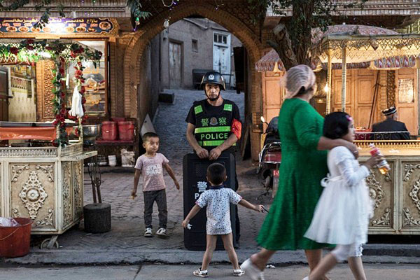

</a> 
<TABLE border="1">

	
<TR>
<TD align="center"><b> 《九评》编辑部新书——《共产主义的终极目的——中国篇》

	
共产主义来自何处？为什么宇宙中会冒出个共产党？共产主义的本质究竟是什么？结局又会怎样？对这些根本问题的答案，人们众说纷纭，现在是揭开谜底的时候了。</b> 
</TR>
<TR>
<TD>下载全书：<a href="https://github.com/pkey5/dj/blob/master/download/JPN-S-V2-171216.pdf?raw=true">PDF简体版</a>，<a href="https://github.com/pkey5/dj/blob/master/download/JPN-T-V2-171216.pdf?raw=true">PDF正体版，<a href="https://github.com/pkey5/dj/blob/master/download/JPN-S-V2-171216D.docx?raw=true">WORD简体版</a>，<a href="https://github.com/pkey5/dj/blob/master/download/JPN-T-V2-171216D.docx?raw=true">WORD正体版</a>，<a href="https://github.com/pkey5/dj/blob/master/download/Tekan_V24_P32_GB.pdf?raw=true">PDF高清杂志简体版</a>，<a href="https://github.com/pkey5/dj/blob/master/download/Tekan_V24_P32_TC.pdf?raw=true">PDF高清杂志正体版，<a href="https://github.com/pkey5/dj/blob/master/download/JPN-S-V2-171216D_GB2312.zip?raw=true">简体字TXT文本</a>  </TD>
</TR>
<TR>
<TD>下载：<a href="https://github.com/pkey5/dj/blob/master/download/ultiGoalCmCN8k.epub?raw=true">镶崁8k mp3 epub简体版电子书</a>，<a href="https://github.com/pkey5/dj/blob/master/download/gbUltiGoalCmChina.epub?raw=true">epub简体版电子书</a>，<a href="https://github.com/pkey5/dj/blob/master/download/twUltiGoalCmChina.epub?raw=true">epub正体版电子书，<a href="https://github.com/pkey5/dj/blob/master/download/goal8K.zip?raw=true">希望之声声音档(mp3)</TD>
</TR>
<TR>
<TD>下载：<a href="https://github.com/pkey5/dj/blob/master/download/Reasily_EPUB_Reader_v17.12.01.1_apkpure.com.apk?raw=true">安卓手机epub电子书阅读器apk，安装后点击左上角那三条横杠的菜单(一般智能手机都有支援ePub，安卓或苹果都可安装“掌阅iReader”这个APP，请自行注意安全)</TD>	
</TR>

</TABLE>
	

视频：

+ <a href='https://github.com/pkey5/dj/blob/master/download/30_wu_han_da_xue_sheng.mp4?raw=true'>30名武汉大学生人间蒸发！被活摘了吗？</a>
+ <a href='https://github.com/pkey5/dj/blob/master/download/wuhan_zhong_guo_de_qi_guan_yi_zhi.mp4?raw=true'>黄洁夫说：“没有武汉就没有中国的器官移植”，和武汉大学生失踪有关吗？</a>
+ <a href='https://github.com/pkey5/dj/blob/master/download/nan_hang_kong_yun_huo_ti_qi_guan.mp4?raw=true'>【重磅新闻视频】南航自曝空运活体器官，超过500宗。器官哪里来？</a>

<h1 align="center"><b>强行抽血与绿色通道背后的活摘器官罪恶</b></h1>

<table border="0" cellspacing="3" cellpadding="3">
<tbody>
<tr>
<td align="center"></td>
</tr>
<tr>
<td align="center">英国维吾尔协会负责人、外科医师安华‧托帝亮出手机内的照片，指出新疆某机场出现为特殊旅客、人体器官运输专门开辟的快速通道。（陈柏州／大纪元）</td>
</tr>
</tbody>
</table>

【大纪元2017年12月29日讯】中共宰割人民，而“宰割”竟然不是比喻。这个话题，会有多沉重？

从2000年开始，大陆器官移植呈爆炸式增长，等待供体的时间短得不可思议，在全世界绝无仅有。有些医院以促销招揽客户，还出现“包换包退”的广告词。非常迅速地，以人体器官为前提的移植手术，在中国成为带来巨大利润的新兴产业。在白色的病房内，隐藏着中共的灭绝人性和中共江泽民犯罪集团的滔天罪恶。

<b>强行抽血疑云</b>

多年来，大批法轮功学员在被关押期间经历了体检和抽血。有调查人员认为，这明显是以器官移植为目的而进行的。近几年，陆续发生了在家的法轮功学员也被强行抽血的事件。据明慧网报导，为了抽取法轮功学员的血样、口液，各地警察不择手段地上门骚扰、绑架，并且威胁家属。“追查国际”将其视为一项佐证，证实中共活摘器官至今仍然猖獗。

2017年12月14日，辽宁省锦州市义县城关乡派出所所长和警察到法轮功学员单明媛家抽血。当时单明媛不在家，结果警察抽取了她的丈夫王会华的血样，还告诉她丈夫说是好事。

12月12日，贵州安顺法轮功学员周智君被强行抽血。当天上午国保大队、派出所等人员上门，说要抽点血建档案，让周配合。周智君拒绝，但被四个人一拥而上、强行抽血并拍照。

2014年，明慧网发表了《多地警察上门逼迫法轮功学员验血》一文，报导了20多位法轮功学员被强行抽血的案例。他们来自辽宁、湖南、贵州、北京等地，包括80岁的老者。

独立调查中共活摘器官的美国记者伊森‧葛特曼透露，他在调查时发现，多个证人在中国监狱里被强行抽血和做相关的以器官移植为目的的体检。在葛特曼的著作《屠杀》中，有一位证人叫王春英。她被关押在马三家劳教所时，和其他30几个人一起被强行抽血。

王春英说，当时9个警察强行把她按在床上，“在脚脖子那里抽了5～6毫升血，我做了30年的护士，一般的肝功能、肾功能检查不用抽这么多血。这是正常血量的两三倍。这次抽血的背后一定有检查其它功能的目的。一直到我2009年11月份离开马三家，都没有把化验的结果告诉我们。”

中共在1999年7月镇压法轮功，从2000年开始，大陆器官移植迅猛增长，其发展的起点和高峰期恰与中共迫害法轮功重合。2006年，中共活摘法轮功学员器官在海外被首次曝光。此后10年，“追查迫害法轮功国际组织”和独立调查人员通过调查取证，取得了大量证据资料，证实：中共活摘器官确实存在，在中国存在着一个庞大的活体器官库，活摘器官的受害主体是法轮功学员。

<b>维族医生揭露中共</b>

维吾尔族人安华‧托帝（Enver Tohti）是目前唯一一位现身作证、实施过活摘器官的大陆医生。

1995年7月的一天早上，当时在乌鲁木齐铁路局中心医院工作的安华‧托帝，在主任的安排下，带着野外手术设备和两名助手，赶到乌鲁木齐西面的西山刑场。一名行刑后的犯人躺在地上，安华和助手快速摘除了犯人的肝脏和两个肾脏。托帝说，子弹打在犯人的右胸，他没有死，还可以活下去。可是，摘取器官终止了他的生命。主任叮嘱他说：“记住，今天什么事都没有发生。”

这个事件如噩梦般挥之不去，折磨著安华的良知。后来，他流亡英国，走上维护人权的道路、并毅然现身讲出当年在行刑场的经历。

今年10月，安华‧托帝到台湾举办讲座，揭露了中共活摘人体器官牟利的新证据——中共在新疆实施的“健民工程”。据安华‧托帝介绍，中共从2016年6月开始，以“全民健康体检”之名，只针对维族人进行大规模的全面抽血和体检。据去年9月份媒体报导，当时此项任务在新疆和田地区已经完成。今年根据伊森‧葛特曼的调查，至今有99.7%的维族人已完成抽血。

安华‧托帝质疑，这是中共为了扩大器官移植规模而建立血型配对器官库。他谈到，在中国大陆，“最便宜的东西就是人命”。中共没有道德底线，从来不把人当人看。出生在共产党统治以外的地方的人，不会了解共产党有多么邪恶。

谈到为何法轮功成为受害主体，托帝表示，“因为这群人不抽烟、不喝酒、器官品质好，因此，成为主要受难群体”。他还说，“在中国所有人、你只要把自己排除在共产主义分子之外的人，就是潜在被摘器官的目标”，因此，不只法轮功，被摘取器官的有维族、家庭教会等。他表示，如果能够在中国追踪到失踪人口，会发现，涉及器官摘取的失踪是很普遍的现象。

安华‧托帝提到，在一份中国医疗杂志里，有一篇“两例心肺移植术”的论文，其中写道：“供体入室后，按常规予以麻醉及插管”。从死人身上摘取器官为何要插管？外科医生的经验告诉托帝，“供体肯定是个活人！”他表示，这种医学案例居然公然发表在权威期刊上，“实在太恐怖了！”

<b>绿色通道 通向何处？</b>

2016年4月29日，中共国家卫生计生委、公安部、交通运输部、中国民用航空局、中国铁路总公司、中国红十字会总会六个部门联合发出《关于建立人体捐献器官转运绿色通道的通知》。随后，大陆各个航空公司争相开通“绿色通道”。

2016年5月9日，中共央视对全国首例通过“绿色通道”运送器官做了报导，当时是从700公里外的杭州转运到湖北武汉协和医院的一间移植手术室，全程仅用4个小时，“大大提高了器官成活率和手术成功率。”

据大陆媒体报导，南方航空公司自2016年5月开通“绿色通道”后，截至2017年10月，已运输活体器官超过500件，成功率达100%。

“追查国际”主席汪志远对此评论说：“中共大张旗鼓地开通‘绿色通道’并大力宣传报导，其实是要为当局宣称自2015年1月1日起公民自愿捐献器官成为移植供体的唯一来源而站台，以掩盖活体器官获得的真实来源。”

汪志远告诉记者，“绿色通道”说明“中共有庞大的器官供体库，统一调配，快速运转、使用。”“大陆各地很多城市都有活人器官库，大部分的人体器官是在当地获取。空运器官实际上比较少。尽管如此，仅南航这一个航空公司一年内就运输500多例活体器官，这是十分可怕的。”

汪志远还表示：完全有理由推测，“绿色通道”可以被中共用来运输活人，因为中共的活摘器官是按需杀人。

有关绿色通道，安华‧托帝医生在台湾时曾向记者展示他手机内的照片，显示在新疆某机场，出现为特殊旅客、人体器官运输而专门开辟的快速通道。机场地板上，可见以简体字和维吾尔字母书写的通道标示。

托帝认为，要让机场设立特殊通道，说明交通量庞大。“我觉得毛骨悚然！如果这是真的，这个交通量要有多大才能让一个机场建立这么一个专用通道？每天有多少个无辜人的生命被摘（器官被活摘）？”

<b>罪恶链条</b>

中共活摘民众器官，早有记录，并不始于法轮功学员。1978年4月，年轻女教师钟海源被执行死刑时，被活体取肾，就为了一位患肾衰竭的高干子弟。她的鲜血滴满了施行手术的军车底板。1995年，河北青年聂树斌被执行死刑，同样被指是“故意错判”，也涉及器官移植。

近几年，大陆曝光了武汉地下卖肾车间，还有江西圈养活人供取肾，听来都令人心惊不已。而这又怎能与中共政府权力运作下的大规模活体强摘器官、害命盗尸、甚至将尸体制成标本继续牟利的罪恶相提并论？

大陆网友愤然写道：“过去说共产党宰割人民，是一种比喻的说法，指它奴役、镇压人民。现在说共产党宰割人民，完全是一种叙述的说法，指它开枪血腥屠杀、活摘器官，等等。”

还有人说：“当法轮功学员的器官供体不够用的时候，普通民众就该被派上用场了。所以，那些说‘活摘器官和自己没关系的’老百姓啊，醒醒吧，在中共这台绞肉机里，每个人都可能成为那个供体。只有彻底摆脱中共从精神到肉体的控制，在中国解体中共，才是解脱之道！！！”

中共执政68年，虐杀生命、宰割肉体、禽兽不如。活摘器官被曝光，令世人看清暴政的极度邪恶。目前，美国、欧洲议会等国家和团体、全球的正义人士都严厉谴责中共活摘法轮功学员等良心犯器官的行径，要求中共立刻停止活摘罪行、释放无辜被关押的法轮功学员。

揭露中共、解体中共，就是脱离邪恶、拯救生命。只有抛弃中共、重建道德，才能杜绝发生在大陆的强摘和盗卖器官的罪恶。

责任编辑：高义

<h1 align="center"><b>“610”官员坦白的一起活摘案例</b></h1>

作者:玉清心

【大纪元2016年07月18日讯】2016年7月15日，在“追查国际”公布的最新调查报告中，有一例最新活摘案例：牡丹江市“610”官员朱家滨亲口承认活摘法轮功学员高一喜器官，器官“卖了”。

黑龙江省牡丹江市法轮功学员高一喜，男，45岁，2016年4月19日被牡丹江市公安局警察非法抓捕，仅10天就被迫害致死。

4月30日，高一喜16岁的女儿赶到火葬场。她在两米外看到父亲遗体：双目圆睁，双臂僵硬的向左右伸著，双腕铐痕明显，双拳紧握。胸背部肿胀很高，但是腹部却特别瘪。不到两分钟时间，她被警察拖走。

家属强烈质疑高一喜的器官已被活摘。为此，“追查国际”立案追查。调查员在对相关涉案人的调查取证中，获得涉案主要责任者之一，当地“610办公室”综合科科长朱家滨的录音证据。朱家滨直接承认活摘了高一喜的器官：“屠戮了，开肠破肚，就摘了，就卖了呗。”“追查吧，老子天下第一，老子怕啥，老子叫屠夫，专门干活摘的！”

高一喜被害案，是一起中共活摘法轮功学员器官的案例，在法律上完全可以认定。有犯罪的时间、地点、受害人、加害人，关键的活摘罪行，是由加害方朱家滨“坦白交代”的，他不但对活摘高一喜的犯罪事实供认不违，甚至还威胁调查员：“你现在要有胆量，站到我面前，我一样把你活摘了，老子外号叫屠夫！”

从被害人身份看，高一喜是法轮功学员，但有名有姓，有家庭有亲属。而中共已不限于报不报姓名，也不在乎有没有家属的追究，只要是法轮功学员，都是活摘目标。联想到近年大陆不少地区，警察对本地区法轮功学员强制抽血，甚至登门暴力抽血的现象。警察显然不怀好意！那又做什么用呢？警察只说是执行上面的命令。众所周知，被关押的法轮功学员被抽血，是为人体器官库做配型准备的。对未被关押、但在警方监控下的法轮功学员抽血，很可能也是为人体器官库做后续配型准备的，这是目前唯一能解释通的理由。

从案发地点看，也不限于法外飞地的劳教所、洗脑班。警察就从有登记制度的看守所里，把人拉去医院活摘，无所顾忌。

从案发的时间看，这是2016年发生的新案件。面对中共长期大量活摘器官杀人的残酷事实，从2006年的沈阳苏家屯事件开始，国际曝光已十年，中共并未收敛，仍旧无法无天。高一喜案在提醒人们，活摘法轮功学员器官的罪行始终没有停止，被杀害的人数在不断攀升，中共嗜血成性的本性没有改变。不解体罪恶的根源中共，活摘无法根除。

从犯罪证据看，这也是首例由“610”官员亲口承认的为了卖钱而活摘法轮功学员器官的案例。610官员朱家滨本人、非法抓捕高一喜夫妇的牡丹江市公安局先锋分局圆明社区警务室副队长吕洪峰等5人，在牡丹江第二看守所酷刑折磨高后送他去医院的刑警队副队长于洋等人，都是涉案人，哪个也逃不掉。

“610”官员朱家滨和调查员的对话录音中，朱家滨是一副杀人狂的变态，不禁令人毛骨悚然。江泽民创办的“610办公室”，确实是个十恶不赦的邪恶机构，正常人加入进去，会被变成魔鬼。各级“610办公室”，就是大大小小的魔窟，是中共犯反人类罪的桥头堡急先锋。今天的“610”，不但在继续“活摘”，而且公然叫嚣活摘，实在邪恶至极！

略有意外的是，过去“610办公室”在对法轮功的各种迫害中，总是藏在背后指挥操控。可以说，每一迫害实施，背后都少不了610的鬼影。而在高一喜案中，“610”骨干份子朱家滨，竟然自己跳出来，不打自招，直接了当承认活摘了，赤裸裸露出一副狰狞面孔，可谓“末日的疯狂”。

而这一反常举动，似乎也在预示，活摘的巨大黑幕不容再掩盖，暴行必须终结，真相必须公之于众。现在连主导活摘的“610”自己都迫不及待地跳出来，自曝黑幕。这或许表明，中共大限已到，活摘器官正成为压倒中共的最后一根稻草。#

责任编辑：高义

 

  <h1 align="center"><b> 中共高官青睐器官移植专家与产品的背后</b></h1>
 <table border="0" cellspacing="3" cellpadding="3">
<tbody>
<tr>
<td align="center"></td>
</tr>
<tr>
<td align="center">中国富商郭文贵曝出，江绵恒（如图）换肾三次，杀了五个人；孟建柱为母亲换肾，杀囚取器官；李友换肝，供体选了几十个。（大纪元资料室）</td>
</tr>
</tbody>
</table>
【大纪元2017年11月07日讯】在国际社会持续曝光中共强摘法轮功学员器官等滔天罪恶，以及中共原卫生部长黄洁夫明确宣布从2015年起全面禁止使用死囚器官后，中国大陆每年的器官移植数量仍远远超过其所公布的实际器官捐献量，这不能不让人高度怀疑其供体的来源，而对此中共仍讳莫如深。

事实上，中共的器官移植业随着其建政开始发展，最初的器官移植医生通过为中共高层保健服务而得到特权，并利用国家机器，特别是军队系统发展器官移植技术。中共则利用这些医生进行器官移植的培训和推广，形成共产党体系内特有的器官移植系统。

关于文革前后器官移植的案例公开的很少见到，但还是有一些透露出来。如1977年10月，301医院泌尿外科医生李炎唐进行肾移植，活体取肾，取肾车由警车开道，一路开绿灯，通过通讯兵部队架一条线，从取肾地点直接通到手术室，当肾取下可用时，立即通知手术，病人开始准备并开刀等待，两不耽误。再如1978年，江西小学教师钟海源被活体取肾，移植给高干子弟飞行员。

显然，早在文革前后，利用军队系统搞器官移植，特别是使用活体器官来提高移植品质成为了中共器官移植的特色，而罔顾伦理正是中共器官移植的罪恶所在。毫无疑问，这背后的黑幕远超人们的想像。不过，或许我们从众多中共高官青睐器官移植专家与产品，可以寻找到蛛丝马迹。

<b>中共高官多次接见肝胆移植专家吴孟超</b>

	
今年95岁，现海军医院附属东方肝胆外科医院院长、亦是福建医科大学名誉校长的吴孟超，刚刚获得“上海医学发展终身成就奖”。他先后受到邓小平、江泽民等高官的接见，2012年吴孟超的“先进事迹”被大力宣传并要求对其学习，死去的中共原军委副主席徐才厚也对其大加夸赞，坊间还有消息称，他被视为江泽民的“大功臣”。

根据官方报导，吴孟超先后完成了国内第一例肝脏外科手术和世界第一例中肝叶肿瘤切除术，创下了切除肿瘤重量最大、肝脏手术年龄最小、术后存活时间最长等多项世界纪录，开辟了肝癌基础与临床研究的新领域，因此被誉为“中国肝脏外科之父”。

2012年2月，吴孟超还获得中共央视颁布的2011感动中国人物奖。官方简历上介绍说，那时“他已亲手完成了1万4000多台肝脏肿瘤手术，其中肝癌切除手术9300多例，成功率达到98.5%……90岁高龄依然奋战在肿瘤手术第一线”。这其中有多少是肝脏移植手术？有多少供体来自法轮功学员？

不过官方不敢介绍的是，吴孟超治疗晚期肝癌，最常用的手法就是做肝移植来取代被切除的癌变肝脏，他一人就做了1.4万例，这就存在一个问题：他是从哪里得到匹配的肝脏呢？作为全军器官移植会议的首席顾问，并曾在一些医院的器官移植庆祝大会上发表贺词的吴孟超，他会不知道供体来源吗？显然不是。

同样，中共媒体不敢披露的是，他是江泽民最为关心的医生，曾被江至少四次接见。有知情人于2014年向海外《新纪元周刋》透露，江和吴的关系很特别，每次江参加医学界开会，只要江到会，必定要问一句，上海的吴孟超到了吗？这其中的潜台词大家都懂的。据说，2011年，在江濒死之际，也是吴孟超给其做器官移植手术。

而在江泽民1999年7月镇压法轮功并将活摘法轮功学员器官产业化、军事化后，吴孟超带领的东方肝胆外科研究所解决了器官移植中的某些问题，这使得江提出的活摘器官产业化成为可能，且利润丰厚。吴孟超为此得到江和军委徐才厚的多次嘉奖和奖励。

除了在东方肝胆外科医院做器官移植手术外，吴孟超还在福建医科大学开设孟超肝胆医院，在上海建吴孟超医学中心，在宁波医院建上海吴孟超医学中心分支，等等，而这些医院都涉及器官移植。哪里来的那么多供体？

<b>中共高官大赞器官移植外科主要创始人裘法祖</b>

	
说完吴孟超，不得不说说他的导师、中共器官移植外科主要创始人裘法祖。他早年留学慕尼黑大学医学院，获医学博士，抗战胜利后回国，主持创建了中国最早的器官移植机构——同济医科大学器官移植研究所。中共建政后，高官早期的器官移植的背后都少不了他和弟子夏穗生的影子。1993年，他当选中科院院士。

2001年，裘法祖获得了中国医学基金会“医德风范终身奖”。2004年，他90岁生日的那一天，时任中共中央政治局常委的吴官正、全国人大常委会副委员长的路甬祥等发来贺信，彼时任中共中央政治局委员、湖北省委书记的俞正声在讲话中代表省委、省政府向其表示祝贺，原全国人大常委会副委员长吴阶平在发言中大赞裘法祖，而湖北省省长罗清泉向其颁发荣誉证书。

无疑，裘法祖是因为为中共器官移植做出了突出贡献，才获得如此带血的“荣誉”的。

给江绵恒换肾的移植专家黎磊石跳楼后众高官发唁电
日前，身在美国的富商郭文贵曾大曝中共高官为何得了癌症还活着的秘密，这是因为他们可以换器官续命，“活摘器官，按需杀人”。他曝出江泽民之子江绵恒换肾三次，杀了五个人；原政法委书记孟建柱为母亲换肾，杀囚取器官；北大方正的李友换肝，供体选了几十个。他并指南京军区总医院副院长黎磊石就是给江绵恒、孟建柱之母换肾的医生，而他2010年“跳楼”而亡的背后鬼影幢幢。

黎磊石堪称中国肾移植的鼻祖。官方媒体报导其头衔包括：中国工程院院士，解放军肾病研究所所长，南京大学医学院临床学院副院长、教授，国际著名肾脏病专家，中国肾脏治疗创始人，一代医学宗师。官方媒体还称，2004年，在他和学生进行的肾移植手术中，人、肾存活率达100%。可以推测，以江绵恒父子在中国的权势，为江绵恒换肾，非请黎磊石不可。

至于其肾移植中心，则从最初的每年移植十几例发展到一百多例，成为国内最大的肾移植中心之一，到2004年肾移植手术突破一千例。黎磊石还主持编写了《中国肾移植手册》，大陆很多肾移植医生都是读这本书出来的。

如此替中共效命的黎磊石不仅获得了江泽民的亲自接见，而且2007年中共军方还下发《向黎磊石学习的决定》，他亦立二等功五次，三等功八次。

耐人寻味的是，黎磊石死后，包括刘延东、李源潮、徐才厚、蒋树声、梁光烈等在内的中共高官纷纷发唁电、唁函或敬献花圈和花篮。是什么原因让这些高官如此做的呢？

<b>中共器官移植“掌门人”黄洁夫背后的高官</b>

	
提到中共原卫生部部长、中共器官移植的“掌门人”、现人体器官捐献与移植委员会主任黄洁夫，国内外移植届都不陌生。他历任中山医科大学附属第一医院肝胆外科主任，副院长、院长，中山医科大学校长兼党委书记；学术方向为肝脏移植和肝胆道恶性肿瘤外科学治疗；2001年11月任卫生部副部长，2005年7月升任中央保健局局长，是负责中央保健委员会专家组、中央保健会诊专家的总管，负责所有中共中央领导人的医疗保健。

而黄洁夫的前任吴阶平是泌尿外科医生。从1960年吴阶平进行第一例肾移植开始，利用活体器官进行移植手术，满足中共党、政、军界高级人员健康需要便成为惯例。

要知道，老年人的保健以心血管、慢性病为主，是内科医生的专长，泌尿外科医生和肝移植外科医生成为中共高级领导的保健总管，本身就是违背医疗常识的。这背后的猫腻中共高层心知肚明。黄洁夫背后有多少中共高官的支持也就可想而知了。

自然，黄洁夫这样的背景也使其成为了中共当局应对国际社会指责其强摘法轮功学员器官的最佳人选。

在这几年的公开表演中，正是黄洁夫公开承认中共使用死囚器官，也是他公开否认活摘法轮功学员器官。正是他在2009年9月公开宣布“中国目前已累计开展器官移植超过10万多例，成为仅次于美国的第二大器官移植大国。我国每年开展的器官移植手术已超过1万例次。其中，开展最多的是肾移植，累计8万6800例。目前每年进行肾移植手术6000例左右”，也是他避而不谈供体的来源。

而2005年9月，黄洁夫曾参加以时任中共政法委书记的罗干为团长的中央代表团前往新疆，为一名46岁的肝癌患者进行手术，手术中需要备用肝脏作移植准备，24个小时内就取来了两个匹配的肝脏，在医学界上创了世界纪录。

<b>诸多高官纷纷前往参观威高集团</b>

	
中共十九大前，有消息称，山东威海首富董事长陈学利的代表资格被取消，而这十分蹊跷。资料显示，在过去的十多年中，有多名中共高官先后考察过该集团，他们中有吴官正、吴邦国、罗干、李鹏、刘云山、王乐泉、薄熙来、张高丽、回良玉……如2003年8月，时任中共中央政治局常委、中央政法委书记的罗干来到威高；2004年8月10日，时任商务部部长的薄熙来到威高；2005年5月，时任新疆一把手的王乐泉率自治区党政考察团视察威高；7月6日，时任中共中央政治局常委、全国人大常委委员长的吴邦国来到威高；2007年9月，时任国务院副总理的回良玉也来到威高；2013年11月，刘云山亦来威高调研……

为何高官们如此青睐威高集团？这极有可能与其产品中用于血液透析或器官移植所产生的排异反应的免疫吸附柱有关，这是2005年威高集团与中科院大连化物所合作开发的，此产品打破了德国费森尤斯公司的垄断。

可以佐证威高集团深度介入器官移植的证明之一是，2016年6月，威高集团与红基会共同成立博爱基金，包括中国器官移植发展基金会理事长黄洁夫在内的若干官员和器官移植医生参加了成立仪式。

另外，2007年12月威高集团与世界500强之一的美国美敦力公司签署合作协议，建立战略合作伙伴关系，也不容忽视。在双方成立的合资公司中，美敦力公司控股51%。美敦力是世界最大的医疗科技公司之一，主要为慢性疾病患者提供终身治疗方案。

美国记者安妮．切尼（Annie Cheney）在她的《人体经纪人：透视美国的人类器官地下交易市场》披露，在美国，人体器官的市场很大，是个有数十亿产值的产业，支撑著尖端研究和每日的医疗过程。对于发展科学知识、完善医疗技术这样利润丰厚的重要事业而言，死者身上的组织、脏器、腱、骨骼、关节、四肢、手、脚、残缺部分和头颅是不可或缺的。强生、美敦力医疗产品等大公司需要依靠人类器官来指导他们开发医疗设备。研究者们依靠它们磨砺自己的外科手术技巧，甚至制造化妆品。医生们则用它们来替换心脏瓣膜、治疗烧伤病患、换骨，甚至垫高嘴唇、消除皱纹。

根据1968年美国通过的《统一组织捐献法》规定，买卖死者遗体都是非法的。但是这同一部法律又规定，如果是为了填补由保护、运输、储存和加工尸体而发生的成本，这样做是合法的。这样的漏洞也就意味着，骨骼、组织、脏器、关节、四肢、头颅甚至是残缺不全的遗体在市场上都是紧俏商品，研究人员、产品开发者和医生的需求远远超过供应。如头颅可以卖到900美元以上，腿将近1000美元，手、脚和胳膊每个几百美元。全部肢解和掏空以后的一具尸体在公开市场上可以卖到将近1万美元。

在美国获取尸体需要高额代价的背景下，美敦力公司和生产用于器官移植排异反应产品的威高集团合作，尽管没有明确的证据，但很难不让人联想这背后是否存在一些黑幕，比如将被强摘的尸体、器官卖到美国？

<b>结语</b>

	
除了郭文贵曝出中共强摘器官的黑幕一角外，今年9月20日，互联网上出现的“国安委骨干与某红二代的神秘对话”也部分涉及了这一话题。对话称，中共统治者爬到顶尖位置后，就只有两个目的：一是保持政权的永久稳固；二是琢磨如何长生不老，怎么能活得更长、更高质量地活下去。为了延长寿命，可以不惜一切代价。

对话中提到，中国最大的资源就是人口，那是取之不尽、用之不竭的DNA储存库。领导们都有几千亿、上万亿元的巨额财富，现在科技发达了，有了那么多钱后，都想延年益寿，想长生不老。经济上受益，身体也要受益！能换肾，能换肝，心、肺什么都能换，于是换完内脏换脑器官。人在接受器官移植后，会产生难以避免的排斥反应，因此需要定期地换血清、换血，而部队里的年轻战士就是第一梯队，他们的血清被源源不断、无偿地输送给中央领导们。

另据海外追查迫害法轮功国际组织的报告，中国存在着庞大的活人器官供体库，以法轮功学员为主体，同时也有藏族、维吾尔族、基督徒和其他中国人。强摘器官是中共集团操控整个国家机器而进行的，党、政、军、武警、司法和医疗系统等都有涉入。他们对普通百姓进行隐秘屠杀、盗取器官，从而为中共权贵的健康和利益服务。这也意味着有大量中共高官身上都不同程度沾染了这样的罪恶，而上天之眼已一一记下。他们需要记住的是，靠罪恶延长的生命并不能真正延长生命，反而招致恶报，遭天惩。生死有命，富贵在天，这个世界上人是说了不算的。#

责任编辑：莆山

 

 <h1 align="center"><b> 一个武警的觉醒</b></h1>
 

 
这是辽宁省锦州市的一名曾担任活摘法轮功学员器官现场的持枪警卫的证词，披露了几年前目击的一起活体摘取法轮功学员器官的事实。

事件回放。2002年，证人为辽宁省公安系统工作，参与了非法抓捕、拷打法轮功学员的行动。其中一位30多岁的女性法轮功学员，经过一个星期的严刑拷打、强暴、被强迫灌食，已经是伤痕累累。2002年4月9日，辽宁省公安厅某办公室派来两名军医，一名是沈阳军区总医院的军医，另一名是第二军医大学毕业的军医，将该名学员转移到另一场所（注一），在这名女学员完全清醒的情况下，没有使用任何麻药，摘取了她的心脏、肾脏等器官。证人当时持枪担任警卫，目击了活体摘取的全过程。

部份谈话录音记录

证：手术刀在胸脯，一刀下去，血是喷溅出来的，血是喷溅出来的。问：你看到的是男的还是女的？证：女的，女的。问：年轻的么？证：30多岁吧。问：你说一下她当时是怎么说的。证：当时，我们经历了就是，得有一个星期对她的审问，严刑拷打，身上已经有无数次伤疤，并且电棍、电，她已经神智不清……神智不清，把她打的，已经就是，反正她又

不吃东西，然后我们强行的给她灌牛奶，往她的胃里，她不喝就强行的给她灌。你知道那个，把她的鼻子捏上，于是维持着。她7天瘦了将近15斤，经过体重。而这个时候不知道，可能是辽宁省公安厅某办公室，反正是一个挺保密的部门，派了两个，一个是解放军沈阳陆军总医院的一个军医，还有一个是第二军医大学毕业的，具体反正一个是岁数大的，一个年轻的，在某、某，就是给她送精神病院的一个手术室，然后进行一套东西。不打任何麻药，刀在胸脯上，他们这个手啊一点抖都不抖，要是我下手我一定抖了。别看我在武警，我端过枪，我也进行过实弹演习。但是，我也见过很多死尸，但是看到他们，我真的佩服他们这些军医，手一点也不抖，直接戴着口罩拉出来。当时我们一人拿一把手枪在旁边站岗，那个女人就嗷……大叫一声，说法轮大法好。证：说你杀了我一个人，大概意思就是你杀了我一个人，你还能杀了我们好几亿人么，为了自己真正的信仰被你们迫害的人么？这个时候，那个医生、军医犹豫了一下，然后看了我一眼，又看了我们的领导一眼，然后领导点了一个头，他还继续把血管……先摘的是心脏，还是再摘的肾。当心脏的血管剪动一下，她就进行抽搐，非常可怕的，我给你学下声音，反正我也学不好，撕裂的撕裂的那样式的，然后就啊啊……就一直张着大嘴，睁着两个眼睛，张着大嘴。哎呀……

我不想再讲下去了。……证：当时，这个人身份是一个老师啊，是一

个老师，在中学教书的老师，她的儿子今年可能12岁了吧。她的老公是个没什么能耐的一个，也是一个工人吧。在这之前，她受过的羞辱更大。我们的民警有不少就是变态的那种，给她进行，用钳子、用窥视器，都是不知道哪来的仪器，反正我都亲眼所见，我当时没照照片就是遗憾，对她进行属于是猥亵，她长的有点姿色，比较漂亮，对她进行强暴……，太多了。问：就是在你所待过的那个公安局里面你就亲眼看……证：当时我没在公安局里做，是在一个就是培训中心，就在一个宾馆的后院，包了十个房间，一个小楼上，就是小别墅那块儿做的。问：黑监狱。证：差不多。问：你只有对他们逼供一次？还是很多次？证：很多次。当时王立军，现在的重庆公安局长，下死命令“必须斩尽杀绝”。……注一：在最初交谈中，证人为了不暴露自己，没有明确说出活摘器官的场所。在第二次交谈中，证人明确说出活摘器官是在沈阳军总医院15楼的一间手术室内进行。经核实，沈阳军区总医院15至17楼均为外科。

 <h1 align="center"><b>【独家】沈阳陆军总院实习医生亲历活摘器官 军队押送 持枪逼迫 活摘肾脏 活取眼球 我快崩溃了</b></h1>
 <table border="0" cellspacing="3" cellpadding="3">
<tbody>
<tr>
<td align="center"></td>
</tr>
<tr>
<td align="center">旅居加拿大的乔治90年代亲历了中共活摘器官的全过程，他最近向大纪元披露了那可怕的经历。（伊铃/大纪元）</td>
</tr>
</tbody>
</table>
【大纪元2015年03月05日讯】（编者按：当大纪元记者伊铃如约来到采访地点时，乔治不安的表情还是让人吃了一惊。那是一种发自内心深处、压抑了许久的一种痛苦。这种表情，在采访过程中多次出现；不止一次，这种痛苦令乔治不得不停下来；也不止一次，他的脸上现出深深的恐惧。为了安全考虑，本文隐去了具体时间和受访人的细节。）

口述：乔治，采访、撰文：伊铃

事情发生在上世纪九十年代。当时我是某军医学校即将毕业的学生，正在沈阳陆军总院泌尿外科实习。有一天医院突然接到沈阳军区的电话，说是一个军事命令，要求医务人员马上上车，去执行一项军事任务。

<b>秘密军事任务</b>

当时大概是下午时间，记得还刚吃过饭。科主任开始点名，没被点名的医生、护士要求离开；被点名的人员留下来，我也在点名之内。然后科主任命令：所有留下来的人从被点名的那一刻起，切断与外界的一切联系，包括跟亲人、朋友；任何人不能碰通讯工具，如电话机等。

出发时，我一片茫然，不知道要去干什么。我们这些被点名的医生、护士共6人，其中2个女护士（一个护士长，一个护士），其余4个男人（3名军医加我这个实习生）。然后马上集合，上了一辆被改装过的面包车。

上车时，发现医院出动了2辆同样被改装过的面包车，我们上了其中的一辆。另一辆的情况不清楚。我还看到，我们车前面有军车，军车的门还没关，里面是拿着枪的士兵。

上车以后，车子马上启动。前面有军车开路，车开出陆军总院以后，就上了高速公路，车速特别快。开路的军车打着警灯，呜呜的叫，高速路上所有的车都给我们让道。

我们坐的车内用淡蓝色的布完全封闭，一路上也不让看外面。透过布帘的缝隙，我看到副驾驶座上也是坐着带枪的士兵。

车开到一个地方停下来，我们下车，发现这个地方周围有很多山，建筑物的周围有穿军装的士兵站岗。有一个军官来接待我们，听那位军官说，这是离大连很近的一个军队监狱。

<b>活摘肾脏</b>

当天晚上，我们住在当地军队招待所，房间外面有士兵站岗。早晨起来，一个护士跟2个军人到监狱里去取血，对血型。取血回来之后，我们全都上车，车子很快启动。也不知道到了什么地方。停下车之后，我从虚掩的门缝向外看：原来，我们车的周围全是站着拿冲锋枪的士兵，所有军人都是脸朝外，后背朝内。

我们在车上等著，不许有任何动静。这个改装车后面的门能打开，没有锁死，是虚掩的。过了不久，突然有人敲车门。推开门之后，只见4个体格强壮的军人押著一个人过来。

押上来之后，把人平放在黑色塑料袋上面。车上早就铺好了一个大概2米多长的黑色塑料袋，特别宽长，一看是特制的。我看到那个人的两只脚是用一种特制的、类似于纤维的、很细的绳捆住。这种绳勒住，一动就会陷到肉里。他双手被反绑在身后，脖子上绕了一根绳，跟后面绑着的双手连着。只要踩着他背后这根绳子，人就起不来。因为一动，就勒住脖子，人没法起来，挣扎不了。

进来之后，对面的医生告诉我，让我踩住他，不让他动。当我按住他的腿时，我能感觉到他的体温是热的。

我看到他的喉部全是血，正在流动的鲜红色的血，整个喉部被血流的模糊，看不清伤口的形状，但可以肯定有伤口。

这时，所有医护人员在护士的协助下迅速穿好手术服，包括帽子、口罩、手套，只留2只眼睛。我当时充当的角色是助手，负责剪断动、静脉、输尿管。护士长马上用剪刀把他衣服剪开，然后用消毒液在他的整个腹部到胸部，大面积消毒3遍。

这时，其中一个医生拿着手术刀，从剑突下（胸骨下）作切口，一直划到脐部，作一个大切口。当时他的腿在抽搐，他的喉部已经发不出来声音。然后医生把整个腹腔打开。当时，血啊、肠子啊一下就冒出来。一个医生把肠子往对面一推，很快就取到一侧肾脏；对面的医生负责取另一侧的肾。

只听到医生说让我去剪动、静脉。当时要求必须留出来一截做吻合用。当我用伸出去的剪刀一剪下去，血一下就喷出来，身上，手上喷的全是血。这血还在流动，证明人是活的。

医生动作非常熟练、速度非常快。当时，左右两个肾脏都取出来了，肾脏已经在医生手里了。另一个护士拿着一个恒温盒，取出来的脏器就放在恒温盒里。

<b>活取眼球</b>

	
同时，我对面的医生让我去取眼球。我当时是坐着，我向他的脸部看去……我看到，他睁著一对十分恐怖的、无法用语言表达的眼睛，看着我……恐怖，无法用语言表达的恐怖。真是看着我，他的眼皮还在动，他是活的……

我脑袋已经一片空白，全身发抖，虚弱无力，都已经不会动了。这太恐怖了！

我想起头一天晚上住招待所时，里面的一个军官来告诉我们负责人说：不到18岁，是个非常健康的活体。难道是他？活体摘除器官，太可怕了。

我告诉那个医生，我做不了。

这时，对面的医生，用左手手掌把他的头狠狠的摁在地板上，2个手指把他的上眼皮把住，右手拿止血钳一剜，整个眼球就出来了……

当时，我不能再做什么了，我在发抖，全身是汗，处于虚脱的状态……

<b>等待活体器官</b>

	
这时，一个医生敲了一下隔板，副驾驶位上的军人就用对讲机呼叫，然后后面车门进来4个军人，用另一个2米多长的黑色塑料袋把那个人整个套住。此时他已经不会动了，军人把他拖到车门外停著的、一辆带蓬的军用卡车上。

这时我们的车门快速关上，启动。我们所有的手术服，手术帽，橡胶手套全都放在一起，等著回去销毁。车子在军车开道下，以特快速度往回开。

回到医院，我们把器官送到手术室。此时，手术台上已经站着另一批手术医生，他们早已准备好，在等著做器官移植手术…….

此时，我已经不能再做任何事，全身软弱无力。主任看我的情形，让我在一边休息。旁边有休息的地方，我还能看到他们在做手术。

<b>精神几近崩溃</b>

	
由于极度的恐惧和惊吓，我回家以后全身无力，开始发高烧。当妈妈问起，我只是简单讲了一下缘由，妈妈以为只是普通的外科手术，并没有当回事。我不敢跟任何人说起，家里其他人都不知道。从那以后，我很快离开了沈阳陆军总院。

但是痛苦远远没有结束。一方面，这件事情太恐怖了，我承受不起再刺激，我不想再提起；我也担心被中共追杀，被灭口；加上我亲眼见到鲜活的生命遭受虐杀，内心极度不安。这种无形的精神压力，使我痛苦不堪。

很长一段时间内，无论是白天还是晚上，眼前显现的都是那个恐怖的场景：那个面包车内，所有工作人员穿着白色手术衣，白橡胶手套、白帽子、白口罩，只有2个眼睛露外面，车顶是强光灯照着，底下躺着的是一个被活体摘取器官的、我们的同类，一个活生生的生命……他的那双眼睛，那个无法用语言表达的痛苦的、恐惧的眼神，就那么恐怖的看着我……

我的心灵承受不了，没有亲身经历过的人无法体验那种痛苦。很长一段时间，我感觉都快要疯掉，人要崩溃了。这么多年过去了，经历多年的心灵挣扎，那种恐怖的记忆仍然无法抹掉。多少年来，我不想去触及，有意回避它。因为一提起这件事，我就无法自持，感觉就要崩溃。

当海外媒体曝光大陆活摘器官时，我一下就明白了：这一切都是真的，而且在中共的军队系统早已存在。只不过，镇压法轮功让他们找到一个更大的器官供应源。

加拿大独立调查员、加拿大前亚太司司长大卫∙乔高(David Kilgour)认为对中国最好的帮助就是制止中共活摘器官。

美国的资深中国问题专家葛特曼（Ethan Gutmman）2014年8月12日正式发售他的新书《屠杀》。他表示，新书中披露了大量的新证据证实中共强摘人体器官的罪恶，特别是在1999年中共镇压法轮功后，开始大规模强摘法轮功学员器官，并且这个罪恶现在还在继续。他指出，前中共政法委书记周永康在其中是一个重要人物，中共最高层都知情。

责任编辑：岳怡；复核编辑：姜斌

	
<h1 align="center">【720系列】对中共活摘器官说不（上）</b></h1>	
<table border="0" cellspacing="3" cellpadding="3">
<tbody>
<tr>
<td align="center"></td>
</tr>
<tr>
<td align="center">2016年6月23日，美国国会众议院外交委员会举行联合听证会。左一为大卫‧麦塔斯，左二为伊森‧葛特曼。（李莎／大纪元）</td>
</tr>
</tbody>
</table>
【大纪元2016年07月15日讯】1999年7月20日，中共党魁江泽民出于妒嫉，一意孤行，发动了对法轮功的镇压。迫害机制开足马力，动用整个国家机器，企图消灭这一精神信仰群体。谎言诬陷、仇恨宣传、酷刑虐杀、精神折磨、株连亲属⋯⋯乌云蔽日，黑白颠倒。江氏的群体灭绝政策，催生了无数罪恶，制造了无数悲剧。十七年里，惨烈的迫害事实，几经辗转，冲破封锁，不断地从中国大陆传出。

2006年3月，有证人在海外曝光，中共在劳教所活体摘取法轮功学员器官，贩卖牟利，焚尸灭迹。这是针对法轮功学员、已知的、最邪恶、最恐怖的犯罪行径。十年来，“追查迫害法轮功国际组织”及海外独立调查员们坚持不懈、调查取证，获得了大量数据资料和证人证词，证实中共强摘器官的数量惊人。同时，海外法轮功学员不遗余力地向社会各界揭露中共罪行，呼吁正义支持，共同制止中共活摘器官的反人类罪行。在多方努力下，此重大人权侵犯事件已经引起了国际社会和主流媒体的广泛关注，谴责罪恶、要求将首恶绳之以法的正义之声不断高涨。中共活摘法轮功学员等良心犯器官是人类历史上最大的恶行，也成为考验全人类良知的一道关卡。善恶之间，何去何从？

<b>调查中共活摘法轮功学员器官大事记</b>

2006年3月9日，原辽宁省中西医结合医院员工安妮，作为第一名证人，向海外媒体曝光中共活摘法轮功学员器官的罪恶。她的前夫曾活体摘取过大约两千名法轮功学员的眼角膜。

2006年3月10日，“追查迫害法轮功国际组织”开始了面向中国大陆的系统调查。

2006年7月6日，受邀进行独立调查的两位加拿大人——著名国际人权律师大卫‧麦塔斯（David Matas）和前加拿大联邦议员、亚太司司长大卫‧乔高（David Kilgour）共同发布了“关于调查指控中共摘取法轮功学员器官的报告”，确认了活摘指控，称此罪行乃“这个星球上前所未有的邪恶”。

2009年10月，《血腥的活摘器官》（Bloody Harvest）英文版在加拿大出版发行，该书是大卫‧乔高和大卫‧麦塔斯于2006年发表的调查报告的第三版。

2012年7月12日，《国家器官：移植在中国被滥用》（State Organs: Transplant Abuse in China）正式出版。该书汇集了全球四大洲七个国家的医学界、法律界及人权专家的11篇论文，探讨了中共以国家机器的方式滥用器官移植的现象。书中说，中国的器官移植不同于其它任何国家，几乎所有用于移植的器官都来自于囚犯，其中许多是良心犯。杀害囚犯获取他们的器官，冲破了最基本的医学道德与伦理的底线。

2014年8月12日，美国资深记者、中国问题专家伊森‧葛特曼（Ethan Gutmann）所著《大屠杀》（The Slaughter）出版。葛特曼通过实地考察和对难民的采访，在书中讲述了中共活摘法轮功学员和其他良心犯器官的暴行。

十年来，“追查国际”经过持续系统的追查，包括对5名中共政治局常委、1名军委副主席、政治局委员、国防部长、前解放军总后勤部卫生部长等，对中国865家器官移植医院的上万通电话调查，对9500多名移植执业医生的几十万份公开媒体报导、医生论文、医院网站备份和数据库资料的多轮搜索和分析论证，共采集到2000多个电话录音证据，获取了上万条资料证据。

2016年5月19日，“追查国际”发表了一份21万多字的综合报告，呈现了60个电话调查录音证据、1628个资料证据，得出如下结论：
一、活摘法轮功学员器官是江泽民下令中共主导的国家系统犯罪。
二、活人器官供体库最初的主体来源涉嫌是数百万被非法抓捕的上访法轮功学员。
三、六大类证据揭示中国存在着庞大的活人器官供体库。
四、中共活摘法轮功学员器官没停反增，而且两次出现了大量的突击移植，2015年只用了捐献的器官是骗局。
五、大量数据分析得出：大量法轮功学员因活摘器官被中共虐杀。

2016年6月22日下午2点，在美国国家记者俱乐部，加拿大前亚太司长大卫‧乔高、美国资深调查记者伊森‧葛特曼和加拿大人权律师大卫‧麦塔斯，联合发布了中共强摘人体器官的最新调查报告。这份题为“血腥的器官摘取／大屠杀：更新版”（Bloody Harvest/The Slaughter: An Update）的报告显示，中国发生的实际器官移植数量远远超过官方公布的数字。三位联合作者估计，中国器官移植手术数量每年约为6万至10万例。在过去的十五年中，在大陆，估计进行了大约150万例器官移植手术。这些器官的主要来源是法轮功学员，因此，被强摘器官致死的法轮功学员数量比之前的调查所估计的要高得多。（报告链接：http://goo.gl/0AWxc5）

2016年6月23日下午，美国国会众议院外交委员会举行联合听证会，题为“强摘器官：对野蛮行为的审视”。大卫‧乔高、伊森‧葛特曼、大卫‧麦塔斯等人在听证会上作证。

伊森‧葛特曼发言说：“1999年，中共安全系统发起消灭法轮功运动。截至2001年，超过一百万的法轮功学员被关押进劳改系统并被迫接受以牟利为目的的器官检查。与此同时，中国的军队和地方的移植医院大量增多。”

追查迫害法轮功国际组织（简称：追查国际）公众事务主任李祥春说，在中国，器官供体在等待器官受体，并且有充足的供体可提供大量的候补供体。

<table border="0" cellspacing="3" cellpadding="3">
<tbody>
<tr>
<td align="center"></td>
</tr>
<tr>
<td align="center">2016年6月29日下午，三位独立调查员受邀来到欧洲议会举办听证会，发布了关于中共活摘良心犯器官的最新调查报告，促请欧盟采取行动立即制止中共的活摘罪行。（凌宇／大纪元）</td>
</tr>
</tbody>
</table>

2016年6月29日下午，三位独立调查员——大卫‧乔高、伊森‧葛特曼、大卫‧麦塔斯又受邀来到欧洲议会举办听证会，并提交了关于中共活摘良心犯器官的最新调查报告，促请欧盟行动制止中共活摘器官。大卫‧麦塔斯说：“这个更新版调查报告的最终结论是，中共令整个国家参与到大规模谋杀之中，而受害者主要是无辜的法轮功学员，但也有维吾尔族人、藏族人以及家庭教会成员，中共这样做的目的是获得用于移植的器官。”

<b>证据证词 指向活摘</b>

在明慧网和大纪元的报导和采访文章里，有一些大陆法轮功学员被迫害致死的案例疑似涉及活摘器官。现仅列举三例如下：

法轮功学员王斌，原黑龙江大庆油田勘探开发研究院电脑软件工程师。2000年8月，王斌因欲进京上访被抓、被非法劳教一年。在大庆男子劳教所，王斌拒绝转化，多次被毒打。2000年9月24日晚，王斌被毒打四十多分钟，奄奄一息，身体多处黑紫，10月4日晚，王斌死亡。两名法医王春彪、齐井福摘取了他的内脏。王斌的妻子在太平间拍下丈夫尸体的照片。在王斌的前胸，有一条粗大的缝合伤口，从脖颈到胸腹，惨不忍睹。

<table border="0" cellspacing="3" cellpadding="3">
<tbody>
<tr>
<td align="center"></td>
</tr>
<tr>
<td align="center">王斌遗体（明慧网）</td>
</tr>
</tbody>
</table>

法轮功学员李淑媛，葫芦岛市连山区台集屯镇大荒地村村民。2002年7月6日晚，李淑媛因为发法轮功真相资料被便衣追捕后遇害。7月7日，家属到村边的河套认尸。现场有两辆写有“公安”的白色警车。公安、法医、台集屯派出所的人围住李淑媛的尸体。李淑媛一丝不挂躺在地上，从胸部到小腹全被剖开，肉皮分敞着，白色的肋骨根根支露著，内脏：心、肺、肝、肠、肚等所有腹中的东西全部被摘取掏空，鲜血淌了一地，摘出的器官用四五个袋子装着放在尸体旁，法医再把腹部刀口缝上。李淑媛的家人吓得瘫倒在地。警察随手写了一张“窒息死亡”的验尸报告证明，又说：“心脏没病，脑子没病，我们拿器官去化验。”随后，两辆公安警车带着李淑媛的器官离开现场。

法轮功学员江锡清，是重庆市江津区地方税务局干部。2008年5月14日，江锡清被绑架、判非法劳教一年。在其刑满前不到四个月，当局突然通知家人，江锡清“死亡”。2009年1月28日晚上，亲属在殡仪馆看遗体，女儿江莉说：“我们摸一下父亲的身体，是热的，当时比我们的手温还高。”家人质疑人没有死，要求抢救，但是被几个彪形大汉强行拉走。2009年3月27日中午，重庆市检察院第一分院的处长周柏林对家属表示：“你父亲的整个内脏器官被提取作了标本。”

2009年12月12日，“追查国际”公布了辽宁省锦州市的一名活摘现场持枪警卫的部分证词：2002年4月9日，在沈阳军区总医院15楼的一间手术室内，证人持枪警卫，亲眼看到两个军医（其中一名军官证号码0106069）将一名30多岁的修炼法轮功的中学女教师，未经施打麻药，活生生地摘取了她的心、肝、肾器官。在此之前，女教师遭受了一个月的严刑拷打、侮辱和强暴。证人说：“手术刀在胸脯，一刀下去，血是喷溅出来的。”“先摘的是心脏⋯⋯当时心脏血管剪刀一下，她就进行抽搐，非常可怕的，⋯⋯撕裂的那样式的，然后就啊⋯⋯就一直张著大嘴，睁著两个眼睛，张著大嘴。哎呀⋯⋯我不想再讲下去了。”

2016年6月，重庆的访民邓光英向海外媒体曝光了重庆当地多起活摘器官的事实案例。她特别讲述了亲身见证的法轮功学员徐真在2011年10月20日凌晨被活摘器官致死的经过。根据明慧网的资料，徐真是重庆合川区法轮功学员，2011年9月20日因为发放法轮功真相资料被绑架，9月26日被劫持到重庆市女子劳教所，2011年10月20日被迫害致死，年仅46岁。

邓光英说：“这个活摘人体器官，把合川区一个叫徐真的活摘了。我亲眼看到是这样的：他们把徐真抓上来就使劲疯狂地打，把全身都打肿了！然后叫她写出捐献器官的自愿书，她不写，不写就把她全身扒光，用一个小小的机器把嘴巴摁起，摁起之后用水灌满矿泉水瓶子，灌了十瓶水（野蛮灌水）。有个叫贾征（当晚她值班，是迫害法轮功的主要队长，警牌号是5032053），还有一个叫陶忻（主管迫害法轮功的队长，警牌号是5032177），她们两个把她（徐真）拽起，一个蹬左边，一个蹬右边，先把人家血抽了，抽血之后，它们劳教所还叫医生在劳教所这边来挖她的眼睛。她在被挖眼睛的时候是2011年10月20日凌晨2点，我看了钟的！她的惨叫声多凄凉啊，轰动了整个四大队：‘啊！它们活挖我的眼睛啊！’她的叫声惊天动地，惊动了整个四大队的劳教学员。”

邓光英说，活挖眼角膜通常在重庆女子劳教所4楼进行，狱警会让牢头狱霸把守在活摘现场外。残忍的活摘现况让狱霸都承受不住惊吓。

（未完待续）

责任编辑：高义	

	
<h1 align="center"><b>【720系列】对中共活摘器官说不（下）</b></h1>
<table border="0" cellspacing="3" cellpadding="3">
<tbody>
<tr>
<td align="center"></td>
</tr>
<tr>
<td align="center">6月13日，美国国会众议院一致通过343号决议案，首次在国家层面正式确认中共活摘器官罪行，引国际聚焦，震荡效应还在发酵。（AFP）</td>
</tr>
</tbody>
</table>
【大纪元2016年07月20日讯】<b>国际谴责中共强摘器官 媒体关注</b>

自从2006年中共活摘法轮功学员器官的黑幕被揭开，在法轮功学员的努力推动下，以色列、西班牙、意大利、澳洲、加拿大、美国、台湾等国家和地区，都在通过立法等方式阻止或规范与中国有关的器官移植行为。

2008年11月21日，联合国要求中共立即组成独立调查团，对法轮功学员受到酷刑虐待甚至被活摘器官的指控进行调查，并要求对进行迫害的责任人绳之以法。

2013年12月12日，欧洲议会通过一项紧急议案，要求中共立即停止活体摘除器官，并呼吁中共“立即释放”包括法轮功学员在内的所有良心犯。决议要求：“欧盟对中国境内的器官移植以及与这种不道德行为相关的迫害做出全面、透明的调查。”

2013年底，全球54个国家和地区超过150万人联署致联合国的请愿信，要求制止中共活摘器官。

2016年6月13日，美国国会众议院一致通过343号决议案。决议案作出六项决定，其中四项针对中共，两项针对美国。内容包括：要求中共立即停止摘取所有良心犯器官；立即停止对法轮功持续十七年的迫害，释放所有法轮功修炼者和其他良心犯；要求中共允许针对器官移植滥用进行独立调查；要求美国国务院就禁止向参与强摘器官和人体组织的中国人和其它国家人士提供入境签证的实施情况，向国会提交年度报告等。

对于美众院的343号决议案，长期关注“活摘”的人士表示，该项立法肯定了活摘器官报导的可信性，认定了中共政权的罪责，意义重大。

中共已故大将罗瑞卿之子、原总参航空装备处处长罗宇表示：“全世界都在注意这件事（中共活摘器官），而且这件事是证据确凿。因为在世界上总有人在发声，总有一个正义的声音来谴责一切罪恶，这就是美国国会决议的意义。”

<table border="0" cellspacing="3" cellpadding="3">
<tbody>
<tr>
<td align="center"></td>
</tr>
<tr>
<td align="center">6月22日，活摘器官最新调查报告新闻发布会现场（李莎／大纪元）</td>
</tr>
</tbody>
</table>
2016年6月23日，美国国会众议院就法轮功学员等良心犯器官被强摘召开了听证会，这是美国国会自2006年以来第三次就同一主题举行听证会。

在听证会上，众议院欧洲欧亚潜在威胁小组主席达纳‧罗拉巴克（Dana Rohrabacher）议员说：“中国共产党是当今世界最邪恶的力量之一。中共支持的系统性强摘器官行为是滔天罪恶。中共不仅每天剥夺人民的基本权利，而且真实地在盗取他们的器官牟利。”他认为，“追究中共的责任非常关键。我们今天发出的信息是：我们关注在中国正在发生的囚犯，特别是法轮功良心犯被强摘器官的问题，这是我们所不能容忍的。”

今年4月底，来自5党派的12名欧洲议会议员共同发起了48号书面声明，指出在中国的良心犯被强摘器官的行为必须立即被制止，并要求欧洲议会应刻不容缓地对在中国发生的活摘器官进行独立调查。根据欧洲议会程序，书面声明在发起后三个月内，如果签名支持的议员达到751名议员总数的一半（376人），这项书面声明将会被提交给欧洲理事会和欧盟委员会，这两个部门被要求调查中共活摘罪行，并敦促欧盟各国公开谴责这一罪行。

至7月14日，签名支持48号书面声明的欧洲议员人数达到402人，已超过所需人数，这意味着，根据议会章程，欧洲议会将在三个月到期后的第一次全体会议上，宣布通过制止中共活摘器官的书面声明。

比利时议员德梅斯马克（Mark Demesmaeker）是书面声明的发起议员之一，他向记者表示，欧盟在和中共打交道时，一定要提法轮功受迫害问题，欧盟要坚守自己的原则和价值观。他说：“人权不仅仅是为了欧盟，这是普世价值，它把世界上的人维系在一起，包括美国社会，也包括中国。”

爱沙尼亚的议员图恩‧克兰（Tunne Kelam）是另一位书面声明发起人。他说：“150万无辜的中国人被强摘器官，这不仅仅是议员的事，是关乎每一个人的事。只有在独裁、没有人权的国家才能发生的事。这是反人性的罪恶。欧洲议会将要求独立调查，议会将会传递给委员会这样的信息——今天我们正在面对这样的罪恶，不能因为与中国的利益关系而忽视，它是用人性为代价的。我们要接下这个任务，来帮助结束这样恐怖的罪行。”

英国议员杰拉德‧巴登（Gerard Batten）在发言时强调：“中共政府迫害屠杀上百万无辜民众，我们怎能熟视无睹，与中国商讨战略合作？中共大规模系统地强摘良心犯器官用于移植牟利。估计有100万至150万人被强行摘取器官后杀害。中国正在发生的事情，堪比纳粹德国（对犹太人的迫害），没有人性，恐怖。最大的受害群体是遵循‘真、善、忍’修炼的法轮功修炼者。”巴登说：“各国政府应该联合起来，国际上如联合国、所有大洲、所有政府应该一起反对在中国发生的（活摘器官）罪行。”

针对中共活摘器官的罪行，麦塔斯说：“（活摘器官）这种犯罪不只是针对法轮功的，也是针对人类的犯罪。反人类罪行会让所有人遭遇不幸；反人类罪行，也是对我们（每个人）的犯罪。” 葛特曼表示：“当今人类最大的敌人是群体灭绝。”

大卫‧乔高表示：“这一反人类罪行持续在中国发生，现在已经持续了十七年了。每天都有法轮功学员因强摘器官而被杀害。一定要制止这一切，一定要告诉中共政府，你们没有权利杀害你们的公民，而且是无辜的公民，他们日复一日、月复一月地被杀，这一定要马上停止。”

大卫‧乔高对现任中共政权喊话：“对中国来说最庞大的腐败，就是每年为摘取器官而杀害6万到10万人。”他说：“如果习近平主席想改变中国形象，最好的办法是立即制止这一强摘器官的行为。我想习和活摘器官的江泽民并无关联，他应该现在就制止，而不应再等上两年。每年有几千人，甚至5万—10万人在死亡。”

近期，围绕中共强摘法轮功学员等良心犯器官的罪行，西方多家主流媒体和权威期刊对此进行了深度报导和探讨。这些媒体包括：美国的美联社、美国有线新闻网CNN、《新闻周刊》、《华盛顿邮报》、美国之音、自由亚洲电台；加拿大的《环球邮报》、加拿大电视台CTV；英国的《每日邮报》、《泰晤士报》、《独立报》；新西兰的《先驱报》；澳洲的《澳洲新闻集团》（News.com.au）；日本的《外交家》杂志等。

德国美因茨古腾堡大学医学中心的李会革教授表示：“开始，国际媒体态度是比较谨慎、怀疑，不敢相信在当今社会中还存在如此野蛮的犯罪行为。然后经过十年各方的努力，现在媒体认识到了这点，这个犯罪就是人类历史上前所未有的罪恶。现在大量媒体在报导，接下来会产生很大的媒体效应。”

<b>清算反人类罪 审判江泽民</b>

加拿大著名人权律师麦塔斯（David Matas）曾指出：“活体摘取法轮功学员器官的事情就是群体灭绝罪。江泽民、周永康、薄熙来等迫害法轮功的元凶，应该像曾经虐杀犹太人的纳粹分子一样接受惩罚。”

联署支持343号决议案的美众院非洲全球健康与人权小组主席克里斯‧史密斯（Chris Smith）议员建议，海牙国际法庭应对中共的反人类罪行进行调查。史密斯说：“决议案是一个工具、向中共政权发出的一个明确信号，杀人并窃取器官是反人类罪，中共必须停止。这一恐怖的人权暴行主要针对的是法轮功学员。参与活摘器官者应该受到法律制裁。海牙国际法庭应调查中国时刻发生的粗暴践踏人权和反人类的罪行。”

大陆前中共总书记赵紫阳的政治秘书鲍彤先生曾表示：“凡是活摘器官的人、活摘器官的党、活摘器官的政府都应该受到人类的谴责，都应该站到历史的审判台上成为被告，接受审判。”

中国权利运动负责人胡军曾在受访时强调，必须要法办迫害法轮功的元凶，“特别是政法系统的‘610’，对于法轮功学员的劳教、酷刑、监狱，还有活摘器官，一切的反人类罪行，在解体中共以后对他们进行清算，这是必然的，必须要绳之以法，这是历史要求，对他们的清算和审判是历史的必然。”

对于审判迫害法轮功的元凶，前陕西电视台编辑马晓明说：“现在屠杀人民的刽子手，它无权对受害的人民进行平反，它只能得到人民和历史的审判。所以我认为公审这些镇压人民、残害人民的刽子手，是唯一正确的选择。”

2015年5月以来，有超过20万名法轮功学员及家属向中共的最高司法机关控告迫害元凶江泽民，罪名包括“反人类罪”、“酷刑罪”和“种族灭绝罪”。在亚洲，已有138万民众于台湾、日本、韩国、香港、印尼、新加坡、马来西亚等地签名，参与刑事举报江泽民的全球联署行动。抓捕江泽民，伸张正义，是沸腾的民意、百姓的呼声。

<b>制止暴行 不应沉默</b>

中共活体摘取法轮功学员等良心犯的器官，罪恶滔天，震惊世界，令人发指。有网友留言：“魔鬼！魔鬼！！这是魔鬼才能干出的事啊！”“中共之邪恶，已远远超出人类的底线，可以说是魔鬼的化身，全世界有良知的人们，尽快联合起来，制止中共的暴行。”

<table border="0" cellspacing="3" cellpadding="3">
<tbody>
<tr>
<td align="center"></td>
</tr>
<tr>
<td align="center">6月7日到9日，在欧洲议会期间，欧洲各国人士签字反对中共活体摘取法轮功学员器官（明慧网）</td>
</tr>
</tbody>
</table>

在关于中共活摘器官的调查报告里，每一个数字就是一个生命。人权惨剧面前，保持沉默、任由生命随着时光的流逝而消逝，是对良知的亵渎，是作为人的耻辱。我们必须审视，审视野蛮的行为，审视内心的波动。

反人类罪行，关乎这个星球上的每一个人。当邪恶越过了红色的底线，当反人类罪在文明的外衣下持续不停，当鲜活的器官从躯体里被掏出、沦为制造利润的商品，当信仰的自由、生命的价值、人类的尊严在邪恶的屠刀下被肆意践踏蹂躏，所有良知未泯的人都必须发出呼喊：停止活摘！停止犯罪！审判凶手！

道德的标尺恒定矗立，岁月的钟摆悄然晃动。今日的一念抉择，摆放明天的位置。光明的大潮即将到来，冲刷一切邪恶，启动正义的审判，掀开新世纪的风云录。

责任编辑：高义

	
<h1 align="center">江绵恒换肾与中共权贵摘器官续命内幕</b></h1>
<table border="0" cellspacing="3" cellpadding="3">
<tbody>
<tr>
<td align="center"></td>
</tr>
<tr>
<td align="center">江泽民手握党政军大权后，江绵恒深得其父贪欲真传，也很快赢得“中国第一贪”的头衔。图为2008年11月11日，江绵恒在北京一场演讲的照片（大纪元资料室）</td>
</tr>
</tbody>
</table>	
【大纪元2017年09月23日讯】（大纪元记者唐青报导）九月份，离中共十九大召开只有一个月。此时，逃亡美国的中国富商郭文贵，大曝中共高官为何得了癌症还活着的秘密。因为他们可以换器官续命，“活摘器官，按需杀人”。他曝出，江绵恒换肾3次，杀了5个人；孟建柱为母亲换肾，杀囚取器官；李友换肝，供体选了几十个。

无独有偶，在互联网上，这两天出现了“国安委骨干与某红二代的神秘对话”。对话内容显示，中共领导们都有几千亿甚至上万亿的财富，他们不但想长生不老，而且什么器官都想换，换完内脏再换脑器官。中国最大的资源是人口，14亿人就是他们丰富的供体。

<b>江绵恒换肾 多个信息源涉及</b>

	
郭文贵在9月1日的直播中指控，现任政法委书记孟建柱是江泽民的家臣。江泽民长子江绵恒2004到2008年在南京医院几次换肾，都由孟建柱、上海政法委领导和军队几个领导在背后组织、选人、为肾配对。孟建柱1996－2001年任上海市委副书记，2001－2007年任江西省委书记，2007年开始任公安部部长，一路升迁，官至政法委副书记、书记、政治局委员。

郭文贵还爆料，江绵恒换肾，“为什么换3个肾，却杀了5个人？因为那两个杀错了，配对配不好。”

江绵恒换肾一事，并非空穴来风，此前已有多个媒体报导他患上了肾癌。

据维基解密爆料，美国驻上海总领事馆2007年12月4日发出电文，引述南京大学一名顾姓教授的话透露，江泽民原有意在政治上积极扶植长子江绵恒，但因江绵恒身患肾癌，动过至少两次手术而作罢。

香港《前哨》杂志2015年3月号披露，2004年，江绵恒查出肾癌，在上海摘除了一个肾。文章还指，时任上海书记陈良宇没有去看望江绵恒，直到江绵恒出院才赶去，江泽民对此不满。海外《人民报》网站2005年12月也有报导披露，江绵恒当时因患肾癌在医院做手术。

<b>“活摘器官 按需杀人”</b>

	
换肾的不光是江绵恒一人。郭文贵还爆料，孟建柱的妈妈又换肝又换肾，孟建柱的妻子也换过两次肾。为寻找活肾，孟的心腹孙力军等人从狱中积极找囚犯配对，杀人取器官，并一度为此杀错了人。为掩盖真相，他们又将为孟母做手术者和知情者都灭口。孙力军现为公安部副部长兼公安部一局局长，是孟建柱的前秘书。

3月份，郭文贵对大纪元记者爆料，方正集团原董事李友换肝涉活摘器官。李友为了换肝，前后选了几十个供体。

郭文贵在视频中多次指控中共权贵“活摘器官，按需杀人”。他举过这样一个例子：一个新疆的21岁小伙子，因为住酒店时使用了假身份证，被抓住以后，被验出他的肾和某领导的家人匹配，结果他被以涉嫌恐怖主义要搞爆炸的罪名，判处死刑。他的肾就这样给换走（盗走）了！而他的肝则给了另一个领导的家人。

那些因为器官被杀害的人的家属，有的已经到了国外，有的还在国内。郭文贵表示，未来想请他们在“全球发布会”上爆出真相。

外界一直传孟建柱和周永康不和。郭文贵9月15日在视频中爆料称，周永康听说孟要“弄他”时，周大笑说：“你知道我当年在冶金部的时候，管土地资源的时候，我送给江泽民和老常委、新常委的人，一车一车的高含量的金属、含金石，哪家没有十几车啊？他们哪家没几条命案啊？！他们换那肝，换那肾，都哪儿来的？不都是杀的新疆人吗？不都是抓的那些年轻人吗？武警部队里边儿，那么多人换血给他们家里边儿，养着他们。杀我周永康？过来试试？我让他们都先死！”

<b>换器官续命 中共权贵的福利</b>

	
有网友在郭爆料后留言说：“江绵恒换肾换器官，那只是中共暴政下的冰山一角，而中共历来至今老革命老干部老领导党国前任现任，哪个不是通过更换器官，更换新鲜血液延年益寿，其实换器官，更换新鲜血液，是党国统治者们的医疗福利，按级别大小，按家族祖辈身份等，享受不同的医疗福利保障。包括特供产品等。”

9月20日，互联网上出现“大舌头的神秘录音”，也有称“国安委骨干与某红二代的神秘对话”。对话称，中共统治者爬到顶尖位置后，就只有两个目的：一是保持政权的永久稳固，二是琢磨如何长生不老，怎么能活得更长、更高质量地活下去。为了延长寿命，可以不惜一切代价。

对话中提到，中国最大的资源就是人口，那是取之不尽、用之不竭的DNA储存库。领导们都有几千亿、上万亿元的巨额财富，现在科技发达了，有了那么多钱后，不但想长生不老，而且什么都想换，换完内脏换脑器官。人在接受器官移植后，会产生很复杂的排斥反应，因此需要定期地换血清、换血，而部队里的年轻战士就是第一梯队，他们的血清被源源不断地、无偿地输送给中央领导们。

今年8月20日，郭文贵预告他将在9月份爆“猛料”时，这样质问道：“为什么有些领导他们得了癌还活着啊？为什么他们的孩子得了癌还活着啊？为什么他们在南京一个人换肾能干掉7个人的肾啊？最后让他还活着，多活了二十几年了！为啥啊？器官移植！这不是假的。为什么李友能器官移植啊？为什么啊？器官移植为什么两三次啊？李友都十几年得了肝癌了！为什么啊？”

种种迹象表明，为了给中共权贵阶层服务，活摘器官在中国形成了国家产业。 “追查国际”的报告揭示：中国存在着庞大的活人器官供体库，以法轮功学员为主体，同时也有藏族、维吾尔族、基督徒和其他中国人。活摘器官是以江泽民为首的中共集团操控整个国家机器而进行的，党、政、军、武警、司法和医疗系统等都有涉入。他们对普通百姓进行隐秘屠杀、盗取器官，从而为中共权贵的健康和利益服务。

<b>两个肾病名医跳楼身亡</b>

郭文贵在9月6日直播中还指控说，马航失联是一起“政治暗杀事件”。原因是江绵恒曾以化名找权威换肾，但是过后，捐肾者、操刀医生和家人都死亡。他说，失联的马航飞机上有不少乘客是和江家、孟家换肾有关的人员，还有公安部一局、三局的人员，但是死后却被当成平民身份。因此，这一事件涉及江家杀人灭口。

郭文贵指称，南京军区总医院副院长黎磊石就是给江绵恒、中央政法委书记孟建柱家人换肾脏的医生。“怎么跳楼了？为什么沾上江家就跳楼呢？为什么上海医院李保春也跳楼呢？是谁给他推下楼的？”

郭提到的黎磊石和李保春两人，都被“追查迫害法轮功国际组织”列为活摘器官责任人而进行追查。离奇的是，这两人都以跳楼的方式结束了生命。

黎磊石堪称中国肾移植的鼻祖。官方媒体报导他的头衔包括：中国工程院院士，解放军肾病研究所所长，南京大学医学院临床学院副院长、教授，国际著名肾脏病专家，中国肾脏治疗创始人，一代医学宗师。官方媒体还报导，2004年，在他和学生进行的肾移植手术中，人、肾存活率达100%。可以推测，以江绵恒父子在中国的权势，为江绵恒换肾，非请黎磊石不可。

据香港《明报》2010年3月底报导，当年3月16日，84岁的黎磊石从南京自家14层高楼纵身跃下，当场身亡。但官方仅称黎“因患肿瘤长期医治无效与世长辞”。事件在当地民众间引发各种议论。有关黎磊石跳楼的信息，记者在截稿时还可以在百度百科查到。

<table border="0" cellspacing="3" cellpadding="3">
<tbody>
<tr>
<td align="center"></td>
</tr>
<tr>
<td align="center">黎磊石跳楼而死的信息在百度百科还能查到。（网页截图）</td>
</tr>
</tbody>
</table>

李保春也是著名的肾脏病学专家，中国透析移植协会委员，上海长海医院肾内科主任、主任医师、教授、博士生导师。据《扬子晚报》2007年5月24日报导，2007年5月4日下午4点左右， 李保春从上海长海医院大楼12层跳下死亡，年仅44岁，正处在事业黄金期。家人对他的死“十分悲哀，难以接受”“妻子邱璐一直死死抓着遗体不让送进棺木，在钉入棺木的一刻发出声嘶力竭的哭喊声”。

<table border="0" cellspacing="3" cellpadding="3">
<tbody>
<tr>
<td align="center"></td>
</tr>
<tr>
<td align="center">上海第二军医大学附属长海医院关于移植专家李保春的简介，他于2007年5月4日跳楼自杀。 （长海医院网站截图）</td>
</tr>
</tbody>
</table>

郭文贵怎么会了解江绵恒、孟建柱家换器官的内幕？他说他亲自参与过。他在9月1日的爆料视频中说，“法轮功原来说换器官，我原来以为是假的。现在是真的！我想很多话我还不能说。我就亲自参与过这样的事情，我就亲自参与过！我未来讲！”

郭文贵从江派阵营倒戈，令外界得以窥探江派黑幕的一角。中共活摘器官的罪恶，是否还会有更多真相曝光，且等郭文贵、“张文贵”、“刘文贵”等的“下回分解”。

责任编辑：李京	

	
<h1 align="center">中共建活摘器官库 对象恐扩及普通民众</b></h1>
<table border="0" cellspacing="3" cellpadding="3">
<tbody>
<tr>
<td align="center"></td>
</tr>
<tr>
<td align="center">追查迫害法轮功国际组织主席汪志远表示，从中国许多医院按需杀人的大量急症移植，活人器官免费大促销等举动观察，活人器官供体库的确存在。 (马有志)</td>
</tr>
</tbody>
</table> 
【大纪元2017年12月27日讯】（大纪元记者庄丽存台北报导）1999年后中国器官移植业爆炸性增长与中共迫害法轮功的时间同步，2000年以前，中国器官移植数量有限。据公开资料显示，从1980到2000年年底，报告累计的肾移植数量总共为34,832例，这个数字在2000年后飙升。医师分析，从不断发现的新证据中，包括器官移植等待时间超短、法轮功学员被强迫验血、一台手术多个备用器官、活摘曝光后的突击移植、多台移植手术同时进行、急诊肝移植数量惊人等，发现中国确实存在活体器官供给库。

究竟这些年来中共器官移稙的数量到底有多少？追查迫害法轮功国际组织（下称“追查国际”）主席汪志远表示，中共活摘器官的数量具体有多大，鉴于种种众所周知的原因，目前不能给出具体数量。但是，基于中共活摘法轮功学员器官是国家犯罪，数百万上访被抓的法轮功学员是活人器官供体库的主体来源，从许多医院按需杀人的大量急症移植、活人器官免费大促销等举措观察，活人器官供体库的确存在。

根据追查国际的调查，截至2016年7月，查获中共891家医院及9,519名医生涉嫌参与活摘器官移植，从事肝、肾移植的医院有712家，遍布整个中国大陆版图，其中包括军队、武警系统和相当数量不具备移植手术条件的中医院、法医院、儿童医院、县级医院和专科医院等。

汪志远表示，追查国际根据查获的证据研究发现，在中国每年有约19.2万～28.8万例的器官移植量，其中每年上千例的器官移植中心有96家；每年做上百例手术的地方肝、肾移植中心有50家；三甲医院加上移植技术资质评估未获通过，但却开展移植手术的军警医院408家；另有移植技术资质评估同样未获通过，但却开展移植手术的中小型移植中心153家等。

他指出，中共大量活摘法轮功学员器官的国家犯罪始于2000年初，至今还在继续。根据追查国际10多年来系统调查所获的大量证据证实，1999年以来，以前中共党魁江泽民为首的中共犯罪集团操控整个国家机器，包括党、政、军、武警、司法系统和医疗机构，对法轮功修炼群体实行了系统性迫害。追查国际已经完成了对江泽民等中共犯罪集团大审判前的证据准备。不只法轮功学员一般百姓也成活摘对象。

台湾法轮功人权律师团发言人朱婉琪表示，到目前为止，从2006年中共活摘器官事件被揭露后，中共活摘器官都没有停止过，在中国的医院等待器官移植时间还是非常短、价格非常大，甚至有的等待时间不到1个月、1～2周都有。换句话说，中国仍存在非常庞大的器官供应库，同时法轮功学员失踪人数还在继续增加当中，甚至在中国大陆东北地区仍有公安上门抓法轮功学员时，强迫抽血检查，这种事情一直在持续当中。

中共为何要否认活摘器官？参与活摘器官犯下什么罪名，能逃过法律的审判吗？朱婉琪说，根据《刑事法》反人类罪的规定，针对特定的团体进行酷刑、广泛的攻击，是反人类的罪责，但目前为止中共根本不承认有活摘器官这件事情，即便有中国法律也不会有人被惩罚，若中共开放让加拿大前亚太国务卿大卫・乔高（David Kilgour）及国际人权律师大卫・麦塔斯（David Matas）进入中国进行独立调查，要求所有中国医院提供资料，很多事情经过透明化就会很快水落石出。

朱婉琪强调，在中共一党专政下，难以制止国家机器参与活摘器官，目前不只是针对法轮功学员活摘器官了，甚至是一般中国老百姓都会成为活摘的对象；因此，其它国家应该要向国际组织求援，向中国表态，除了国家议会通过之外，这是政府与政府之间应该谈的，否则，中国小小的老百姓便可能朝不保夕。◇#

责任编辑：杨亦慧	

<h1 align="center">法轮功学员在家被强行抽血说明什么？</b></h1>
<table border="0" cellspacing="3" cellpadding="3">
<tbody>
<tr>
<td align="center"></td>
</tr>
<tr>
<td align="center">油画《活摘器官》，作者：董锡祥。作品取材于一位执刀医师太太的证词：良知尚存的医生看到一张纸片从挣扎的法轮功学员口袋里掉落，上面写着‘祝妈妈生日快乐’，这时他猛然意识到自己是在犯罪。他的良心受到强烈地谴责，使他无法继续工作。（大纪元资料图片）</td>
</tr>
</tbody>
</table> 
【大纪元2017年12月21日讯】12月中旬，四个国保大队、派出所人员闯进贵州安顺市法轮功学员周智君的家中，对她强行抽血，称要建档案。

11月初，四个警察对贵阳市法轮功学员左应芬采血未遂，就强行采其唾液。警察说，不采血，他们就没了饭碗。

10月，七八个警察翻墙入门，闯进山东省临沂市法轮功学员李克梅家中，将她按住强行抽血。因其反抗，将其手扎满针眼。

大陆不断发生警察去法轮功学员家强行抽血的事件。这一现象令外界不禁联想到国际媒体曝光中共活摘器官罪行。

近十几年来，中国器官移植数量暴涨，其器官来源一直受外界质疑。从2006年活摘器官黑幕曝光后，大量调查报告指证中共这一罪行。美国、欧洲议会、澳洲、意大利、加拿大、爱尔兰等多国政府部门、机构相继通过决议案，制止中共强摘法轮功学员等良心犯器官。

曾获诺贝尔和平奖提名的加拿大著名人权律师大卫‧麦塔斯（David Matas）和加拿大前亚太司司长大卫‧乔高（David Kilgour），十年来对中共活摘法轮功学员器官做了详细调查。其中大量的案例证实，法轮功学员在监狱被系统地验血和被检查器官。

“大量法轮功学员在监狱里被迫害致死，很显然他们并不关心这些人的健康。”那么验血只能解释为，“大量的法轮功学员正在被活体摘除器官后杀害”，麦塔斯说。

2012年12月12日，欧洲议会通过了制止中共活摘法轮功学员及良心犯器官罪行的决议。2016年6月13日，美国国会众议院一致通过343号决议案，要求中共立即停止针对法轮功学员等良心犯的“强摘器官”行为。该决议案获得185位国会议员的联署。

成立于2003年驻美国纽约的追查迫害法轮功国际组织（简称“追查国际”）自2006年至今，对中共活摘法轮功学员器官做了大量详实的调查，发表了21万字的综合报导，不断曝光中共这一罪行。

在押的法轮功学员至今仍被大量抽血，同时在家的法轮功学员也被强行抽血，“追查国际”将其视为中共活摘器官至今仍然猖獗的佐证之一。

在2016年7月至2017年6月间，该组织对中国大陆169家移植机构进行了电话跟踪调查。从获取的数据证明，这些医院至今几乎都在大量进行器官移植手术，年移植量达上百例至千例。

“这种现象可以解释，为什么警察至今还在不断地对在家的法轮功学员抽血的原因。”“追查国际”的发言人汪志远如是说。

明慧网报导，为能抽到法轮功学员的血，包括口液，以检验其DNA的情况，各地警察不择手段地上门骚扰、威胁、绑架他们，甚至威胁他们的家属。

2014年明慧网上发表的《多地警察上门逼迫法轮功学员验血》一文，报导了20多位来自辽宁、湖南、贵州、北京等地的法轮功学员被强行抽血的案例，其中80岁老者也未能幸免。

以下仅列举上面提到的三个最新案例的详情。

警察翻墙入门强行抽血
2017年10月17日，山东省临沂市沂水县姚店子镇凤台庄村法轮功学员李克梅，被姚店子派出所骚扰。

当日上午，姚店子派出所的七八个警察去李克梅家。因农忙，她没在家。下午警察又去一次，还没找到她。到晚上9点多钟，警察又去，她已睡觉。他们就大喊开门，她拒绝。

警察就翻墙入门，用万能钥匙把大门打开，门大厂著，锁头被扔掉；还伪善地骗李克梅打屋门，门打开后，所有人一拥而进，摁著李克梅就扎针抽血。李克梅反抗，警察就故意把针往其手上扎，扎得她满手都是针眼。抽完血，没搜着什么东西，警察才离开。

国保大队上家抽血
12月12日上午10点多，贵州安顺市法轮功学员周智君正在洗菜，听门铃响就去开门。一下闯进六个人，三男三女，有国保大队、派出所、雅沐园片区网络等人员。她认识其中的三人：田成华、陆智华和一位熊姓女性。

他们说要她配合，抽点血建档案。周智君说：“不抽！我如果配合了你们，就是在帮你们犯罪。”他们又让其丈夫劝她，并说，如果不抽就要带走拘留！

她丈夫尝试跟他们讲中共迫害法轮功真相，田成华和另一个跳起来说：“不要跟我们说这些。”

约僵持半小时，四个人一拥而上，将周智君按住，对她强行抽血；另一个男的对她拍照；陆智华还扯她的头发。

强行采集口液
11月6日上午，贵州遵义市红花岗区金顶镇派出所警察刘飞、刘启刚等四人，到了住居在贵阳市的法轮功学员左应芬家里，她当时不在家。警察强逼其女儿找到她，务必叫她与他们见面。

下午，一见到左应芬，刘飞未出示任何身份证件，拿起手机就对她录像。左应芬说：“你是在违法！”并给他们讲自己炼法轮功的益处，劝他们不要助恶为虐。

刘飞说：“是上面安排的，叫我们今天必须采到你的血，要不我们的饭碗都没有了。”还威胁道：“你的户口在遵义，否则（不让采血的话），我们就把你带回遵义或通知所在地的派出所。”

刘飞、刘启刚等人在对左应芬女士采血未遂的情况下，非法强行采集了她的唾液。

在此前，10月31日，左应芬不在家时，警察就到她儿子家，说非要和她见面，而且还要录像、录音、采血等。至今，她的儿女还吓得不敢告诉她警察当时骚扰和威胁他们的详情。

国家犯罪行为
2016年4月29日，中共国家卫生计生委、公安部、交通运输部等六个部门发出《关于建立人体捐献器官转运绿色通道的通知》。

大陆媒体报导，自此，各航空公司广泛使用“绿色通道”。截至2017年10月，南航已通过此通道运输活体器官超过500件，成功率达100%。

汪志远表示，仅南航一家一年就运输500多例活体器官，这十分可怕。“绿色通道”说明“中共有庞大的器官供体库，统一调配，快速运转、使用。”

在他看来，这个供体库，需要大量匹配器官，因而出现警察对法轮功学员有组织有系统地抽血，“这是国家性犯罪行为所致”。＃

文字整理：李洁思、责任编辑：高静	

	
<h1 align="center">追查录音曝江泽民直接下令用法轮功学员器官做移植</b></h1>
<table border="0" cellspacing="3" cellpadding="3">
<tbody>
<tr>
<td align="center"></td>
</tr>
<tr>
<td align="center">追查国际日前调查显示，前中共国家主席江泽民批示用法轮功学员器官做移植。（大纪元资料室图片）</td>
</tr>
</tbody>
</table> 
【大纪元2014年10月01日讯】2014年9月，追查迫害法轮功国际组织（简称追查国际）对原中共解放军总后勤部卫生部部长白书忠进行了关于军队活体摘取法轮功学员器官做移植的犯罪活动调查。白书忠供认是前中共国家主席江泽民批示用法轮功学员器官做移植。

白书忠在录音中说：“当时是江主席啊，……有一个批示，有一个批示的话就是说，说开展这些事情，就是器官移植。…… 因为当时江主席批示以后，反法轮功大家都做了很多工作，……”

白书忠还说“……应该说，就是开展肾移植的不单是军队一方，……”

该调查结果进一步证实了，由原中共党魁江泽民直接下令活摘法轮功学员的器官的罪行，是由江泽民等前中共最高当权者利用国家机器，在全国范围内对法轮功学员进行的一场群体灭绝性的大屠杀。

这场屠杀最残忍的方式是活体摘取法轮功学员器官，在中共官方的秘密组织和保护下， 在司法系统和军队、武警、地方医疗机构相互配合下进行的系统犯罪，其性质是群体灭绝罪及反人类罪！

下面是部分调查录音。

A —- 原中共解放军总后勤部卫生部部长白书忠
B —- 追查国际调查员

A：喂？
B：喂，是原总后卫生部白书忠部长吗？
A：啊，你是哪里呀？
B：……，我们有一些情况想向您了解一下啊，
A：你怎么着，你是
B：啊？
A：你什么时间？有什么事？你说，
B：是这样，在您担任总后卫生部长的时候啊，摘取在押法轮功人员器官做器官移植手术这件事情是当时的总后部长王克布置的任务？还是军委直接下达的命令哪？
A：当时是江主席啊，
B：嗯，
A：有一个批示，有一个批示的话就是说
B：嗯，
A：说开展这些事情，就是器官移植，
B：嗯，
A：后来江主席，听说有一个批示，就是人员卖肾，做手术，这个，应该说，就是开展肾移植的不单是军队一方，
B：我们也得到了一些情报，就是说当时，联勤部还负责关押了一批法轮功在押人员的器官供体，是不是？
A：这个，这个当时的话，唉哟，我觉得，起码在我印象中，当时，是吧，因为当时江主席批示以后，反法轮功大家都做了很多工作。
B：你们和这些联勤一分部、二分部包括联勤四零分部，他们负责的军队医院有没有直接领导和被领导的关系？
A：我们这几个军医大学就能掌控的、咱们总后直属单位几个军医大学反复要求，因为那时江很注意这个问题，很重视这个问题。
B：谁很重视这个问题？
A：江啊，当时，江在位的时候，
B：嗯，
A：还是很重视这个问题，都有批示的。
B：您是从在98年至2004年担任这个……
A：对，对，对，担任卫生部长，总后卫生部长，98年到04年，
B：行吧，我们先初步地了解这些，
A：行，行，好，好，以后有机会，有什么事你问我，没问题啊
B：行，好，谢谢。再见。
A：再见。

据追查国际最新跟踪调查结果表明，这场大屠杀仍在继续。为此“追查国际”特别呼吁，全世界各国政府、组织和正义人士应立即行动起来，全面追查中共的反人类罪恶！配合本组织追查罪恶，制止迫害！

我们告诫一切参与迫害法轮功的人们：迫害法轮功是群体灭绝罪、反人类罪！与纳粹战犯同罪，任何执行命令的托词不能作为豁免的理由，所有参与者必须承担个人责任。自首坦白、弃暗投明、举报他人罪恶、争取立功赎罪，是唯一的出路！

追查迫害法轮功国际组织（简称：追查国际），成立于2003年1月20日，旨在帮助和协调国际社会正义力量及刑事机构，在全球范围内彻底追查迫害法轮功的一切罪行以及相关的机构、组织和个人，无论天涯海角，无论时日长短，必将追查到底，协助受害者将罪犯送上法庭，严惩凶手，警醒世人。

追查迫害法轮功国际组织
World Organization to Investigate the Persecution of Falun Gong
电话：1-347-448-5790；传真：1-347-402-1444；
邮信地址：PO.Box 84，New York, NY 10116
网址：http://www.zhuichaguoji.org/，http://www.upholdjustice.org/

详情请见：
http://www.zhuichaguoji.org/node/44818

责任编辑：李缘	

<h1 align="center">湖南现首例组织贩卖人体器官案 难掩活摘黑幕</b></h1>
	<table border="0" cellspacing="3" cellpadding="3">
<tbody>
<tr>
<td align="center"></td>
</tr>
<tr>
<td align="center">真人演示“活摘器官”，被称之为这个星球前所未有的邪恶。（吴柏桦／大纪元）</td>
</tr>
</tbody>
</table> 
	【大纪元2017年12月20日讯】（大纪元记者李新安、章洪报导）中共一直在否认国际上有关活摘器官的指控，不过近几年，中共媒体却不时反常报导器官黑市及相关案件的新闻。日前，中共媒体报导了湖南省首例组织出卖人体器官案，曝光了一个活体贩卖人体器官的黑色产业链。

中共媒体披露的中国所谓器官黑市买卖的案子和以前所披露的一系列案子都有一些共同特点，所有贩卖器官的团伙都出现在2009年以后，不是在中国器官移植数量暴涨的2000年到2006年期间。器官黑市买卖数量与2006年之前几年每年上万的庞大器官移植数量是完全不能相比的。

<b>中共曝光的肾脏交易市场</b>

据中共《法制日报》12月11日报导，一场因非法肾脏移植手术的失败，引发的索赔纠纷，曝光出了一个非法肾脏交易形如流水线作业的地下肾脏交易市场。官方的新闻罕见地详细报导了这起器官交易的全过程。

报导称，2017年5月底，患有尿毒症的黄某想做换肾手术，联系上器官移植中介李某，谈好手术费用50万元。李某找到了薛某，用40万元的价格将这单生意“转包”。薛某又联系到冯某，冯某负责联系手术医生和提供肾脏供体，18万元费用包干。冯某通过某器官移植QQ群找到了“供体”中介，中介把“供体”张某送到了长沙。薛某某先将张某在长沙圈养了一段时间，冯某等人就利用这段时间找到主刀的医生、麻醉医生等人。薛某租借了湘潭市岳塘区“华侨中医医院”作为手术场地。

6月3日，薛某等人让供体张某和黄某做了肾脏配型等身体检查，配型成功。6月8日晚24时直至次日清晨6时，薛某、冯某、病患黄某、供体张某以及主刀医生、手术助手、护士等12人在“华侨中医医院”完成了这个见不得光的地下手术。

术后，黄某某支付给李某某手术费用等共计46万元，李某某给了薛某某40万，薛某某支付给医生18万元，供体中介费1.5万元，供体张某某的肾“卖”了4万元，另外还有手术室使用费3万元、供体留院治疗费5000元等。

事后，黄某在长沙某医院检查发现肾脏移植失败，不得不将肾脏又摘除。因手术失败，黄某向薛某索赔40万元，后因索赔无果，遂举报案发。

目前，在这个交易中组织出卖人体器官的薛某、冯某等6人被湖南省湘潭市检察院批准逮捕。据官方披露的消息，该案所涉的贩卖人体器官的网络辐射中国十余省市。

该新闻又在12月12日被中共官媒新华网、中国新闻网及中共法制类网站正义网转载。

时事评论员横河表示，中共的喉舌是被严密控制的，重大事件都必须要看新华社通稿，所以可以认为，这些关于死囚或非法黑市器官的报导都是在统一部署下出笼的，企图通过这些报导向外界说明中共打击非法器官买卖是认真的，潜台词就是中国的移植器官至少官方希望其来源合法。而实际上要达到的目的则是变相否认外界对活摘法轮功学员器官的指控和质疑。

<b>中共频报器官黑市的背后</b>

中共近几年不时报导破获黑市贩卖肾脏案的新闻，《法制日报》报导的湖南人体器官的“黑中介”一案是最新一例。

对此，横河介绍，中共以前从来就不承认使用死囚器官和器官买卖进行移植。当2006年活摘法轮功学员器官的罪行曝光后，中共开始罕见地不仅承认而且大肆宣传自己使用死囚器官做移植的所谓“不符合国际医学伦理”的行为，从2009年开始，又开始报导所谓的非法器官黑市，2012年中共公安部在大陆18个省市开展集中行动，声称严厉打击组织出卖人体器官犯罪。此后不断地有类似报导。

早在2012年8月4日，中共公安部公布，他们侦查出一个专门出卖人体器官的“黑中介”，在7月底部署北京、河北、安徽、山东、河南、陕西等18个省市，统一行动打击这个全国性的犯罪网络。打掉了28个“黑中介”，抓捕了137人。

2012年9月10日，《财经》杂志报导一起中国最大宗的公开非法买卖活体器官案。在《非法买卖51颗肾脏背后：器官由三甲医院洗白》的文章披露，51颗活体肾脏被贩卖，被告包括山东法院工作人员、军队304医院医生等。

2014年7月26日，中共喉舌新华网报导了江西省南昌市一起特大组织出卖人体器官案件，该团伙招募和“圈养”供体近40人，先后对23名供体进行了肾脏摘除手术。

5月15日，新华网曾转载荆楚网一条有关武汉一起团伙出卖人体器官案的报导。报导称，从2012年底至2013年8月，由12人组成的团伙先后6次组织他人出卖人体器官，实施6次肾脏移植手术。

<b>中共主动有意把质疑方向转向</b>

横河认为，这类报导还可以部分解释器官来源的质疑。也就是说，中共是主动有意地把质疑方向引导到死囚和非法黑市器官上，以达到掩盖器官真实来源从而掩盖中共系统反人类的罪行。

横河分析，“在2009年之前，器官从取之不竭──当时需要到国际上去拉病人旅游移植，到需要到黑市去买器官，这期间发生了什么？唯一发生的事情就是活摘法轮功学员器官曝光了！所以才去装模作样地整顿移植界。但是它这个装模作样去整顿不是为了解决问题，而是为了掩盖。”

<b>器官黑市买卖数量与2006年之前几年每年上万的庞大器官移植数量完全不能相比</b>

横河表示，黑市的器官买数量非常非常小，跟2006年之前几年每年1万以上的大器官移植这个数字完全不能比的，甚至可以说忽略不计。

目前，中共至今无法说清2003到2006年间大量器官移植的不明供体来源。仅官方公布的数据，从1999年的5,000例增长为2006年的2万例。

中国大陆器官移植数量自1999年迫害法轮功开始一直呈上升状态，器官移植数量在2003年突然大幅度成倍增长。2003到2006年间在国际上掀起了到中国做器官移植的旅游热潮。 中国一些医院的器官平均等待时间短到不可思议的1周至2周。在美国，肝的平均等待时间是2年，肾的平均等待时间是3年。

《南方周末》2007年7月援引东方器官移植中心副主任朱志军的话说：“在2006年，东方器官移植中心创造出一年完成600多例肝移植手术的纪录。”

据《朝鲜日报》称，东方器官移植中心主任沈中阳说，从2005年12月16日到30日，4天里该中心实施肝移植手术51例。公开数字显示，至2004年底，仅东方器官移植中心累计实施1500例肝移植，近800例肾移植，同时还实施角膜移植。

<b>杀人罪恶还在绝密状态下进行</b>

中共活摘法轮功学员器官在国际上曝光后，面对国际舆论的强烈质疑，中共做了系列忽悠国际社会的举措，包括反常报导民间器官黑市、声称建立器官捐献系统等。

据中共卫计委2017年最新公布的人体器官移植资质的173家医院名单，仅浙江省就有8家医院肝、肾年移植量合计约为：肝移植800例，肾移植1000多例。

然而，即便用这一保守数字和浙江省年器官捐献数字做对比，也相差悬殊。浙江省红十字会器官捐献管理中心负责人今年4月20日对“追查国际”调查员说：“捐献人不多呀！2016年全省捐献器官一百多，还有一些不能用。”

横河表示，在一个从来没有捐献文化和历史的国家里，所谓捐献系统刚建立第一年就能满足世界最大移植国的器官供体需要，在任何有理智的外人看来都是天方夜谭。

时事评论员玉清心也认为，中共至今没有停止迫害法轮功，像黄洁夫、郑树森这样的移植医生，都有着很深的中共政治背景。郑树森的一个头衔是“浙江省反X教协会副会长”，他是迫害法轮功团体的负责人。因此，质疑针对法轮功学员的非法强摘器官仍在继续，绝非空穴来风。

他说，中共活摘法轮功学员器官的罪恶已在全球曝光，但曝光出来具体案例很少。中共在实施此项杀人罪恶时都是在绝密状态下进行的，很多案例目前仍在被掩盖中。#

责任编辑：李穹

<h1 align="center">夏祷：活摘──历史巨变前的黑暗 (完整版)</b></h1>
<table border="0" cellspacing="3" cellpadding="3">
<tbody>
<tr>
<td align="center"></td>
</tr>
<tr>
<td align="center">追查国际组织经过九年多的调查取证后确认：1999年“7‧20”后，前中共党魁江泽民为首的中共犯罪集团，利用整个国家机器，对法轮功修炼群体在全国范围实施了一场群体灭绝性大屠杀，犯下群体灭绝罪、反人类罪。 （大纪元合成图片）</td>
</tr>
</tbody>
</table>
【大纪元2016年08月07日讯】<b>序言</b>

2000年起，成千上万的人从中国大地上失踪。他们被绑架，在一个深夜从监狱被集体转移，没有带任何个人的衣物。他们的私人用品、被褥放在仓库里，人却不知去向。

同时，中国大地上出现了一具具无名的尸体。尸体上有许多奇怪的伤痕，一道大缝线横过乌紫色塌陷的胸腹。打开缝线，胸腔里却是空的。

更多的人死后没有留下蛛丝马迹。一年一年过去，他们的亲人焦心地等待他们的消息，却渺无音讯。他们就这样从中国大地上消失了。很多年后，这世界才知道发生在他们身上的故事。

毫不夸张地说，这是二十一世纪所有恐怖故事中最恐怖的一章。这个故事一直是中共的国家绝对秘密，直到今年，一连串波涛汹涌的事件把这惊人的机密推到了世人眼前。

<b>第一部分</b>

<b>高一喜事件</b>

今年4月初，牡丹江市发生了一件事。故事的主角叫高一喜，今年49岁，年富力强。4月19号，高一喜被非法绑架，关入牡丹江市第二看守所。10天后，他的家人去看守所要人，却被告知高一喜已死的噩耗。

家人赶到火葬场，公安堵住通往尸体的通道不让家属接近，并谎称法律要求在24小时内解剖尸体。高16岁的女儿跪求他们，然而不久后公安声称遗体已解剖完毕，两名特警扭住小姑娘的双臂，让她远远看一眼父亲的遗体。

两米外，高一喜双目圆睁，胸腔鼓起来，腹腔塌陷下去，一手高，一手低，左右手拼力往外掰，紧握双拳，手腕上有镣铐烙出来的深深的刻痕，脸上的表情痛苦万分。

<b>高一喜离奇的死亡背后是什么惊人的内幕？</b>

你听说过苏家屯吗？

2006年，来自中国的安妮在美国举行记者会。安妮是沈阳苏家屯医院的护士，她的前夫是苏家屯血栓医院的外科医师。她说出的事震惊了所有的人。苏家屯有一个地下室，2002年，里面关押了约六千个法轮功修炼人。她从来没有进去过，只能远远瞥见那些被关押的人。每年，那些人减少约两千。到了2006年，那里没有一个人活着出来。

“从2003年开始，我前夫精神恍恍惚惚的。他抱着沙发枕头看电视，你把电视给闭了，他都不知道。”“我丈夫的情绪很反常，经常出现恐惧，睡觉的时候经常盗汗、做噩梦、尖叫。当时他心里也很害怕，他跟我说出了一些真相。这些学员一般都是被注射一针使心脏很快衰竭的药物，然后把他们推到手术台摘除眼角膜、肾脏、或心脏。有的学员根本就没有咽气就被摘除肾脏。他做了两年半这样的手术，最后他拿着手术刀手都会颤抖。”

这些参与活体摘取器官的医生许多患上了忧郁症，有些人依靠嫖妓、酗酒来减轻焦虑。

“我丈夫有记日记的习惯。有一篇日记是这样写的：当这个病人昏厥之后，他用剪刀剪开这个病人衣服的时候，从衣服的口袋里掉出来一包东西。他打开一看是个小盒子，里面有个圆的法轮。上面有个纸条，写着：祝妈妈生日快乐。我丈夫受了很深很深的刺激……”

<b>老军医揭露的地下集中营</b>

安妮揭露苏家屯不久，一名沈阳军区老军医揭密：“全国类似苏家屯的秘密集中营至少有36个，位于吉林的代号为672—S的集中营关押了超过12万法轮功学员和异见人士；吉林九台集中营的关押人数超过1万4千人……。”

早在2000年10月1日，法新社报导：中共在东北、西北建了两个容量5万人的集中营。根据古特曼的报告，近年在新疆塔里木沙漠中兴建世界最大的劳改营，关押约5万法轮功修炼者、维吾尔族人、重罪犯。

有多少法轮功修炼人在深夜被唤醒紧急集合，关入密闭的长途火车，穿越大半块国土，关进不见天日的地下集中营？在装载牲口的火车、巴士上，他们遭遇了什么？到今天为止，没有人描述过这些地下集中营。然而安妮曾经这样说过：

“法轮功学员的表情和一般的监狱人的表情不同。其他人在监狱里都有家属，只有法轮功学员被送过来，家属不知道。法轮功学员很多人绝食抗议，不吃饭已经很虚弱。每个人给一张纸，如果不炼了，不炼法轮功了，按上手印，就马上释放。一个人出去了，里面的人不知道。他们会觉得被释放，可能被告知带到外面治疗。带出来的人先打昏，注射麻药。”

和我们今天熟悉的纳粹集中营电影一样，这些在黑暗中进行的事惊心动魄。

2000年开始，成千上万的人从中国大地上失踪。一直要到很多年以后，人们才知道发生在他们身上的事情。这是崛起了的PRC许多秘密中最黑暗的一个。

<b>法轮功修炼人的回忆</b>

“很多大法弟子的消息再也没有了。”苏家屯曝光后，许多法轮功修炼人回想起自己的经历。2001年，各地劳教所对非法关押的法轮功学员做了全面体检。不合作的人被压在地上强行抽血，详细盘问器官病史。教管并且告诉狱警不要打这些修炼人的眼睛，后腰：“腰子有用。”

《穿越生死》的作者王玉芝在绝食一百天后闯出劳教所，之后，她辗转逃到了加拿大。在活摘器官曝光之后她恍然大悟：自己今天能生还，是因为全身从肾到皮肤没有一件健康的器官。

“我经常听到他们撕裂人声的喊声，我不知道他们叫什么名字，这些学员都被编有号，他们在经过这种酷刑后下落都不明，一批一批的都被挪走。”

“许多的法轮功学员在流离失所后，特别是大量农村的法轮功学员，流离失所以后，他们常常是我们早上还在一起，晚上就不见了……。就说这些失踪的，被抓捕的法轮功学员随时或时时都会发生，六年来遍及全中国就是这样。”（《穿越生死》）

“在01年左右，大量的法轮功学员由于中共的镇压去北京的各个部门去上访，当时派出所的人员说，你们再这样就把你们抓到大西北去，江泽民下令要在大西北建立一个集中营，把这些学员都送大西北，与世隔绝。当时我们几乎所有的学员都知道这一情况。”“警察告诉我，说你不报姓名和地址就给你剖心挖肝，连尸体都找不着。我的姐姐在马三家迫害中进行了一系列的身体检查。所以这是一个邪恶的，我今天能来到这里也是死里逃生。”

“我在河北沧州看守一所的时候，一个姓董的狱医跟我说：‘你不要再绝食抗议了，你们的命不值钱，看守二所的大法弟子杨妹就是绝食插胃管插死的。身体还有温度就进行尸体解剖，把五脏全部掏出来弄了一桶还冒着热气。’”

“恶警恐吓我说：‘你以为你是谁？你想见谁就见谁，你还别觉得你怎么着，别看你拿的是外国护照，我们照样让你失踪。你大概好久没回中国了吧，中国现在的国情你可能还不太清楚，看来我得好好给你洗洗脑。中国有几千个叫刘青青的，失踪你一个不算什么，谁看见你到这儿来了，我们也没看见，问我们，我们也不知道。像这样失踪的人多了，你听明白了吗？’”

“河北三河市看守所已关了一百多位四川来的法轮功学员，他们衣服单薄，有的还背着篓子，生活很困难，但都非常坚定。不管警察怎么用电棍毒打他们，就是闭口不说从哪来。后来又陆陆续续地进来一批又一批。警察及四川驻京办事处的人员说：‘在东北和新疆都有关你们的集中营，不报姓名，就把你们送进去，再别想出来，谁也不知道你们在哪。’一辆又一辆的大巴士拉着不报姓名的大法弟子开走了。这里每天都有几百个大法弟子被送进来，后来又被拉走。”

“车开到一个收费站时，便停下来等候。不长时间，陆续来了许多载满大法学员的车，一小时左右便组成了长长的车队，开上京津唐高速路。当时高速路被封了，路面都是冰雪，煞是悲凉。车队到达唐山看守所，车刚停，每辆车上来一位医生，对大法学员逐个号脉，然后转移到一辆辆军车上去……”

“凌晨3点多钟左右，突然紧急集合，全部被绑架的大法弟子被装进大客车急驶而去。车上的恶警诡言怪语说：送你们到两个地方去，一个是马三家，还不转化，就送到另一个地方。那一天大雪封路，车外一片雪茫茫。大客车开了一整天，晚上6点左右到了一个地方……车到后，突然出现一个非常阴森的交接仪式，两方面恶警各站一边，仪式凝重、正规。从此以后，很多大法弟子的消息再也没有了。”（以上来自明慧网）

<b>来自军人的回忆</b>

作为活摘器官罪行的主要参与者，这些年来，来自军人目击者的见证陆续出现，惊心动魄。下面是一位丹东军人的回忆。

“二零零零年十二月的一天，天很冷。大约凌晨一点左右，突然我们部队被紧急集合起来，全副武装开往丹东火车站，把火车站层层包围后，过了一会儿，从天津开来的一列火车进站了。从火车上下来几个军官和几个穿白大褂的军医。他们和我们的军官诡秘的交接一会儿后，我们部队的一部分被抽出负责押运火车，其中我们连也被抽出，我们每俩人负责一节车厢。上车前，我们并不知道押送什么，只是感到这次气氛很紧张、很不寻常。上车后，我们才吃惊的发现，这是一列平时专门用于拉牲口的列车，每节车厢都没有顶棚。但是，这次里边拉的并非是牲口，而是炼法轮功的，男女老少都有，据说是到北京上访的。他们一个个都被用手铐吊在车厢顶部一根根钢梁上，像白条鸡一样。……不知过了多长时间，火车终于到达目的站——沈阳苏家屯。”

“这次‘任务’完成返回部队后，我们才知道这次‘任务’过程中出大事了。原来，我们连的黑龙江双城的战友，在押运法轮功（修炼人）的过程中，看到吊着的法轮功学员，大部分是女的，其中很多是老太太，有的甚至穿的衣服很单薄，心里难受得实在无法承受了，据说他当时出现幻觉，看到吊着的人都是自己的妈妈。于是，他就和拿手铐钥匙的另一名战友商量，希望把那些人放下来暖和暖和，结果被拒绝。愤怒之下，双城的战友向空中鸣枪，吓得那个战友赶紧把炼法轮功的都放了下来。”

这一名军人后来被严刑拷打，却一直闭口不语。眼看就要被折磨死的时候，有人联系上他的舅舅（据说是某地方的武装部长），花了许多钱才把他救回老家。（2013年3月明慧网）

<b>PRC的新事业</b>

进入新世纪，发生了一件奇事：各国病患纷纷去中国接受移植手术，并且在最短的时间内得到了他们在自己国家要等候一、两年的器官。他们等待的时间有时一两周，快的3、4天，最快的4小时。如果这个器官有排斥反应，可以马上再换一个。有时，为一个病人准备的备用肾脏能有2、3个。近年来更开通了绿色通道，为重病人紧急移植。1999年以后，急诊移植十分普遍，上海第一人民医院为了一个病人连换8个肝的惊人案例。“为了一个人的生命，八个人失去生命！”（大卫‧乔高）

各省医院中住入了不同种族不同肤色的人，床位紧张。在杭州一家医院，来自世界各地的患者有白人、黑人，有韩国人、日本人。东南亚国家的病人组团去中国，十几个人同时换器官，许多医院一天做十个、二十个手术是常事。

2007年，世卫公布中国是全世界移植器官手术最多的国家，也是人体标本的最大输出国。2000年是一个分水岭。在2000年之前，1991~1999年的九年加起来，全国肝脏移植手术不到200。然而光是2000年一年就施行了250例，此后一路飘升，2005年一年超过四千例。

2006年，天津一家器官移植医院做了二千个肝移植手术。一位德国医师说：“这个数字比整个德国一年的手术还多。”

如果上面的数字惊人，各大医院公布的数字更叫人咋舌。据追查国际报告，某一大城市的医科大学两个附属医院每年做2,000～3,000例移植。事实上，每年做1～2,000器官移植手术的医院在全国有很多。另外，沈阳老军医透露：由于有巨大的活体供体来源，许多军医院大规模私下进行器官移植。

每年，来自各国的病患源源不绝的去中国接受移植器官。去大陆做器官移植手术的韩国人每年多达1,000人；每个月都有约30名以色列人前往中国大陆接受器官移植手术；台湾每年有3,000～5,000人组团由中介为媒赴大陆做移植手术。英国、以色列、美国、韩国、日本等近20个国家的病人远赴中国接受器官移植。

各省盖起了大型器官移植中心。各地医院大做移植器官手术，一家中医门上的对联写着：“中医肾病与时俱进，肾脏移植一马当先。”目前，据最新调查报告，中国大陆至少有700～900家医院做器官移植手术。

“在一切与人类活体有关的出口产品中，中国产值居世界第一，中国在全世界已形成了巨大的器官交易网，中国已成为国际活体器官交易的中心。2000年后，中国占世界活体器官移植总数的百分之八十五以上。”（2005年上报中央军委资料）

在崛起了的新中国，出现了一个蒸蒸日上，傲视全球的新事业。

<b>标上价钱的人体器官</b>

这活摘器官巨大的供体库来自何方？根据国际特赦组织估计，中国每年秘密枪决的死刑犯约数千人，远远无法匹配器官移植庞大的需求。这些数字高达百万以上的器官的来源成为一个谜。由于大陆的临床报告作者不能说明供体的来源，2014年国际器官学会拒绝中国学者向大会提交的论文。

一旦我们把在1999年7月开始的对法轮功的严酷迫害，以及全国数百家劳教所、地下集中营里关押的数百万法轮功学员和这些数字连在一起，一切就得到了解释。

这个罪行最粗糙的一个环节是﹕肝X万、肾X万、心X万、皮肤X千，这些价钱公布在网站上，随着国际市场的扩大和中介的加入，价钱节节攀升，这些年已翻了许多倍。据中国医科大学第一附属医院国际移植网路支援中心，在中国做一个肾移植6万多美元，肝移植10万多美元，肺和心脏器官在15万美元以上。

2006年，单是山西省一间人民医院移植肾的年获利就高达2.6亿元。在当代中国的GPD中，活体摘取器官获取的暴利所占的比例要叫人倒吸一口冷气。当被问到器官的来源时，医院人员兜售员一般说道：“有，有健康的法轮功学员。你来嘛，来了就知道。”

沈阳老军医曾说过：中共“公开宣布法轮功学员为阶级敌人，同意对其进行任何符合经济发展需要的处理手段，无须上报！也就是说，法轮功学员不再是人，而是产品原料，成为商品。”

是什么链条在背后推动着，把这些成为商品的人体器官输送到各医院，获取暴利？

<b>国家杀人机器</b>

1999年7月，江泽民开始镇压法轮功，纲领是“打死白死，打死算自杀”。此后，从军队、武警、医院、公安、监狱、劳教所到政法委系统、法院，都参与了活摘法轮功修炼人器官的罪恶，参与者众多。官方、警方、监狱一条龙的运作器官的交易。这个罪恶的链锁把所有的人都绑在了一起。

“这场屠杀是以活体摘取法轮功学员器官的残酷方式实施的，是在中共官方的秘密组织和保护下，在司法系统和军队、武警、地方医疗机构相互配合下进行的系统犯罪，是群体灭绝罪、反人类罪！在实施犯罪中，军队、武警医院和器官移植中心为活体摘取法轮功学员器官的主要场所。”

“涉嫌参与犯罪的有31个省市自治区相关的医院和器官移植中心，这些地方分别位于北京、天津、上海、重庆、河北、河南、山东、辽宁、吉林、黑龙江、安徽、湖南、湖北，江苏、浙江、广州、广西、福建、四川、云南、贵州、陕西、甘肃、新疆等地。”

“将法轮功学员作为活摘器官供体的命令直接来自当时的军委主席江泽民，总后勤部则利用军队系统和国家资源，将到北京上访而不报姓名的法轮功学员和各地被非法拘捕的法轮功学员验血编号，输入电脑系统，利用军车、军航、专用警备部队和各地军事设施和战备工程作为集中营，统一关押，统一管理，成为国家级的活体器官库。”

“总后勤部通过各级管道将供体调配到军方医院和部分地方医院，其运营模式是向医院提供一个供体直接收取现金（外汇）的血腥交易。”

“从1999年起，仅活摘法轮功学员器官带来的纯利润已经可以达到了中共军队一年军费预算的规模了。由中共总后勤部主导的活摘法轮功学员的器官，其相关资讯是作为军事机密对待。中共总参谋部利用其情报系统，全力阻挡真相向世界传递。”（以上来自追查国际报告）

这项保密行动被严格执行。2006年5月7日，沈阳老军医披露：“近日总后勤部负责人（中将军衔）向全国各地方相关军事机构转发了在北京秘密结束的一个会议精神，要求‘针对特别军事监管管理区（即集中营）问题的资讯大量外泄’问题，进一步封闭法轮功的资讯管道，强化保密体系，并重申对泄密行为的严厉处罚。”

事实上，整个器官移植的过程都受到严密监控。

“在进行器官移植的过程中，如果器官移植失败，被移植器官人员的资料和尸体必须在72小时内全部销毁。整体的资料和尸体，甚至是活人焚毁必须经军事监管人员认可。军事监管人员有权逮捕、关押、强制处决任何泄露消息的医生、警察、武警、科研人员等。”（沈阳老军医致大纪元信）

<b>潜水艇中戴脚镣的人</b>

2003年4月，中国北海舰队361号潜水艇失事，潜艇上70人全部遇难。361潜艇出航后一直保持静默状态，直至失事也没发出求救信号，失事多天后海军方面才获知。人们推测，潜艇是在执行绝密任务中出事。因为执行这种绝密任务的，出现任何事故，不许发出呼救信号。

361潜艇被急匆匆拖回港口，仓门打开后，众人惊呆了：艇仓内死难的不光是穿着海军军服的官兵，还有众多戴着手铐、脚镣的普通年轻人。这些人是法轮功学员。

在中国的出口产品中包括巨大的活体出口，由军舰运送到国外，在国外进行器官移植。移植后，人体直接焚毁。根据沈阳老军医的消息：“中国在海外有机构专门处理被活体移植的尸体，很多中国在海外的使领馆都参与其中。”“这些出口的活体几乎都有伪造的自愿资料，具体的方式不详，了解的是2005年出口活体超过940人。”

这些活体都伴随伪造的捐献自愿书。“我接触的资料中仅这种伪造的代签资料约有6万多份，都是什么本人自愿进行某种器官移植，并承担一切后果，甚至还有移植心脏，许多的签字都是一个人的笔迹。”

人口贩卖所得巨款由海军将领、司令员分赃。被判死缓的前中共海军副司令王守业家中查到人民币现金5,200万元，美元现钞250万。在其办公室发现的私设小金库账号内有存款5,000余万元。他曾以福利为名，分发近2,000万元给同僚。

<b>尸体加工厂</b>

<table border="0" cellspacing="3" cellpadding="3">
<tbody>
<tr>
<td align="center"></td>
</tr>
<tr>
<td align="center">中共参与强制活摘的医院分布图。（大纪元）</td>
</tr>
</tbody>
</table>

除了活体出口外，活摘器官还有一桩相关的全球事业。

世界巡回展出塑化人体展。尸体标本绝大多数都是中国人，尸体展览公司承认尸体来源为中共警方。

“这都是真的，我可以作证，我负责肝脏那块加工组装。这个人体标本的确是用真人做的。”一位朝鲜族的李先生曾经在哈根斯位于辽宁的尸体加工厂工作一年半，他透露了其中恐怖的内幕。

厂里“所有的员工全是医学院毕业的，不是医学院毕业的不要，一般人在那儿（精神上）受不了。”

“有的尸体是孕妇，你知道吧？有一个车间是尸体处理，在这儿先泡。太不尊重人了。你可以什么都不信，但是最起码要相信人是有尊严的，死的人也是有尊严的。那个大池子里边跟猪一样泡，那里边全是福马林药水。”

“那一个大池子一次泡4、5个人，好的标本是两个人一个池子，不好的有4个人、5个人一个池子。这还不算呢，等到最后从半成品到成品的时候，那时就不像人样了，就像塑胶一样，你知道那货柜车吗？一次就进4、5辆，那里边装的全是尸体，都是用塑胶袋装着。”

森冷的车间里，20个解剖台一字排开。台上面，从男到女、从幼到老的遗体静静躺着，被一群穿手术衣的人使用解剖镊和解剖钳解剖和肢解。

薄熙来当上辽宁代省长后，大肆扩建沈阳马三家劳教所等多家劳教所，接纳各地因不报姓名而无法遣返的法轮功学员。这些人成为大量的活摘及人体标本来源。

因贩卖法轮功学员器官、盗卖被残害的尸体获利巨大，当年大连、沈阳市及辽宁省高层、军警、公安和医学系统、黑道中介等参与其中。这件事在辽宁省高层、大连、沈阳高干子弟、医学圈子内知道的人很多。

<b>故事才开始</b>

在法轮功学员外，据推测，死刑犯、藏民、维吾尔人、政治犯、少数的基督徒构成了这活体器官供体库的约百分之五。一个曾和死刑犯关在同一间牢房里的囚犯说：“死刑执行日期由监狱和附近一家医院协定，当医院需要器官时，即是对犯人行刑的日子。器官移植所获利润由医院和狱警对半平分。”

在巨大利益的推动下，器官移植进入了流水线作业。中介在全球各地招揽生意，有病患看见医院上下对这些中介毕恭毕敬。

由于利润巨大，黑社会介入了这地下生意。在他们的安排下，十几个病人一起住入医院，由几个内科医生同时动手术，或是换心或是换肝、肾，然后一起带着那不知属于谁的器官出院回家。他们不会想到，这些新鲜的器官是在同一天从同一个“供体”身上，开膛破肚摘取下来的。

《血腥的活摘》一书中描述了几名主刀医生围绕供体，同时摘取心、肝、肾，以供在医院等待的来自不同国家的病患移植。供体的器官要在同一时间取出、移植，以达到最高的收益。取下的器官放在冰桶里，由救护车飞快送到医院。许多医院直接把供体运入医院，在现场分别摘取器官，就近移植。

“我记得我们住的那层病房，是中国他们所谓的移植病房。那一整层楼都是移植病房，又有的病房住十几个人，到底怎么会有那么多的器官？”《活摘》纪录片中，台湾移植病人的妻子无奈地说道。去了中国后这些病人才发现，有些医院只有半夜做移植手术；鬼鬼祟祟，像是在掩盖什么；问起器官来源，有些医院告诉你不要过问。

接受器官移植后，这些病患回到自己的国家，有些人活下去，许多人罹患癌症或感染各种病变而死亡，更多人性格，甚至性向发生突变。

科学研究发现，人体的每一个细胞都带有人的资讯，每一个细胞都是一个全息系统。手术后，这些病患在体内携带一个陌生人的记忆活下去。为了器官的鲜活度，活摘器官时只打极少的麻药，因此，这记忆包括被屠杀时的极度惧怖和痛楚。

下面是一位曾经在天津第一医院的器官移植中心，即亚洲最大器官移植中心工作的人的见证。那里接纳了大量来自各国的病患。

“当时在器官移植方面不是国与国之间的联系，而是以黑社会化的中间商为互动的纽带。”

“器官移植不是谁都能做的。有的器官移植不成功，人当时就死去了。有的有着强烈的排斥反应；有个男性患者到医院前是个很正常的人，做了器官移植后精神就失常了，在病房里光着身子跑啊、跳啊、喊啊；还有一个女性移植器官后生理上很快发生了变化，她的嘴旁开始长胡须了，说话声音变的粗声大气的，脾气也变得男性化了，明显的是个男声。这些也绝不是个例，我在那里工作的期间，时不时的就有这样的患例发生。当家属问医生怎么会这样？医生却说是药物的不良反应。那些家属也很无奈，他们复杂的心情真的是难以言表……”

“这里做移植的医生都是三个人一组，多少个组就不知道了，都是整夜整夜地做，翻译就跟家属坐在走廊的椅子上等，肝移植要十几个小时的时间。”

对许多人来说，接受器官移植只是故事的开始。

<b>目击者的证言</b>

从2000年到现在，无数法轮功修炼人消失，渺无音信。

“我曾经听我前夫说过，大多数人都是身强力壮的，好多人还没有咽气，他们的器官就被摘除，被摘除后很多人就被直接丢在焚尸炉中，没有任何迹象。”

还记得苏家屯吗？它的焚尸炉雇用农民焚烧尸体。农民从尸体上摘下手表、戒指，从嘴里掏出金牙后推入焚尸炉，化为一缕灰烟。

“我有几次在半夜很晚的时候看到从医院大楼禁用的电梯里，四、五个40多岁的男人往外推死人，那个电梯平时是禁止使用的，可能连着暗道。我看到推出来的尸体很奇怪，都用医用绿布包扎着，包的非常紧，也非常厚，超过对普通尸体的处理程度。”“我还看到过几次，从外面往禁用电梯里推人的，用布盖着，不让看。”（重庆医科大学附属第一医院工作人员李金珍）

“这里的医生哪里是动手术，简直就是在杀人，血喷得到处都是，手术室的地上全是血，我们用水管冲，都要冲两个小时才干净。”（重庆医科大学附属第一医院清洁工）

随着活摘器官的曝光，更多活摘器官的目击者站出来作证，包括历年来对死刑犯的活摘。

“有的人被摘取器官，不是一枪打死，而是先打倒，然后抬到事先准备好的车上，趁人还活着开膛破肚，剖取器官。有的人疼得挺不住哀求说：快一点的，先让我死，求求你们！”

2009年，一位曾在活体摘取器官现场担任警卫的前公安向追查国际揭露了他亲眼见证的罪行。2002年4月9日，辽宁省公安厅某办公室将一位30多岁的女性法轮功学员转移到沈阳军区总医院15楼的一间手术室。在这名女学员完全清醒的情况下，没有使用任何麻药，摘取了她的心脏、肾脏等器官。

2011年，访民邓光英被关在重庆女子劳教所四大队期间，亲眼看到法轮功学员徐真被强摘器官而死。下面是邓光英的证词。

“是我亲眼看见是这样的，他们把徐真抓上来就使劲疯狂地打，把全身都打肿了！然后叫她写出捐献器官的自愿书，她不写；不写就把她全身扒光，用一个小小的机器把嘴巴摁起，摁起之后用矿泉水瓶子，灌了十瓶水。”

“她在被挖眼睛的时候是2011年10月20日凌晨2点过7分，我看了钟的！她的惨叫声，轰动了整个四大队，‘它们活挖我的眼睛啊！’她的叫声惊天动地。”

当时同被关押的法轮功学员胡英说：“就是2、3点吧，听到很凄惨、恐怖的一声惨叫，当时吓得都睡不着觉了，都吓醒了，我们是在2楼，她是在4楼，就听到惨叫声，听不到她喊的是什么。”

<b>穿白衣的刽子手</b>

救人的医生护士变成杀人的屠夫。在这些人身上，我们看见了活摘器官最深刻的罪恶。

据追查国际调查，目前，全中国做器官移植手术的医院大多和活摘器官有关。一些大学的附属医院如北京大学、清华大学等都参与了活摘器官。

摘器官的主力是军队，由军队培养各大军区年轻的专业移植医生队伍，接受军队纪律管理。军医、医科大学被称为器官移植的“黄埔军校”。这支队伍周游在各大军区的当地军队和地方医院进行手术。在这些操刀的军医中，有人因为表现突出晋升为将军，更多人受不了良心的折磨而亡。到今天为止，共7名军医专家、副院长自杀。

2007年5月，上海第二军医大学著名器官移植专家李保春从他平时等待肾源的12楼跳下死亡。“没人知道他当时想着什么，也没有留下一句话。”李保春死前几个月经常失眠，靠吃安眠药维持，后来吃任何药都不见效。

2010年，84岁的黎磊石从南京自家14层高楼跳楼身亡。他教出许多器官移植医生加入这手上沾著鲜血的行业，死前精神压力极大。

卫生部指定开展肝移植、肾移植的四川大学华西医院遭纪委巡视，前院长石应康贪腐金额高达十亿，2016年从20楼跳下。

2013年，山东大学齐鲁医院换肝“一把刀”，年方50的肝移植主任姜旭生在家中刎颈、割腹自残而亡，身上有多处刀痕。

2014年，上海肿瘤医院泌尿外科副主任张世林从8层楼自己办公室窗户跳下。张世林有时一周做17台手术。两年前开始，他一进手术室就心慌，无法集中心神，原先开朗的个性变得少言寡语，独往独来。

自杀之外，更多的医生遭报横死或被灭口。

2007年，乌鲁木齐空军医院大夫师龙生被一司机撞倒在地后，又再被一辆车二次碾过去，整个人被碾成肉饼，像是杀人灭口。

四川德阳人民医院院长范天勇遭遇离奇车祸而亡。巨大的山体滑坡，飞石像长了眼睛一样砸向他胸腔腹腔的脏器，同车的人却都平安无事。

石家庄市第一医院院长肝肾移植专家郑志敏晚期肝癌在本院住院治疗，医院严密封锁消息，谢绝任何来访，不许泄露郑志敏的病情。医院的人说：“心虚啊，怕人家说是遭了报应！”

许多医生因“滥用器官移植”或贪腐、违法违纪而被逮捕。包括309医院的院长高小燕；广州军区总院肾脏科的副主任朱云松；吉林大学第一医院院长王冠军；湘雅医院的张养德。

另外，出现了一大批活摘主刀医生非正常死亡，医院隐瞒实情的现象。而即使还活着，无数的主刀医生过着生不如死的日子。天津第一医院的沈中阳靠吸白粉做移植手术，许多医生酗酒、嫖妓麻痹自己，或是患上严重的忧郁症，如安妮的前夫。正如安妮所说：“也有参与的医生说是被调到其它医院，但其它医院根本没有这个人，也不知道这些医生去了哪儿，也许被灭口，也许自己选择匿名隐藏在这个世界。”

追查国际2015年公布的名单上，全中国涉嫌参与活摘的医生共9,500名。

<b>当PRC的秘密被曝光</b>

2006年活摘器官的罪行曝光后，“苏家屯”三个字被遮罩，中共用死刑犯掩盖移植器官的来源，并推出禁止人体器官贩卖的规定。此后，到中国移植器官的外国人被要求取一个中国名字，费用在各种要挟下攀高，医院却不开收据。

2007年，中共祭出了鼓励捐赠器官的政策。同时，全国无数洗脑班、监狱、医院特殊区块和地下集中营内仍囚禁着数字庞大的法轮功修炼人。活摘器官转向更隐蔽的操作，同时收紧了对外的供体供应，以至食髓知味，欲罢不能的医院、医生把手探向社会，形成了地下器官移植黑市，以至于近年出现多起挖眼、挖内脏的恐怖事件。

在十年来不懈地调查下，上海、天津、黑龙江等地的一些医院、劳教所和法院已承认参与了活体摘取法轮功学员的器官，然而这反人类的滔天大罪一直没有广为人知。中共与各国之间有一个不成文的交易：活摘器官是一个不能曝光的秘密。这个秘密一旦成为各大报的头条新闻，中共将失去在世界上的立足之地。

<b>第二部分</b>

<b>黑暗十年</b>

自从活摘器官头一回曝光在世人眼前，距今已十年整。从一开始时人们的震惊和无法相信，这十年来，活摘器官的罪行随着海外调查和媒体的一步步曝光，触及的面越来越深越广，引起的反响也越来越大。

今年6月以来，活摘器官已成为国际媒体重磅报导的事件，崛起的中国多年来不为人知的罪行成为国际社会关注的核心。更多活摘的内幕被揭露，之前有一天会真的被揭露出来的事情一件接一件被揭露。

下面，我们很快追溯一下这些年来活摘真相的发展。

2006年3月，安妮在华盛顿记者会上首次曝光苏家屯活摘器官的秘密。

2007年，加拿大政要大卫乔高、大卫麦塔斯发布《活摘器官报告》。

2010年，西班牙立法禁止人民去中国做器官移植手术，违者将受到起诉。

2012年，欧洲议会、美国国会先后举办活摘器官听证会。

2013年，奥地利最老的报纸《维也纳日报》（WIENERZEITUNG）以头版新闻报导中共活摘器官的罪行。

2014年2月，芬兰主流媒体《赫尔辛基日报》和《晚报》大幅报导了对活摘人体器官的指控。以色列各主流媒体报导了法轮功学员受到了残酷迫害。葡萄牙三大电视台之一播出《红色制度下的法轮功》，在全国引起震动，葡萄牙人奔走相告。

2015年，《活摘》（又名《大卫战红魔》）纪录片荣获美国广播电视文化成就奖（皮博迪奖）。

2015年6月，台湾立法院通过《人体器官移植条例》修正案，规定民众无论在国内外接受或提供器官移植均应以“无偿捐赠”方式为之，违者最高处5年徒刑。若医师涉及中介，最重可吊销执照。2015年年底，联合国禁止酷刑委员会要求调查中共强摘器官。

<b>罪行现场：中国</b>

就在活摘器官在国际上被揭露的同时，在中国，这滔天罪行的现场，现任当局也展开了秘密调查。

2013年，习近平成立25个调查小组，其中5个小组长级别是中将。这些小组去全国各地解放军医院、武警医院做调查，调查结果是国家机密。同年，有习近平背景的《财经网》披露全国黑市器官买卖网络，称之为“涉及军方医院和地方法院的一起器官刑事案件”。

与此同时，王岐山大力抓捕贪官污吏，第一个被抓的就是薄熙来。这些贪官被判刑时，罪名多是严重的违法违纪，然而他们真正的罪名却是和活摘法轮功学员器官有关。周永康、薄熙来、徐才厚、令计划四人被称为“新四人帮”。薄熙来在辽宁建尸体加工厂；周永康及其子把法轮功学员和死刑犯掉包，换取暴利；郭伯雄、徐才厚指挥军中活摘器官的调度。

2014年12月，卫生部副部长黄洁夫向全世界宣称：2015年1月1日起，中国停止使用死囚器官，公民自愿捐献成为器官移植供体的唯一合法来源。然而红十字会公布的数据显示，2015年只有约2,766人自愿捐赠。同时在此期间，器官移植不减反增。

<b>活摘：现在加速进行式</b>

2015年9月，习近平宣布裁军30万。军队是活摘器官的核心，习大动作裁军被解读为整顿军队，直捣活摘器官的总部。在这之后，各地医院加足马力做器官移植手术。为了以最快速度把人换成钞票，杀人灭口，活摘器官达到了疯狂的速度。追查国际向各地器官移植医院调查，显示移植器官的手术正在加班加点，昼夜不停地做。

今年3月，华西医院医生调查录音：“我们每年都做得很多，做得很多，我们肾移植，我们整个病房都是肾移植。我们每天都在做。”

3月1日，北京朝阳医院肝移植医院调查录音：“肝移植我们一直在做，已做了十多年，做了1,000多例了，因为我们的供体来源很丰富，病人最多最多等两周时间，我们还有一个重病人的绿色通道，今年己做了十多例，价格一般是70来万。”

绿色通道是为重症肝衰竭病人做急诊移植，最快4小时可以拿到器官。

随着活摘作业越来越流水线化，关押活体供体的地方从地下集中营延伸出来，来到了移植医院隐秘的地方。如北京航空医院地下室、山东省警官总医院内院、北京公安医院，许多大量做器官移植手术的医院直接就关押着法轮功修炼人。这些地方阴森凄惨，门禁森严。

山东省警官总医院分为内外两个院，外院开放给一般人和警察。两道铁门后为内院，关押的是从监狱、劳教所、看守所直接转来的法轮功修炼人。内院实质上是一所多了医生和医疗设备的监狱，是一所人间炼狱。

吉林大学第一医院的肾移植中心设于阴暗的地下室。这间医院的门前戒备森严，该院邻街的正门和3个侧门，每个门至少两个保安人员手拿步话机，虎视眈眈地观察著进出人员。

“北京东城区王府井大饭店北面的东厂胡同5号，在这个小胡同里是北京公安医院，门口没有单位的牌子。这里设有迫害法轮功学员的专门“病房”，坐电梯转到隐秘、阴森的地下室，内有监控器、窃听器，每个床头上锁一只脚镣，床沿上挂着手铐，不时传来阵阵惨叫声和电棍发出的吱啦声。有的法轮功学员整日被铐在床上遭强迫插管灌食长达数月之久。”

就是在这些地方，还有看不见的地下集中营，各种军事设施，关押著大量的修炼人。直到活摘器官的罪行停止，这些修炼人将在最短的时间内被一个个屠杀，不留痕迹。

<b>大逆转</b>

2016年4月，发生了牡丹江市高一喜事件。

在这之前，只有很少的亲人亲眼看见被活摘器官的修炼人惨烈的驱体。2000年9月，大庆油田勘探开发研究院计算机工程师王斌被毒打致死，内脏被野蛮摘除，遗体放在医院太平间里，心脏、大脑被剖出。王斌的妻子偷偷拍下他巨大伤痕切过胸腹，颜色紫青，惨不忍睹的身躯，多年来，这是活摘器官最直接的证据。这时，活摘器官的滔天大罪才开始。

16年后，当高一喜胸骨凸起，腹腔塌陷的身躯出现在亲人的眼前，被他16岁的女儿亲眼看见，即使是隔着几尺——当这一具带着活摘器官证据的身躯再次出现在世人眼前，我们知道，距离活摘器官这罪行浮现世人眼前的日子近了。

在这之后，国际上发生的事情和王立军叛逃一样戏剧化，高峰迭起。

2016年6月13日，美国国会众议院一致通过343决议案，要求中共停止强摘法轮功学员等良心犯器官；

6月22日，人权律师大卫‧麦塔斯，前加拿大联邦部长大卫‧乔高和记者伊森‧葛特曼发布《血腥的器官摘取/大屠杀：更新版”（BloodyHarvest/TheSlaughter:AnUpdate》，厚达300页。报告指出，经过“核查和确认有712家医院在从事肝脏和肾脏移植”。2000年以来，每年器官移植手术的实际数字在6万至10万例之间，2000年至今做的手术可能高达150万例。

2016年6月22号，美国国会第三次“中共强摘器官”听证会表示：对法轮功的迫害是“中国近代史上最大的耻辱。”

6月23号，美国国会通过343号决议案，要求中共停止强摘良心犯器官

通过343号决议案之后，世界各大媒体密集报导中共强摘法轮功学员器官。美联社、美国有线新闻网CNN、《新闻周刊》、《华盛顿邮报》、美国之音、自由亚洲电台；加拿大《环球邮报》、电视台CTV；英国《每日邮报》、《泰晤士报》、《独立报》；纽西兰《先驱报》；澳洲《澳洲新闻集团》；日本《外交家》杂志等媒体谴责中共活摘器官的国家机器罪行为“恐怖”、“纳粹”。自从活摘器官曝光之后，这以中共军队为核心的国家机器罪行前所未有的被曝光在国际社会面前。

6月28日，英国保守党人权委员会发布对华人权报告——《最黑暗时刻》，并呼吁英国国会议员发起立法禁止中国器官旅游，并敦促各国对从事器官摘取的医生发出旅行禁令。

7月，欧洲议会制止中共活摘器官的48号书面声明获得超过半数议员签字连署。

在活摘器官的秘密曝光十年后，终于，国际上对活摘器官的声讨进入白热化。

<b>我今是屠夫</b>

《血腥的器官摘取/大屠杀：更新版”》有一个沉痛的结论：“这个更新版调查报告的最终结论是，中共令整个国家参与到大规模谋杀之中，而受害者主要是无辜的法轮功学员，但也有维吾尔族人、藏族人以及家庭教会成员，中共这样做的目的是获得用于移植的器官。”“摘取法轮功修炼者器官的数量比我们原先估计的大得多。最终的结论是，中共利用国家机器在进行大规模屠杀。”

在美国国会通过343号决议案前两天，中共牡丹江市“610办公室”综合科科长朱家滨在电话中承认活摘了高一喜的器官，器官摘后“卖了”。

调查员：你把人家的器官摘完了，那就没事了？朱家滨哪！

朱家滨：卖了！

调查员：啊？

朱家滨：都卖、都卖了。

调查员：卖了就可以了，你说得这么轻巧啊？那高一喜要是你的亲兄弟，你也这样说话吗？

朱家滨：那不是人那玩艺儿，屠戮了，开肠破肚，就摘了，就卖了呗。

调查员：跟你说朱家滨哪，你呀，是“610”的头目，国际网站写得很清楚，你知道“610”当初就是江泽民镇压法轮功，镇压法轮功设立的一个非法组织，你们这个部门就是违法的，是凌驾于法律之上的，你知道吗？

朱家滨：不知道啊。

调查员：你们参与活摘高一喜器官，你还这样说话，你良心没有了？你良心何在啊？

朱家滨：有啊，在这儿呢，我看扑通、扑通跳呢！你要是出现在我面前，我也把你活摘了，你信不信？

调查员：你要知道，善恶有报是天理，知道这个道理不？

朱家滨：不知道，我就知道摘完卖钱，这是我的道理。你不知道我外号叫什么名吗？

调查员：杀人偿命，你知道吗？

朱家滨：我刚才跟你说了，你现在要有胆量，站到我面前，我一样把你活摘了，老子外号叫屠夫，下回吧，下回给我打电话别叫我名，我改名了，我今叫屠夫。

调查员：我跟你说，你迫害法轮功，活摘法轮功学员高玉喜的器官，一定要追查你的刑事责任，你知道吗？

朱家滨：追查吧，老子天下第一，老子怕啥，老子叫屠夫，专门干活摘的！

江泽民当年说的“打死白死，打死算自杀”等于是向中国的公检法司发下了死亡总动员令，使人们犯下滔天大罪而不自知。这个中央指示造成了麻痹良知的共犯结构，在整个中国打造一座直接通向地狱的牢笼。

2006年，沈阳老军医就曾经说过：“这些人眼中，这些被进行器官移植的人员已经不被作为人类看待，而是如牲畜一样的动物，作一例，两例或许还心有余悸，但是一旦经过几千几万例的过程后，一切都被改变，活体移植，活人焚烧都变得麻木。”

“中国的那些狱卒说，你是法轮功，你就不是人，我们可以对你做任何事情。包括强摘器官。”（大卫‧麦塔斯）

就在343决议案通过，全世界媒体报导活摘的同时，今年六月，南京、贵阳、新疆等地数十名法轮功学员被暴力抽血，警察称要建立法轮功人员资料库，血型DNA全部入库。据称今年五月，江泽民残余势力下达命令，全国公安建立数据库将每个法轮功学员血型DNA、手印、脚印等全部入库，以加紧对法轮功迫害。

就在国际媒体同声谴责中共活摘器官的时候，活摘器官正在疯狂进行和扩大中。

<b>历史巨变的前夕</b>

中共活摘器官已将中国医界拖下深渊。这庞大的共犯结构已把中国打造成一座地狱。当地狱的门打开，里面的群魔一一现形，崛起的中国黑暗的秘密就将揭示在世人面前。

早在1848年，《共产党宣言》道出了共产党的真实身份：“一个幽灵，共产主义的幽灵。在欧洲大地上游荡。”一个世纪以来，共产党已在世界上杀害了几亿人。它残害的不只是人的肉体，还是人的灵魂。在整个共产国际，它所做的就是撒旦的作为。它所敛取的，就是人的灵魂。在二十一世纪，活摘器官：这星球上从来没有的罪恶再一次揭示了共产党毁人伦，灭良知的本质。

上个世纪末，苏联、东欧共产政权土崩瓦解。唯一剩下的共产大国：中国改头换面，形成了资本主义、共产主义合体的奇异面貌。直到今天，中华人民共和国力图挣脱解体的必然命运，然而，距离中共解体时日已无多。

中国正在面临历史的巨变。且看今天的中国：雾霾锁半壁江山，洪水复盖了大半国土，从邯郸到邢台，多少村庄和人被滚滚黄水激流怒瀑带走。仿佛是噩梦重演，百姓围堵街心，在官员面前跪下来，热泪满面的脸上是恨和绝望。又一次，中共不顾百姓死活打开了洪水的闸门。六十年后和六十年前一模一样，已成为经济军事大国的中共反人性的本质纹风未动。

在这历史巨变的时刻，活摘器官在国际上大面积曝光是一个巨大的信号。当这反人类的罪行揭露在世人面前，像是那件国王的新衣，89年坦克之后早已失去合法性的中共就将在咒语中解体。不久的将来，像是二战后人们打开纳粹集中营大门，我们打开紧闭的铁门，走出苏家屯，走出那36间没有人知道在何处的地下集中营，那关押著千万名修炼人的人间炼狱。 #

责任编辑：高义

<h1 align="center">中共采集全体新疆人DNA 背后真相超恐怖</b></h1>
<TR>
	<TD></TD>
</TR>
【新唐人北京时间2017年12月18日讯】美国人权组织揭露，中共正在搜集新疆人的DNA和血型等生物数据。专家、维权人士和维吾尔协会都指，中共此举背后隐藏着极其邪恶的目的。

<b>中共以〝体检〞为名全员采集新疆人DNA</b>

12月13日，总部位于纽约的非政府国际组织〝人权观察〞（Human Rights Watch）的新闻稿中披露，新疆阿克苏地区人口服务管理和实名制工作领导小组办公室7月印发《全区人口精准登记核实工作指南》（简称《工作指南》）。其中规定，当地新疆人不同型态的生物特征由不同机关负责搜集。

三维成像、指纹、声纹、虹膜扫描等生物信息，由党政官员组成联合工作队，以入户采集或设立固定采集点集中采集等方式采集，同时查核户口信息。

而DNA和血型信息，由各地卫生计生部门负责，通过〝全民健康体检工程〞进行采集。

但这一体检工程的官方文件和有关官媒报导中，都没有列明DNA是检验项目之一。

据新华社11月初的报导，将近1,900万人在2017年已经参加了〝全民体检〞。

《工作指南》要求，采集对象为该地区12至65岁的人群，但对〝重点人员和需要关注人员及其近亲属〞，则不受年龄限制，需要〝全员采集〞。

另外，已经移居中国其它地方的新疆人，也被要求向地方当局提供他们的生物学特征样本。

<b>前所未闻 邪恶目的〝不可告人〞</b>

〝人权观察〞中国部主任索菲．理查森说，〝这种针对所有的人的包括DNA在内的强制性生物学特许证资料库设立是对国际人权准则的粗暴侵犯。这种做法是以免费保险项目的名义秘密推行，尤其令人不安。〞

中共卫生部原中国健康教育研究所所长陈秉中向《大纪元》表示，中共在体检中大规模采集人体高度敏感性的DNA和血型信息，无形中增加了很大的卫生开支，〝大面积地扫描，世界上前所未有，闻所未闻。〞陈秉中认为，中共这样做让人怀疑有不可告人的动机。

在美国的维吾尔协会主席伊利夏提也在接受《大纪元》采访时表示，特别是隐蔽的进行采集，这就说明中共想掩盖什么，而掩盖就说明存有阴险邪恶的目的。〝这就不仅仅是人权的问题了，这是一个民族的生存问题了。〞

据伊利夏提分析，中共搜集居民的DNA数据有三个目的。

一是达到对每个维吾尔人进行控制。他说：〝一旦有了他们的生理数据，那么找到一个人，不管他在什么地方进入边界，或走出边界，那对中共来说就易如反掌。〞

二是把维吾尔人整个民族当成中共器官移植的备用库。〝近期在新疆喀什的飞机场开通器官绿色通道，如果器官的来源不是很多，它怎么可以在一个机场开设绿色通道，这说明这个地方的器官源是非常充足的，而喀什是维吾尔人居住最大（多）的地方。〞

三是采集血样以备制造生物武器。他说，中共政权一直把维吾尔人当成是敌人，要么彻底同化，要么就消灭，所以，中共很可能针对维吾尔人传播一些他们无法抵抗的疾病，进行种族大屠杀。

<b>胡佳：中共在新疆〝磨刀〞</b>

据〝人权观察〞记录，新疆公安厅曾于2016年9月公开标购DNA定序仪，显见其正构建大型基础设备，以便通过分析DNA样本，将大量人员建档管理。

而〝人权观察〞今年5月份的记录显示，中共公安机关已建成可搜索性的全国性DNA资料库，录有逾4千万人的资料，包括异议人士和流动人员。DNA资料库让公安机关不仅可以搜寻特定人士，亦可找出其亲族成员。

北京维权人士胡佳对《大纪元》说，以前这是中共对犯罪嫌疑人的措施，现在已经用到整个维吾尔民族身上。这种措施对新疆人运用之后，肯定会用于藏族人，包括青海、四川、甘肃南部及云南西北部的藏族人，也会用在汉族人身上。〝新疆是一个磨刀的地方，在那里把刀磨得快快的，把刀法练得很成熟。〞

胡佳说，中共的〝防恐〞前沿其实是〝维稳〞前沿，就是维护这个专制体制的根基，中共在这方面早就做好了〝万全〞的预案。

DNA采集只是藉口？新疆或已成活摘器官供体库

陈秉中表示，这样大面积做体检一般是固定项目，只有特殊情况下才需要采集，〝如需要接受器官移植，但那是万分之一才有一个；除此，骨髓移植需要，可只有造血功能不全、白血病才去做。〞

今年10月30日，流亡英国的前乌鲁木齐铁路局中心医院肿瘤外科医师安华托帝，在台湾接受自由亚洲电台的访问时提到，维族人遭强摘器官的情况愈演愈烈。他出示一张国内冒险传给他的照片，上面显示的是新疆某机场标示为〝人体器官运输〞开辟的特殊通道。

<table border="0" cellspacing="3" cellpadding="3">
<tbody>
<tr>
<td align="center"></td>
</tr>
<tr>
<td align="center">前新疆医生安华托帝展示新疆某机场的〝人体器官绿色通道〞。（自由亚洲）</td>
</tr>
</tbody>
</table>

他表示:〝我觉得毛骨悚然！但如果这是真的，你这个交通量要有多大，才能让一个机场建立这么一个专用通道？〞

安华托帝还透露，中共在新疆的所谓〝健民工程〞，只针对维族人全面抽血体检。他质疑，这是中共为活摘器官移植扩大和建立血型配对器官库。中共后来改称为〝DNA基因检查〞，但DNA检查只需从口腔采样就够了，为何要抽血？

安华托帝引述维族媒体报导，1995年到2007年，中共在新疆进行〝防止极端化〞的〝思想改造班〞，十万名新疆人失踪，官方至今都没有说法。他怀疑，这些人是被活摘器官。

安华托帝说，1990年代乌鲁木齐就盛传有人偷器官，当地很多农民带孩子给他检查，有没有器官丢失。他检查了100多位，有3个孩子身上有疤痕，经超生波证实肾脏被偷。

此外，1995年他还曾被上级带到西山刑场，亲手活摘了一名死囚的肝脏和肾脏。之后，他就开始暗中调查活摘器官的黑幕。

安华托帝质疑，在其它国家，患者等待器官移植要等两、三年，才会有合适的器官，为何在中国大陆只要等两星期，在急诊情况更只要四小时，湖南省人民医院甚至在2006年推出〝先来先得〞的免费肝肾移植，以招揽顾客。

他说：〝这个器官是这么紧缺的东西，他怎么会有那么多的器官免费送给你？四个小时就能拿到一个肝脏，就说明他们有很大的一个活体器官库，因为器官在离体以后，只能存活六个小时，他为了保存这个器官，最好的保存方法，就是让他待在人体内。〞

此前，多方媒体报导，早在法轮功学员被中共大面积活摘器官之前，新疆人和藏族人就已经成为中共秘密活摘器官的主要供体来源。

为了给中共权贵阶层服务，活摘器官从文革时期就形成了党内秘密产业。江泽民将法轮功学员定性为〝政治敌人〞之后，中共获得了更多的无偿器官供体，活摘移植产业的〝服务对象〞随之迅速扩张至平民，甚至外国人，成为中共官员和党政机构牟取暴利的手段。

据大陆法轮功学员透露，凡是被中共非法关押的法轮功学员，几乎都会被以〝体检〞为名进行抽血检查。

近年来，大陆西南部分省市，当局还会到未被关押的法轮功学员家中，强制抽血〝体检〞。这和新疆人的所谓〝全民体检〞非常类似。

（记者桓宇综合报导/责任编辑：古韵）

<h1 align="center">川人：中国共产党定将亡于“活摘”暴行</b></h1>
【大纪元2016年12月16日讯】据新唐人电视台报导，12月8日晚上在台北市议会首映了纪录片《难以置信》，该片是由艾美奖得主肯‧史东（Ken Stone）导演，美国纽约Swoop电影公司制作的纪录片，它是以一名调查记者的视角，揭示了中共强制活体摘取法轮功学员的器官并以此牟利的实情。影片采访了活摘实施者、医学专家、人权律师、政要及曾在中共劳教所遭受迫害的法轮功学员，把这样一个令人难以置信的事件具体展现在每个观众面前。目前《难以置信》已获得11个奖项，并在美国、英国、澳大利亚、意大利、奥地利、以色列、印度、捷克共和国、斯洛伐克等数十个国家公映。

很多观看过《难以置信》影片的观众都对中共大规模活摘法轮功学员器官的暴行表示确信无疑。有观众表示：“我觉得太可怕了，这是人类史上最可怕的事，我无法想像有组织或政府会允许这种事发生，而且还持续在发生。”有观众明确的说道：“活摘器官是很可怕的、非法的、违背良心的，中国医院应该停止活摘法轮功学员的器官……联合国应该采取行动，应该有立场。”还有明白事理的观众认为：“现在很多国家的人去中国做器官移植，他们不知道器官的来源，但他们就在间接地支援这项犯罪。所以我们要让大家知道活摘的真相，去共同制止中共活摘人体器官的暴行。”

2016年6月13日，美国国会众议院全体院会全体一致通过了343号决议案，要求中共立即停止针对法轮功学员等良心犯的“强摘器官”行为。2016年7月27日，欧洲议会通过48号书面声明和“制止中共活摘器官”紧急议案，根据规定欧洲理事会和欧盟委员会，将被要求调查中共活摘人体器官暴行。迄今，所有欧盟28个成员国都有议员签署这份声明，而且是来自欧洲议会里的所有党团。2015年12月，联合国禁止酷刑委员会发布报告，要求对中共强摘器官的指控进行独立调查。2013年3月，澳洲参议院一致通过决议，呼吁澳大利亚政府以“支持联合国和欧洲委员会的倡议，反对强摘器官”。

2014年3月5日，意大利参议院人权委员会一致通过了一项243号决议，要求意大利政府敦促中共立即释放良心犯，包括法轮功学员，并对中共活摘器官的罪行展开全面调查。2014年11月6日，加拿大国会国际人权委员会通过动议，对中共当局“活摘‘良心犯’、宗教团体和少数族裔成员的器官用于移植的可信的指控深表关注，谴责并要求立即停止未经同意就从活体或死者的捐助者身上摘取器官。”2013年7月10日，爱尔兰议会外交事务及贸易联合委员会通过阻止活摘法轮功学员器官的决议。2012年12月11日，台湾立法院全体无异议通过决议，要求中华民国政府关注营救被关押的包括法轮功学员在内的4,033名中国良心犯，并谴责“中国活摘法轮功学员及死刑犯器官作为买卖移植之用的暴行‘骇人听闻’‘天理难容’”。

2006年3月，苏家屯活摘法轮功学员器官事件被曝光后，中共很不以为然，一边保持沉默不予回应，一边依然公开的进行活摘器官移植手术。在国际舆论一再追问下，2006年4月，中共官员宣称：“中国取死刑犯器官移植是谣言，主要来源于公民自愿捐赠”。但据中国红十字会公民自愿捐赠数据显示，中国每年自愿捐献器官的人数只有不到100人，而2006年中国器官移植数量超过10万例。中共官员的荒唐解释不仅没能打消国际社会的疑虑，反而使中共活摘暴行欲盖弥彰。

从2006年中共官方首次称“活摘”是谣言至今，10年过去了，中共始终无法合理解释每年10万例以上的供体器官从何而来，无法合理解释中国器官移植手术等待时间为何仅需几天、无法合理解释中国为何短短几年就成了全球器官移植第一大国，无法解释原中共解放军总后勤部卫生部部长白书忠在电话采访中亲口承认是江泽民下令活摘法轮功学员器官的事实，更无法解释薄熙来、周本顺、魏建荣等一大批中共高官均亲口承认活摘法轮功学员器官是江泽民下的命令。

面对国际社会日益频繁的谴责，2016年10月16日，中共新华社发表社论对“活摘”进行辟谣。辟谣无效后，2016年11月12日，中共又利用央视《焦点访谈》进行“辟谣”。不仅如此，中共还通过其掌握的媒体通过有意报导自愿捐献器官的新闻进行潜移默化的“辟谣”。可中共媒体无论怎样辟谣，都没能给出详细数据解释中国每年10万例供体器官的合法来源，更没能对中国器官移植手术等待时间非常短（仅有几天）做出合理解释，它们更无法解释白书忠、薄熙来、周本顺、魏建荣等大批中共官员为何均提到“活摘”是江泽民下的命令。但所有中共媒体解释不了的各种问题，纪录片《难以置信》给出了详细的数据，并做出了合理解释。在大量真实数据、证据、证人与事实面前，美国、欧洲、加拿大、台湾、意大利、英国等国家的议会纷纷通过决议强烈谴责中共活摘人体器官的暴行。

如果事实真如中共所言，中共从来没有过活摘人体器官的暴行，那么中共为何不肯把纪录片《难以置信》放在中央电视台各大频道轮番播放呢？让全中国人都来痛批“反华势力”炮制的活摘“谣言”岂不更好？一个拥有“四个自信”且掌握“宇宙真理”的政党却处处害怕“敌对势力”渗透，却处处害怕人类的普世价值与民主自由，却处处害怕民众了解中共独裁政权迫害民众的真相，这样的政党到底是“伟大”还是邪恶？现在全世界正刮起一股观看中共活摘人体器官纪录片的旋风，当世界每一个人都了解到中共的残暴本性，都了解到中共的“活摘”是极端邪恶的反人类罪行时，世界每一个有正义感的人都是中共的“死敌”。

其实中共“活摘”的并不仅仅是人体器官，它“活摘”的是整个人类社会的良知。如果人类社会的良知被中共活摘殆尽，人类的未来还能有希望吗？人类社会不是残暴独裁政权肆意作恶的场所，残暴独裁政权每挑战一次人类公共道德准则它们就是在“活摘”人类社会的良知。现在全世界各国议会与民众都公开声援法轮功学员反中共“活摘”，这种行为是制止中共对人类社会肆意作恶的正义行为，更是一种守护人类社会公共准则与良知的大义之举。世界上任何一个有正义感的人都将义无反顾的参与其中，人类所有的正义力量都将成为中国共产党所称的“敌对势力”，中国共产党的解体是一个不可逆转的历史潮流。所以残暴独裁的中国共产党定将亡于“活摘”暴行！

责任编辑：赵元

<h1 align="center">中共公安内部数据： 仅地方医院活摘50万法轮功学员器官</b></h1>
<table border="0" cellspacing="3" cellpadding="3">
<tbody>
<tr>
<td align="center"></td>
</tr>
<tr>
<td align="center">现在旅居丹麦的异议人士杨光透露，仅公安部掌握的资料，就有超过50万名法轮功学员被活摘器官致死。（新唐人）</td>
</tr>
</tbody>
</table>
7月25日，海外《新唐人电视台》报导，据知情人士透露，仅公安部掌握的资料，就显示有超过50万名法轮功学员被活摘器官致死。

这部分印证了“追查国际”的公告称，中共活摘法轮功学员器官，至少涉嫌杀戮超过200万人。

另据报导，中共军队总后勤部是活摘器官的核心机构，中南海曾暗中调查中共军队医院活摘器官情况。

文 _ 黄昭越

1989年10月2日，异议人士杨光匆匆坐船逃往香港。一位老朋友告诉杨光，因为他经常发表文章揭露中共恶行，公安部已经准备抓捕他，劝他快逃。

杨光现在旅居丹麦。在得知法轮功学员被活摘器官的消息后，杨光通过人脉多方打探，结果他的两位生死之交向他透露了惊人内幕：仅公安部掌握的资料，就显示有超过50万名法轮功学员被活摘致死。

杨光在给“新唐人”电视台的亲笔信中说，这位朋友在公安部工作，负责某沿海大型城市的情报站，消息来源丰富。2012年新年，杨光接到了他的拜年电话。杨光就询问了他一直关注的活摘话题。

杨光说：“据公安部的一个朋友在电话里跟我说，仅他知道的一般医院的统计，在这十几年里，对法轮功学员摘取器官移植的案例，造成法轮功学员的非正常死亡，已经超过50万人，这50万人仅仅是一般的人民医院，市立医院等这样普通的医院，并不包括武警医院，军医医院，和公安医院，因为武警医院和军医医院那个统计数字更机密，连他们公安部的人都没能掌握。”

2006年，杨光在海外媒体上了解到，法轮功学员指控中共活体摘取法轮功学员器官。良知促使他决定打探真相。杨光想到自己有一位患难之交，在文革时期他们曾一起被打成反革命，他还是杨光老师的儿子，后来成为医疗业内人士。

杨光说：“我有一个同学，是东北一个医科大学的副校长，负责后勤供应，负责医疗设备和手术设备的准备，及各种移植器官设备向西方的采购。他准确的知道，仅仅（他们）一个城市里的医科大学，每年起码做2000例到3000例的器官移植手术。”

这位朋友向杨光透露，1999年以后专责镇压法轮功的610办公室，向他们医院提供了很多供体。

杨光说：“他的器官来源呢，我的同学跟我说，有一种情况，没有姓名只有一个编号，也没有家庭地址，更没有人收骨灰，610办公室也不同意收骨灰，而且不管是手术当中还是送到炼人炉去炼了，都有610的人员在现场监督，这种器官供体基本都是法轮功学员，法轮功学学员器官的供体，在整个医院的器官手术上能够占90％而我这同学跟我说，武警医院、军医院和公安医院的移植数字，往往比他们民用医院移植的数量还大。”

杨光和这位副校长的联系，2009年被中共国安发现，对方还遭到国安威胁。杨光发现，这位同学随后被“退休”。

今年6月，杨光看到海外“追查国际”组织的报告，该报告推算出，大约有200万法轮功学员被活摘器官虐杀。杨光认为，真相还远远没有到来，有待更多有良知和正义感的人士，一起探索和披露。
<table border="0" cellspacing="3" cellpadding="3">
<tbody>
<tr>
<td align="center"></td>
</tr>
<tr>
<td align="center">今年6月，“追查国际”组织的报告，该报告推算出，大约有200万法轮功学员被活摘器官虐杀。杨光认为有待更多有良知和正义感的人士，一起探索和披露。（大纪元合成图）</td>
</tr>
</tbody>
</table>

今年6月，“追查国际”组织的报告，该报告推算出，大约有200万法轮功学员被活摘器官虐杀。杨光认为有待更多有良知和正义感的人士，一起探索和披露。（大纪元合成图）

追查国际：
活摘涉嫌杀戮超200万人

6月20日，“追查迫害法轮功国际组织”（简称“追查国际”）发布最新公告称，根据目前掌握的大量证据证明，中共活摘法轮功学员器官是由时任中共军委主席江泽民亲自下令，以江泽民、罗干、周永康等中共中央和中央军委高层涉入，全国军队、武警和各省市整体参与的大屠杀。

仅因活摘取器官而被杀戮的法轮功学员的最低数量涉嫌超200万人。这是一场对普通民众的群体灭绝性国家行为。江泽民集团涉嫌犯下了群体灭绝罪、反人类罪。

追查国际在2003年1月20日以来调查所获得大量的证据基础上，采用大资料实证调查、证据陈述和交叉验证的分析论证模式，得出如下几个核心结论：

结论一：中共活摘法轮功学员器官而犯下的罪恶来自国家行为。

“追查国际”通过几千通电话调查所获取的5类37个调查录音证据证实，是江泽民亲自下令，中央常委、中央军委等高层涉入，在全国范围进行，动用了军队、武装警察，和政府的武力包括公、检、法、司和政法委系统，以及全国所有的器官移植机构。

其中原中共军方总后勤部卫生部部长白书忠2014年9月在追查国际的电话调查中承认，是江泽民下令用法轮功学员的器官做移植手术。通过中共政治局常委张高丽进一步印证了江泽民下令活摘法轮功学员器官几百万的罪恶。
<table border="0" cellspacing="3" cellpadding="3">
<tbody>
<tr>
<td align="center"></td>
</tr>
<tr>
<td align="center">原中共军方总后勤部卫生部部长白书忠2014年9月在追查国际的电话调查中承认：是江泽民下令用法轮功学员的器官做移植手术。（新纪元合成图）</td>
</tr>
</tbody>
</table>

结论二：活人器官供体库的背景来源调查结果显示，数百万被非法抓捕失踪的上访不报姓名的法轮功学员成为活摘器官大屠杀的主体受害者。

1999年江泽民集团迫害法轮功之后，数百万上访者被非法抓捕失踪，随后全国器官移植爆炸性增长。中国器官的丰富，达到1至2周就可以配型做手术，创造了世界奇迹，到2005年底就吸引了数万国外器官旅游的人，直到2006年3月被证人指控大量活摘法轮功学员器官，许多事情转入了地下。

调查证据证实：很多上访不报姓名的法轮功学员被秘密关押、用代号管理做为活人器官供体。

结论三：7大证据证实中国器官移植是反向配型，证明活人器官供体库的存在，基数涉嫌有200万至600万。

器官移植等待时间超短，数量惊人的急诊移植，怵目惊心的多台移植手术同时进行，活人做备用器官，被关押的法轮功学员在受尽肉体摧残和精神凌辱的同时被莫名其妙地抽血化验、却从不被告知检验结果。种种证据揭示庞大活人器官库的存在，并论证活人器官库总人数涉嫌高达200万至600万人。

结论四：大资料逐个调查和实证分析得出的结果：中国医院器官移植实际数量是公开公布数量的10至20倍，因此被杀戮的法轮功学员人数涉嫌超过200万人。

调查发现，中国至少有3套器官移植数字，第一套是中共卫生部对外发布的所谓移植总数，第二套是各家医院公开发布的移植数，第三套是真实的移植数。

主要的器官移植是军队和卫生部严密控制的一些核心地方医院和军方医院完成的，根据调查，真实肝肾移植是医院公开发布数量的10至20倍，而医院公开资料则是中共卫生部发布的所谓总移植数量的大约3倍。

分析从事肝、肾移植的714家医院（共发现865家器官移植医院），保守统计，他们公开的肝肾移植总量超过40万例。因此算出实际肾移植量应是：320万至640万例。在此基础上，推测出被杀戮的法轮功学员最低量涉嫌超200万人。

中南海曾查中共军队医院活摘情况

2014年11月6日，中共官媒《解放军报》发表题为〈给别人看病，先拿自己“开刀”〉的报导，文章一开始就引述一则通报称：“4名专家教授因私自外出行医，被警告处分……”。文中暴露出2014年3月至9月中南海暗中整肃军队医院的样貌，显示军医院中违法事件的严重程度。

文中引述总后卫生部负责人的话称：“全军医疗卫生系统分批对386个单位巡查督导。”更一连用了4个“前所未有”形容这次明查暗访的情况。

据悉，这次调查军队医院，目的是追查江泽民派系主导的活摘器官事件，其他都只是表面文章。

消息称，去年底，中共当局开始对军队进行大整肃，后勤部门是重点之一，其中对军队医疗系统进行了全面的调查。

尤其今年3月更扩大对300多个军队医院进行调查，包括陆海空三军和武警医院。调查重点之一是活摘器官事件，尤其武警医院是参与活摘最重要的医疗机构，其他还包括4个军医大学的附属医院等。
<table border="0" cellspacing="3" cellpadding="3">
<tbody>
<tr>
<td align="center"></td>
</tr>
<tr>
<td align="center">消息称，中共当局今年3月扩大对300多个军队医院进行调查，调查重点之一是活摘器官事件，尤其武警医院是参与活摘最重要的医疗机构，其它还包括4个军医大学的附属医院等。（大纪元合成图）</td>
</tr>
</tbody>
</table>

该消息来源称，中共中央派出了25个检查组，其中有5个级别最高，组长都是中将级的军官，主要针对参与活摘器官问题进行调查，调查结果列为绝对机密。

实际上，中共当局从2012年就已经开始派人进行调查，至今已经有7名和活摘器官有关的军队医疗专家和副院长以上级别的官员自杀，10多人被以各种名义“双规”。

调查组中还安排非军方的司法部门人员，据悉是因为许多军队和武警医院不但进行器官移植手术，还和法院、检察院、公安局（主管监狱）串通购买犯人器官。军方移植专家以前也进行所谓的“走穴”，即到地方医院动手术，获得高额手术费，因此这方面也是核心小组的一个调查内容。

分析称，官方报导的因私自外出行医而被处分的4名教授，很可能与活摘器官有关，因为很多从事移植的医生常常到需要进行器官移植的医院做手术，或到拥有器官的医院。

而在中国大陆，因健康原因需要进行器官移植的病人很多，如患尿毒症的病人多半选择肾移植。

中共军队总后勤部是活摘核心机构

据明慧网报导，中共军队总后勤部是活摘器官的核心机构。总后勤部则利用军队系统和国家资源，将到北京上访而不报姓名的法轮功学员和各地被非法拘捕的法轮功学员验血编号，输入电脑系统，利用军车、军航、专用警备部队和各地军事设施和战备工程作为集中营，统一关押，统一管理，成为国家级的活体器官库。

<table border="0" cellspacing="3" cellpadding="3">
<tbody>
<tr>
<td align="center"></td>
</tr>
<tr>
<td align="center">据明慧网报导，中共军队总后勤部是活摘法轮功学员器官的核心机构。利用军事设施和战备工程作为集中营，成为国家级的活体器官库。（大纪元合成图）</td>
</tr>
</tbody>
</table>

总后勤部统一分配集中营，分管调度、运输、交接、警卫和核算，在进行器官移植的过程中，如果器官移植失败，被移植器官人员的资料和尸体必须在72小时内全部销毁。

整体的资料和尸体，甚至是活人焚毁必须经军事监管人员认可。军事监管人员有权逮捕，关押，强制处决任何泄露消息的医生、警察、武警、科研人员等。军事监管人员由中央军委授权相关军事人员或军事机构执行。

总后勤部通过各级管道将供体调配到军方医院和部分地方医院，其运营模式是向医院提供一个供体直接收取现金（外汇）的血腥交易，医院付帐给总后勤部后自负盈亏。

军方高层通过总后勤部直接牟利，器官的利润不入军队预算，而其活摘器官的层层系统却是靠军费维持，因此来自活摘器官的金钱是没有成本的纯利润。

军队移植是大头，卖给地方的器官只是额外牟利，目的是把地方医院作为向海外揽客的橱窗和广告，否则只有中国军方做移植手术对世界将难以掩盖。

由中共总后勤部主导的活摘法轮功学员的器官，其相关信息是作为军事机密对待。中共总参谋部利用其情报系统，全力阻挡真相向世界传递。◇

<h1 align="center">为制止活摘 中国夫妻瑞典首都演示迫害</b></h1>
<table border="0" cellspacing="3" cellpadding="3">
<tbody>
<tr>
<td align="center"></td>
</tr>
<tr>
<td align="center">法轮功学员通过模拟演示在向路人讲述中共活体摘取法轮功学员器官的邪恶行径。躺在手术台上的这位冯先生，就是中共活摘器官下的幸存者。（刘欣丽／大纪元）</td>
</tr>
</tbody>
</table>
【大纪元2017年07月25日讯】（大纪元记者刘欣丽瑞典斯德哥尔摩报导）2017年7月20日，瑞典首都斯德哥尔摩的天气十分晴朗。在市民游客穿梭的市中心景区皇家花园，人们的目光被摆放在街边的手术台所吸引。一位先生躺在手术台上，身旁一位身穿手术服的医生拿着手术刀在他的身上划过，手术台旁一块展板向路人解释了这个场景的意义。

原来，这是法轮功学员通过模拟演示在向路人讲述中共活体摘取法轮功学员器官的邪恶行径。躺在手术台上的这位冯先生，就是中共活摘器官下的幸存者。

流亡海外 讲述迫害
在中国大陆针对法轮功修炼者的迫害已经进行了18年，来自北京的冯先生夫妇从高压恐怖下逃离到了自由的社会。18年间他们不停地坚持向身边的人讲述在中国发生的迫害。

今年的7月20日，夫妇二人参加了在斯德哥尔摩举办的反迫害讲真相活动。冯先生躺在模拟活摘演示的手术台上，他希望用自己的亲身经历告诉人们在中国发生的惨无人道的迫害。不善言辞的冯先生说：“我只是想告诉大家法轮大法好，只想告诉人们中共迫害法轮功的真相。”

在活动现场，刘女士含着眼泪说：“我是不幸中万幸的人，躲过了成为中国人体器官交易的牺牲品，现在还能享受到自由和人权。” 她呼吁各国政府及善良的人们与法轮功学员一起，共同制止这场迫害。

改掉恶习 开始修炼
1996年，冯先生在单位同事处看到一本《转法轮》，回家通读后觉得很好，从此开始走入法轮大法修炼。冯先生以前脾气非常不好，生起气来不仅骂人骂得很难听，还会在愤怒时拿碗砸向妻子。而且，他怎么也改不掉抽烟喝酒的习惯，刘女士怎么劝也不管用。

学了法轮大法后冯先生整个人都变了，不仅戒掉了烟酒，还给妻子和孩子讲在大法中学到的“真、善、忍”做人道理。过去他因工作之便经常从单位拿一些家里需要的工具等东西回家，还用公费医疗的名义从单位医务室开好多药放在家里备用。学了法轮功后这些事情都不再发生了。

冯先生在单位负责管理库房，别人想要他从库房拿些东西回家用，他不好意思当面拒绝，就自己掏钱去外面商店买回来给那个人，这在以前是从不可能发生的事情。

一年之后，妻子刘女士看到了丈夫的变化，不再抽烟喝酒，也不再骂人了，身体也健康了，于是带着5岁的女儿也加入了大法修炼的行列。一家三口每天早上5点钟会准时到小区炼功点和大家一起炼功两个小时，随后上班上学，过着再平凡不过的生活。

高压之下 坚持信仰
1999年7月20日是江泽民利用手中权力全面迫害法轮大法修炼者的开始。对冯先生来说，那是一段难忘的记忆。当天晚上得知消息的冯先生和妻子商量要怎么面对政府的迫害，他认为是政府不了解法轮功，自己一家在炼功中受益，因此要挺身而出，为李洪志老师、为法轮大法说句公道话。抱着这简单的信念，夫妻两个商量去国家信访局上访。

然而迎接他们的是非法的抓捕，接下来的几年间，夫妻二人轮流被关进洗脑班、被非法克扣工资、生活长期被监视，每天生活在高压和恐惧之中。2011年，刘女士因在大街上发放法轮功真相光盘被举报，冯先生也只因回答了警察一句真话而被抓。被非法关入劳教所后，夫妻二人均遭受到了酷刑折磨。

由于冯先生拒绝放弃信仰，警察拿水枪喷他、不让他睡觉、让他长期进行高压劳动。在劳教所期间，冯先生还多次被体检，详细检查各项器官以及进行抽血。从狱中归来的冯先生得知大量的法轮功学员被活体摘除器官的消息，心里十分后怕。

民众了解真相 签名支持
国王花园是斯德哥尔摩市中心的著名景点，法轮功学员在公园里竖起“法轮大法好”的横幅，用模拟演示活摘器官、真相展板、功法演示等方式，向当地民众讲述中共18年来对法轮功学员的残酷迫害，尤其是活摘法轮功学员器官的罪行。许多路人在驻足观看并了解了情况之后表达了对法轮大法的支持。

有一位瑞典女士，她在中共驻瑞典使馆前多次见到法轮功学员，她说，中共有军队、有武器居然惧怕信仰“真、善、忍”的百姓，那么我想这些修炼者背后一定有很强大的力量。她表示支持法轮功学员反迫害，同时她希望能有更多的人都来关注，那样才更有力。

还有一位中年男士，在斯德哥尔摩一个民主机构工作。今年6月由瑞典非政府组织与斯德哥尔摩市政府联合举办的政治周活动期间，他了解了法轮功真相。他觉得法轮功学员用瑞典赋予人们的言论、信仰自由的权利来揭露中共独裁的迫害，非常的好。他希望有机会邀请法轮功学员去他们那里，想进一步深入了解法轮功。

一位来自德国的男士，听了真相后很是震惊，他简直不敢相信还有这样的事情发生，他几乎是用颤抖的手在反对活摘器官的表格里签字，他边签字边说：“这个必须制止！”当天有很多年轻人经过活动现场，他们了解了真相后赶紧签名，然后让同伴也过来签，并表情严肃地说：“这很重要，每个签名都是支持。”然后站在一旁等著同伴，临走时对法轮功学员连声道谢。#

责任编辑：周仁

<h2><b>韩国最大媒体制作强摘器官纪录片《调查报告7》</b></h2>
<h1 align="center">“与恶魔的交易” 中共器官移植旅游怪圈</b></h1>
<table border="0" cellspacing="3" cellpadding="3">
<tbody>
<tr>
<td align="center"></td>
</tr>
<tr>
<td align="center">韩中医疗团队与韩国移植手术患者合影。（TV朝鲜《调查报告7》截图）</td>
</tr>
</tbody>
</table>
【大纪元2017年11月18日讯】（大纪元记者林恩慧韩国首尔报导）韩国最大日报社《朝鲜日报》的旗下电视台“TV朝鲜”，日前通过节目《调查报告7》揭露中共医院以外国人为对象进行不法移植手术的实况。

据节目介绍，自2000年以来约有两万名韩国患者去中国接受了器官移植手术。节目揭露移植的器官大多数是来自中国的良心犯，特别是从法轮功修炼者身上非法摘取来的器官。

TV朝鲜节目摄制组直接到中共当地T医院，成功捕捉了进行移植手术的韩国人、主刀医生。另外除韩国患者外，还有很多中东地区的外国人也到中共医院进行移植手术。

在韩国，迫切等待器官移植的患者有3万2000名，而肾脏移植的平均等待时间为5年。
一位医生提出了这样的问题：“如果你不做移植手术就活不过一年的话，不管是不是从一个活人身上强摘器官，那你要不要去中国接受移植手术？”

11月15日，TV朝鲜纪录片《调查报告7》栏目以“杀了才能活”为题，报导了中国器官移植旅游的怪圈。

《调查报告7》开篇介绍说：“这次播放的节目让我们一起来感受一下深刻的伦理苦痛。”器官移植旅游是人类生命尊严、伦理与人类生存的本能之间发生冲突。

韩国人从本世纪初开始去中国做器官移植手术。在中国，有资质做器官移植手术的医院有169家，其中，韩国人去的最多的有8家。
<table border="0" cellspacing="3" cellpadding="3">
<tbody>
<tr>
<td align="center"></td>
</tr>
<tr>
<td align="center">中国T医院器官移植中心（TV朝鲜《调查报告7》截图）</td>
</tr>
</tbody>
</table>
<table border="0" cellspacing="3" cellpadding="3">
<tbody>
<tr>
<td align="center"></td>
</tr>
<tr>
<td align="center">169家器官移植医院中，韩国人去的最多的有8家。每年去中国接受器官移植手术的韩国人有两千余名。（ TV朝鲜《调查报告7》截图））</td>
</tr>
</tbody>
</table>
据《血腥的活摘器官》一书透露，三年间前往这8家医院中某一医院的韩国患者超过了3,000名，也就是说每年平均去做器官移植的患者有1,000名。剩下7家医院的患者加在一起保守估计也有1,000人，那么每年去中国做器官移植的韩国患者高达2,000名。这就意味着，在过去的十年间，可能有两万多名韩国人去中国做器官移植。

这些患者当中很多人是在“主治医生的建议下”去做器官移植手术的，甚至有医生告诉患者说“只要你去中国接受器官移植手术，我就保证你的术后维护治疗”。这些人回国后还组织定期聚会，但是他们并不知道这些器官是谁的、怎么来的。

<table border="0" cellspacing="3" cellpadding="3">
<tbody>
<tr>
<td align="center"></td>
</tr>
<tr>
<td align="center">中国移植医院的一位朝鲜族护士说：“肾脏移植需要1亿2,000万～1亿4,000万韩元，如果捐赠1.500万韩元，可以尽快安排移植手术。”（ 照片：TV朝鲜“探查报告7”截图）</td>
</tr>
</tbody>
</table>
在韩国等待肾脏移植手术平均需要5年，中国虽然是一个人口大国，但过去二十年间中国的器官捐献者不过37名。那么这么多的器官是从哪里来的呢？

TV朝鲜摄制组从讲述中共强行活摘器官和不法买卖的纪录片《活摘》（Human Harvest）中找到了线索。

目击活摘器官的武警在纪录片《活摘》中说：“当时我们经历了一个星期对她（被害者）审问，严刑拷打，身上已经有无数次伤疤。（为了保存器官）不打任何麻药，（这些医生）手一点也不抖，直接就把她的皮肤拉开了了。先摘的是心脏，然后再摘的是肾。当心脏的血管剪动一下，她的身体一阵抽搐。非常可怕的。”

然后他非常痛苦地表示：“唉…..我不想再讲下去了。”
<table border="0" cellspacing="3" cellpadding="3">
<tbody>
<tr>
<td align="center"></td>
</tr>
<tr>
<td align="center">揭露强行活摘器官、丈夫曾是神经外科医生的护士。（TV朝鲜《调查报告7》截图）</td>
</tr>
</tbody>
</table>
在辽宁省一家医院任职过的护士证言：“我和我的前夫在1999年到2004年间在这家医院工作。丈夫是一名脑外科医生，参与摘取法轮功学员眼角膜手术。这家医院大量活摘法轮功学员的肝脏、眼角膜等器官，部分被强行活摘器官的法轮功学员，有的在还有呼吸的情况下就被扔进用锅炉房改建的焚尸炉里。”

她在经历了这些事情之后，与丈夫离婚，逃亡到了美国。

也有参与活摘器官的医生的证词。在2013年4月，中国医生Enver Tohti在苏格兰议会上讲述了自己的经历：“我打开他（死刑犯）时让我震惊的是血还在流，表明他还活着。我摘取出肝和两个肾。这个过程30分钟都不到。”

摄制组介绍了中国发明的“原发性脑干损伤撞击机”。该装置是用一个圆形的金属球直接锤击脑壳，形成的冲击波穿越头盖骨，到达脑部，让人瞬间脑死亡。
<table border="0" cellspacing="3" cellpadding="3">
<tbody>
<tr>
<td align="center"></td>
</tr>
<tr>
<td align="center">“原发性脑干损伤撞击机”是中国开发的为了获得完整的器官，让人瞬间进入脑死亡状态的杀人装置。（TV朝鲜《调查报告7》截图）</td>
</tr>
</tbody>
</table>
TV朝鲜摄制组制作了“原发性脑干损伤撞击机”的模型，并对此咨询了韩国“器官移植伦理协会”会长兼外科医生李承原（音译）。李承原道：“‘原发性脑干损伤撞击机’除了为摘器官将人进入脑死状态外别无它用，谁会让人脑死呢？”

摄制组通过可信的根据和证词得出这样的结论：去中国做手术的韩国人，其移植的器官大多数是来自中国的良心犯，特别是在法轮功修炼者身上非法摘取来的器官。

中国的传统身心修炼功法法轮功，因为有突出的增进健康的效果而受到认证和支持，修炼者的人数也因此急速增长，但自1999年7月以来受到了中共的非法镇压。
<table border="0" cellspacing="3" cellpadding="3">
<tbody>
<tr>
<td align="center"></td>
</tr>
<tr>
<td align="center">有证言在中国流通的大多数的器官都是违法摘取的法轮功修炼者的器官。（TV朝鲜《调查报告7》截图）</td>
</tr>
</tbody>
</table>
在中共监狱关押又戏剧性地被释放的金某是直接目击强摘器官的人。他说：“（在监狱里）一位法轮功学员被虐待致死后，当天晚上，医院来人把器官摘除了，用保温箱装走了。其他刑事犯（也）亲眼所见。”

2000年初，中国器官移植旅游刚刚开始的时候，韩国人几乎无人知晓。曾经向自己的患者推荐中国行的医生后来在得知这个事实后就不再推荐了。

从中国接受器官移植回来的韩国患者说“要想活，除了那个方法（移植器官）别无它法。那些不想死的人（为了准备手术费）一般都把房子卖掉了”。
<table border="0" cellspacing="3" cellpadding="3">
<tbody>
<tr>
<td align="center"></td>
</tr>
<tr>
<td align="center">有证言在中国流通的大多数的器官都是违法摘取的法轮功修炼者的器官。（TV朝鲜《调查报告7》截图）</td>
</tr>
</tbody>
</table>
是你的话，要不要去中国接受器官移植呢？（TV朝鲜《调查报告7》截图）
“好，现在轮到您来回答这个问题了。如果是您或者您的家人必须接受器官移植才能活，在韩国需要等待5年，但是去中国只需要一个星期，最迟也只需要一个月就能移植。但是这个器官是从活人身上强摘的，您会怎么做？”

《调查报告7》节目最后写道：

“不管信神和不信神都不要跟魔鬼做交易”   ──中国监狱良心犯金某

“不要跟恶魔交易，选择属于大家”  ──TV朝鲜《调查报告7》#

责任编辑：杨亦慧

<h1 align="center">台立法院首映《活摘》 揭中共带血经济</b><h1>
<h1 align="center">台湾换肾平均等3.8年 换肝7.2年 中国只须1~2周即可配对 面对中共强摘器官 不能做帮凶</b></h1>
<table border="0" cellspacing="3" cellpadding="3">
<tbody>
<tr>
<td align="center"></td>
</tr>
<tr>
<td align="center">台湾国际器官移植关怀协会12月8日偕同多位民进党立委在立法院举办纪录片《活摘》首映座谈会。（陈柏州／大纪元）</td>
</tr>
</tbody>
</table>	
【大纪元2017年12月08日讯】（大纪元记者吴旻洲、戴德蔓台湾台北报导）选在世界人权日前夕，台湾国际器官移植关怀协会（下称该协会）8日偕同多位民进党立委，在立法院举办纪录片《活摘》首映座谈会，影片从接受器官移植的病患、家属、医护人员等角度，勾勒出中共摘除器官的黑暗流程。该协会法律顾问朱婉琪提醒，历经11年调查，证实中共活摘器官是一个反人类罪的进行式，面对这样的暴行，“我们必须扪心自问，这过程到底自己做了什么？”

曾获美国广播电视文化成就奖的《活摘》，揭露中国大陆非法器官交易的内幕。内容讲述3名台湾病患苦等不到器官移植，赴陆后发现，同团的十几人也都在等待器官，但不论何种血型，竟都有器官可供手术，而且同间医院还有几十名病患准备移植。且经多方证据显示，器官竟多来自法轮功学员。
<table border="0" cellspacing="3" cellpadding="3">
<tbody>
<tr>
<td align="center"></td>
</tr>
<tr>
<td align="center">台湾国际器官移植关怀协会12月8日偕同多位民进党立委在立法院举办纪录片《活摘》首映座谈会。左起为民进党立委洪宗熠、张宏陆、张廖万坚、协会法律顾问朱婉琪、秘书长黄千峰、医师代表丁楷庭。（陈柏州／大纪元）</td>
</tr>
</tbody>
</table>

<b>中国器捐须自愿 恐有非自然供应库</b>
<table border="0" cellspacing="3" cellpadding="3">
<tbody>
<tr>
<td align="center"></td>
</tr>
<tr>
<td align="center">台湾国际器官移植关怀协会12月8日偕同多位民进党立委在立法院举办纪录片《活摘》首映座谈会。图为该协会医师代表丁楷庭。（陈柏州／大纪元）</td>
</tr>
</tbody>
</table>

相较于台湾换肾脏平均等待1,406天（3.8年）、换肝脏等待2,653天（7.2年），赴陆进行器官移植平均等待竟只需2~4周、甚至1~2周，等待器官移植的时间，短到令人觉得不可思议。

与会的台湾国际器官移植关怀协会医师代表丁楷庭表示，由于器官移植前须先考量“组织相容性”，并做组织抗原配对，但因为供体来源稀少，所以一般等待时间都很长。他以器捐做得最好的英国为例，即便规定成人没有登记“不捐赠器官”，就视同“默认同意捐赠”，但换肝也要等待113~138天（约4个月）。

丁楷庭说，英国这种默认器捐的等待期程已是极限，而当前中国同台湾一样，均须填写自愿捐赠卡才能器捐，但中国器官移植等待时间竟远低于英国，换肝竟只要2周。“器官移植的比率人口是常态分布，不可能同样情况到中国就缩短，没有这样的事情，代表中国有庞大的器官供应库等非自然因素。”

<b>台湾禁器官移植旅游 登录资料却未落实
<table border="0" cellspacing="3" cellpadding="3">
<tbody>
<tr>
<td align="center"></td>
</tr>
<tr>
<td align="center">台湾国际器官移植关怀协会12月8日偕同多位民进党立委在立法院举办纪录片《活摘》首映座谈会。图为该协会法律顾问朱婉琪。（陈柏州／大纪元）</td>
</tr>
</tbody>
</table>

朱婉琪说，面对中共强摘器官的罪行，台湾不能做中共的帮凶，因此在协会的努力下，于2015年时已三读通过《人体器官移植条例》，除了明确规定禁止国人“器官移植旅游”，还规定病人无论境内、境外进行器官移植，均必须强制登录，且回台进行后续医疗时，还必须提出境外移植器官医院、器官种类、医师姓名等文件。

朱婉琪表示，台湾这项先进的立法是亚洲创举，但在实际执行发现2个问题，首先是卫福部宣导不足，导致国人赴陆移植器官等问题目前仍在发生；第二是器官登录制度并未落实，她希望卫福部能进行彻底稽查，并呼吁立委也能持续关切。

<table border="0" cellspacing="3" cellpadding="3">
<tbody>
<tr>
<td align="center"></td>
</tr>
<tr>
<td align="center">台湾国际器官移植关怀协会12月8日偕同多位民进党立委在立法院举办纪录片《活摘》首映座谈会。左起为民进党立委张宏陆、张廖万坚、洪宗熠。（陈柏州／大纪元）</td>
</tr>
</tbody>
</table>

<table border="0" cellspacing="3" cellpadding="3">
<tbody>
<tr>
<td align="center"></td>
</tr>
<tr>
<td align="center">台湾国际器官移植关怀协会12月8日偕同多位民进党立委在立法院举办纪录片《活摘》首映座谈会。图为民进党立委高志鹏。（陈柏州／大纪元）</td>
</tr>
</tbody>
</table>
 

<b>中共是人权刽子手 台湾更应大力发声</b>
与会的立委张廖万坚也说，器官移植相关法律普遍国人都不知道，政府的政策应该要多跟人民沟通、宣导，特别是这项进步议题、人权议题，更应该要好好的宣导。

立委洪宗熠表示，中共对人权的迫害，让我们感到他非常需要改进，“我们对于像法轮功、推动人权的一些活动，一定会全力的支持。”在立法院的部分，也会针对一些人权的活动，也会对一些提案做大力的帮忙。

立委高志鹏认为，人权是普世价值，台湾更不能置外于国际社会，尤其在华人世界里，台湾是相对而言最注重人权、也更能让大家发声的地方，面对中共这个人权的刽子手，台湾责无旁贷的要发更多的声音、更大的声音，让全世界注意到。

<table border="0" cellspacing="3" cellpadding="3">
<tbody>
<tr>
<td align="center"></td>
</tr>
<tr>
<td align="center">台湾国际器官移植关怀协会12月8日偕同多位民进党立委在立法院举办纪录片《活摘》首映座谈会。图为观看纪录片的大同高中陈老师（左）、江同学（右）与其他受访同学。（陈柏州／大纪元）</td>
</tr>
</tbody>
</table>

<table border="0" cellspacing="3" cellpadding="3">
<tbody>
<tr>
<td align="center"></td>
</tr>
<tr>
<td align="center">台北商业大学学生翁晨恩（左二）与同学观看活摘纪录片并与台湾国际器官移植关怀协会法律顾问朱婉琪（右三）合影。（戴德蔓／大纪元）</td>
</tr>
</tbody>
</table>

<b>广传真相 制止迫害</b>
大同高中模拟联合国社社长江同学看到这次活动讯息，觉得很有意义，搭配学校有国际人权日课程，陈老师在同学的建议下，带领全班到立院观看纪录片。陈老师说，看完影片后真的非常震惊也很难过，无法想像竟然有活摘器官这种事，实在太没人道了。

“很震惊！”江同学说，这次活摘纪录片的放映，可以让一般学生接触到国际议题，可以知道法轮功学员被活摘器官的真相，并努力把真相传播出去。

对于中国大陆的医疗体下向权力与金钱靠拢而罔顾人命，江同学说，钱虽然可以解决很多事，透过正当管道获得的商品，用钱买当然合理，可是器官如果不是合法的来源，也不应该用钱去买，就像毒品，有钱买毒品就是违法。

另一位同学表示，活摘这种事是第一次听到，也对法轮功学员遭受中共的迫害感到不舍，也了解一些法轮功的真相，“不是要每个人来炼法轮功，但应该本着人权的立场，每个人要尽份心力呼吁中共不要迫害中国人民。”

台北商业大学学生翁晨恩说，以前听过类似活摘器官的讯息，不管是在路上看到法轮功的横福，或是偶尔看到新闻报导专题，可是却没有真正深入了解到底发生什么事了，这次透过影片与座谈才发现活摘问题的严重而且是国际性的。

翁晨恩认为如果大家都漠不关心，“现在中共迫害的是法轮功，不知道未来是不是会延伸到台湾人，或是别国的人类同胞。”

“如果活摘事件不加以管制或是约束的话，中共就会越来越扩大，不会收敛！”翁晨恩说，所以每个人都必须要重视这个问题，也必须知道中共活摘的事，只要是人都需要人权，我们也要谨慎不要成为共犯，更要告诉周边的亲朋好友中共活摘器官罪行的存在。◇#

<table border="0" cellspacing="3" cellpadding="3">
<tbody>
<tr>
<td align="center"></td>
</tr>
<tr>
<td align="center">台湾国际器官移植关怀协会12月8日偕同多位民进党立委在立法院举办纪录片《活摘》首映座谈会。（陈柏州／大纪元）</td>
</tr>
</tbody>
</table>

责任编辑：于嫚	

<h1 align="center">台湾苗栗县议会首映《活摘》 揭露中共暴行</b></h1>
<table border="0" cellspacing="3" cellpadding="3">
<tbody>
<tr>
<td align="center"></td>
</tr>
<tr>
<td align="center">2017年12月6日下午，台湾苗栗县议会举办纪录片《活摘》首映暨座谈会。图为观看嘉宾合影。（许享富／大纪元）</td>
</tr>
</tbody>
</table>
【大纪元2017年12月06日讯】（大纪元记者陈文敏台湾苗栗报导）世界人权日前夕，12月6日下午，台湾苗栗县议会举办纪录片《活摘》首映暨座谈会，影片揭露中共强行摘取法轮功学员器官的真相，现场有十多位苗栗县议员和两百多位来宾观赏。他们对于中共活摘器官、贩售图利的恶行都感到震惊，县议员陈光轩更呼吁全世界更多民众站出来揭露中共罪行。

导演李云翔历时8年拍摄的纪录片《活摘》，讲述中国法轮功学员被强行活摘器官的独立调查，这部影片荣获多项国际大奖。台湾国际器官移植关怀协会的法律顾问朱婉琪、理事周明辉医师与现场民众在影片放映后座谈。

主办单位、台湾国际器官移植关怀协会的资料显示，自2000年开始，台湾每年数百名病患前往中国大陆以旅游之名行器官移植之实，付上巨额金钱外甚至赔上性命者，不在少数。

直至2015年在朝野努力下《人体器官移植条例》修法通过后，国人赴中国做器官移植人数减少，但仍未停止。

周明辉表示，影片谈到的是正在中国大陆上演的活摘事件。在没有道德的社会与法律的保障之下，医疗科技遭到滥用时，中国民众会成为活摘的受害者。台湾以前有很多人都不知道到中国换的器官是活摘的器官。

他说，2015年后，台湾人到中国去换器官是违法的，因此必须向民众宣导，希望台湾人不要成为罪行的帮凶。

“面对活摘酷刑，我们必须拷问自己的良心，自己到底做了啥？”朱婉琪说，“从2006年到2017年，针对20到21世纪，最恐怖和复杂的犯罪，我们曾经进行了一些调查证明，中共活摘器官是进行式，非过去式，法轮功学员人数持续在失踪。”

<table border="0" cellspacing="3" cellpadding="3">
<tbody>
<tr>
<td align="center"></td>
</tr>
<tr>
<td align="center">苗县议员陈光轩。（许享富／大纪元）</td>
</tr>
</tbody>
</table>

观看后心情非常沉重的苗栗县议员陈光轩表示，希望大家可以一起加油，把中共活摘器官的罪行让全世界都知道。

苗栗县生命线协会理事长陈宗圣沉痛地说：“看到这种活摘、真实的事件，其实内心真的非常非常挣扎。一个人的生命就这样子被生灵涂炭，感觉到非常的痛心。我们应该把这个真相 ，让更多的人来了解。”

苗栗县生命线协会主任刘佩璇表示，看完影片除了震惊之外，其实也是有很多的思考跟反思，“如果我们没有这样的需求，活摘就不会持续地发生”。

苗栗县卫生局医政科长古智诚则说：“看过今天的影片之后发现，很多器官来源是不明的。在这边呼吁乡亲，如果说你周遭的亲朋好友，如果要到大陆去接受器官捐赠的话真的要慎思。”

中共前党魁江泽民发动的对法轮功的迫害至今已达18年，残酷的手段令人发指。目前已有24个国家地区、超过241万人联署，声援中国民众，向中共最高检察院以及最高法院举报江泽民。

陈光轩说，全世界各个国家，有非常多的民众呼应这样一个义举 ，他相信邪不胜正，若全世界有更多的民众一起站出来，一定可以制止中共活摘的暴行。#
◇
<table border="0" cellspacing="3" cellpadding="3">
<tbody>
<tr>
<td align="center"></td>
</tr>
<tr>
<td align="center">医政科长古智诚 。（许享富／大纪元）</td>
</tr>
</tbody>
</table>
责任编辑：陈真

<h1 align="center">新疆流亡医生揭活摘器官：中共如恶魔</b></h1>
<TR>
	<TD></TD>
</TR>
不想成为中共刽子手，安华托帝放弃医师身份，选择流亡海外成为一名公车司机，并致力传达真实的中国人权现况。2日，安华受邀在高雄台权会演讲。 （李怡欣/大纪元）  

【大纪元2017年11月15日讯】（大纪元记者李怡欣台湾高雄报导）流亡海外的新疆医师安华托帝·博格达，日前应邀在台权会高雄办公室演讲，针对中共器官活摘及新疆人权议题指出，中共活摘人体器官至今还在发生，“我想告诉台湾同胞，去中国不要单独活动，一定随时让家人知道行踪，‘要是生病了，只要一口气在，就算爬也要爬回台湾’”。

安华：任何人都可能遭中共活摘
很多人以为中共国家暴力只针对特定族群，如法轮功、维吾尔族人。安华托帝表示，这是对共产党缺乏清楚认识，“中共在混乱中滋生、在独裁中壮大，在和平中死亡”，为了不死，中共会不惜一切维持混乱，即使是和平、非战争时期。中共无一时刻不在制造“国家敌人”。

“在中国所有人、你只要把自己排除在共产主义分子之外的人，就是潜在被摘器官的目标”，因此，不只法轮功，被摘取器官的有维族、家庭教会等，如果能在中国追踪失踪人口，会发现涉及器官摘取是很普遍现象。

又为何是法轮功？安华表示，“因为这群人不抽烟、不喝酒、器官品质好，因此，成为主要受难群体”。这也说明了，为何自从1999年中共前党魁江泽民发动对法轮功信仰团体迫害、非法关押开始，中国器官移植出现惊人的爆炸性成长。

利益蒙蔽 医师变杀人犯？
安华引述一份中国医疗杂志“两例心肺移植术”论文其中一段话：“供体入室后，按常规予以麻醉及插管”。摘死人器官何需插管？身为外科医生的经验告诉他：“供体肯定是个活人！”这种耸人听闻的医学案例张狂地写在权威期刊上“实在太恐怖了！”说明活摘医师操刀无数，早已麻痹到忘记把“杀人证据”掩盖。

活摘器官已超越纳粹罪刑，驱动万恶的唯一答案是“利益”。安华说，医生为竞争病源，在网站招揽“生意”，宣传：“买一送一、保证质量、换坏重换”，一家医院网站标榜一年进行4千例器官移殖，中国有1百多家移植院所，“哪来这么多器官？”这已超出人类思维极限。

中共以体检、DNA测试等名义，对维吾尔族人大量采血，而过去，有被关押的法轮功学员也证实，在被监禁时自己曾被抽血。无法合理解释该行径，唯一可能就是为了建立“活体器官数据库”。

一张新疆某机场照片上，标示一条“特殊旅客、人体器官运输通道”，这令他感到不寒而栗，“那得需要多大的交通量，才会让一个机场，专门给你设一个特殊通道、快速通道？”这照片如果是真的，“特殊旅客就是器官的主人，通道就是他的黄泉路”。

“如果我不说，我也是罪犯帮凶”
令人难以置信的是“涉入的医疗人员知情，但认为理所当然、就像例行公事。”安华解释，民主社会的人无法理解中共，“中国人从小浸泡在共产党洗脑世界中，这些人甚至觉得消灭国家敌人是光荣的，没有丝毫罪恶感，除非，他离开中国，或接触外界文明、自由、民主价值，就会醒悟并感到罪恶”。

22年前，安华托帝任新疆地区外科医师，奉命前往刑场，等死囚伏法而未断气瞬间，动刀将热呼呼的器官割下带走，至此，他受大很大冲击，无法接受“医师从救人天职变成杀人刽子手”，他放弃在中国的美好前程，选择流亡海外，成为一名公车司机，并在海外致力传达真实的中国人权现况。

有人问他，“如果时间倒流，你后悔吗？”安华说，放弃医职当然后悔，不过，如再一次，他仍会义无反顾选择站在正义的一方，因为揭开这件事，是每一个人的道德责任。

“中共就是恶魔、甚至比魔鬼还坏，我们不应该让恶魔存在，这是人类的悲剧，也是人类最大的失误”，安华托帝提醒所有人，不要对中共抱有任何幻想，活摘器官将是引爆中共垮台的关键事件。#

责任编辑：杨亦慧
