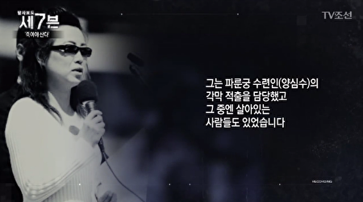

<h1><b>川人：中国共产党定将亡于“活摘”暴行</b></h1>
【大纪元2016年12月16日讯】据新唐人电视台报导，12月8日晚上在台北市议会首映了纪录片《难以置信》，该片是由艾美奖得主肯‧史东（Ken Stone）导演，美国纽约Swoop电影公司制作的纪录片，它是以一名调查记者的视角，揭示了中共强制活体摘取法轮功学员的器官并以此牟利的实情。影片采访了活摘实施者、医学专家、人权律师、政要及曾在中共劳教所遭受迫害的法轮功学员，把这样一个令人难以置信的事件具体展现在每个观众面前。目前《难以置信》已获得11个奖项，并在美国、英国、澳大利亚、意大利、奥地利、以色列、印度、捷克共和国、斯洛伐克等数十个国家公映。

很多观看过《难以置信》影片的观众都对中共大规模活摘法轮功学员器官的暴行表示确信无疑。有观众表示：“我觉得太可怕了，这是人类史上最可怕的事，我无法想像有组织或政府会允许这种事发生，而且还持续在发生。”有观众明确的说道：“活摘器官是很可怕的、非法的、违背良心的，中国医院应该停止活摘法轮功学员的器官……联合国应该采取行动，应该有立场。”还有明白事理的观众认为：“现在很多国家的人去中国做器官移植，他们不知道器官的来源，但他们就在间接地支援这项犯罪。所以我们要让大家知道活摘的真相，去共同制止中共活摘人体器官的暴行。”

2016年6月13日，美国国会众议院全体院会全体一致通过了343号决议案，要求中共立即停止针对法轮功学员等良心犯的“强摘器官”行为。2016年7月27日，欧洲议会通过48号书面声明和“制止中共活摘器官”紧急议案，根据规定欧洲理事会和欧盟委员会，将被要求调查中共活摘人体器官暴行。迄今，所有欧盟28个成员国都有议员签署这份声明，而且是来自欧洲议会里的所有党团。2015年12月，联合国禁止酷刑委员会发布报告，要求对中共强摘器官的指控进行独立调查。2013年3月，澳洲参议院一致通过决议，呼吁澳大利亚政府以“支持联合国和欧洲委员会的倡议，反对强摘器官”。

2014年3月5日，意大利参议院人权委员会一致通过了一项243号决议，要求意大利政府敦促中共立即释放良心犯，包括法轮功学员，并对中共活摘器官的罪行展开全面调查。2014年11月6日，加拿大国会国际人权委员会通过动议，对中共当局“活摘‘良心犯’、宗教团体和少数族裔成员的器官用于移植的可信的指控深表关注，谴责并要求立即停止未经同意就从活体或死者的捐助者身上摘取器官。”2013年7月10日，爱尔兰议会外交事务及贸易联合委员会通过阻止活摘法轮功学员器官的决议。2012年12月11日，台湾立法院全体无异议通过决议，要求中华民国政府关注营救被关押的包括法轮功学员在内的4,033名中国良心犯，并谴责“中国活摘法轮功学员及死刑犯器官作为买卖移植之用的暴行‘骇人听闻’‘天理难容’”。

2006年3月，苏家屯活摘法轮功学员器官事件被曝光后，中共很不以为然，一边保持沉默不予回应，一边依然公开的进行活摘器官移植手术。在国际舆论一再追问下，2006年4月，中共官员宣称：“中国取死刑犯器官移植是谣言，主要来源于公民自愿捐赠”。但据中国红十字会公民自愿捐赠数据显示，中国每年自愿捐献器官的人数只有不到100人，而2006年中国器官移植数量超过10万例。中共官员的荒唐解释不仅没能打消国际社会的疑虑，反而使中共活摘暴行欲盖弥彰。

从2006年中共官方首次称“活摘”是谣言至今，10年过去了，中共始终无法合理解释每年10万例以上的供体器官从何而来，无法合理解释中国器官移植手术等待时间为何仅需几天、无法合理解释中国为何短短几年就成了全球器官移植第一大国，无法解释原中共解放军总后勤部卫生部部长白书忠在电话采访中亲口承认是江泽民下令活摘法轮功学员器官的事实，更无法解释薄熙来、周本顺、魏建荣等一大批中共高官均亲口承认活摘法轮功学员器官是江泽民下的命令。

面对国际社会日益频繁的谴责，2016年10月16日，中共新华社发表社论对“活摘”进行辟谣。辟谣无效后，2016年11月12日，中共又利用央视《焦点访谈》进行“辟谣”。不仅如此，中共还通过其掌握的媒体通过有意报导自愿捐献器官的新闻进行潜移默化的“辟谣”。可中共媒体无论怎样辟谣，都没能给出详细数据解释中国每年10万例供体器官的合法来源，更没能对中国器官移植手术等待时间非常短（仅有几天）做出合理解释，它们更无法解释白书忠、薄熙来、周本顺、魏建荣等大批中共官员为何均提到“活摘”是江泽民下的命令。但所有中共媒体解释不了的各种问题，纪录片《难以置信》给出了详细的数据，并做出了合理解释。在大量真实数据、证据、证人与事实面前，美国、欧洲、加拿大、台湾、意大利、英国等国家的议会纷纷通过决议强烈谴责中共活摘人体器官的暴行。

如果事实真如中共所言，中共从来没有过活摘人体器官的暴行，那么中共为何不肯把纪录片《难以置信》放在中央电视台各大频道轮番播放呢？让全中国人都来痛批“反华势力”炮制的活摘“谣言”岂不更好？一个拥有“四个自信”且掌握“宇宙真理”的政党却处处害怕“敌对势力”渗透，却处处害怕人类的普世价值与民主自由，却处处害怕民众了解中共独裁政权迫害民众的真相，这样的政党到底是“伟大”还是邪恶？现在全世界正刮起一股观看中共活摘人体器官纪录片的旋风，当世界每一个人都了解到中共的残暴本性，都了解到中共的“活摘”是极端邪恶的反人类罪行时，世界每一个有正义感的人都是中共的“死敌”。

其实中共“活摘”的并不仅仅是人体器官，它“活摘”的是整个人类社会的良知。如果人类社会的良知被中共活摘殆尽，人类的未来还能有希望吗？人类社会不是残暴独裁政权肆意作恶的场所，残暴独裁政权每挑战一次人类公共道德准则它们就是在“活摘”人类社会的良知。现在全世界各国议会与民众都公开声援法轮功学员反中共“活摘”，这种行为是制止中共对人类社会肆意作恶的正义行为，更是一种守护人类社会公共准则与良知的大义之举。世界上任何一个有正义感的人都将义无反顾的参与其中，人类所有的正义力量都将成为中国共产党所称的“敌对势力”，中国共产党的解体是一个不可逆转的历史潮流。所以残暴独裁的中国共产党定将亡于“活摘”暴行！

责任编辑：赵元

<h1><b>中共公安内部数据： 仅地方医院活摘50万法轮功学员器官</b></h1>
<table border="0" cellspacing="3" cellpadding="3">
<tbody>
<tr>
<td align="center"></td>
</tr>
<tr>
<td align="center">现在旅居丹麦的异议人士杨光透露，仅公安部掌握的资料，就有超过50万名法轮功学员被活摘器官致死。（新唐人）</td>
</tr>
</tbody>
</table>
7月25日，海外《新唐人电视台》报导，据知情人士透露，仅公安部掌握的资料，就显示有超过50万名法轮功学员被活摘器官致死。

这部分印证了“追查国际”的公告称，中共活摘法轮功学员器官，至少涉嫌杀戮超过200万人。

另据报导，中共军队总后勤部是活摘器官的核心机构，中南海曾暗中调查中共军队医院活摘器官情况。

文 _ 黄昭越

1989年10月2日，异议人士杨光匆匆坐船逃往香港。一位老朋友告诉杨光，因为他经常发表文章揭露中共恶行，公安部已经准备抓捕他，劝他快逃。

杨光现在旅居丹麦。在得知法轮功学员被活摘器官的消息后，杨光通过人脉多方打探，结果他的两位生死之交向他透露了惊人内幕：仅公安部掌握的资料，就显示有超过50万名法轮功学员被活摘致死。

杨光在给“新唐人”电视台的亲笔信中说，这位朋友在公安部工作，负责某沿海大型城市的情报站，消息来源丰富。2012年新年，杨光接到了他的拜年电话。杨光就询问了他一直关注的活摘话题。

杨光说：“据公安部的一个朋友在电话里跟我说，仅他知道的一般医院的统计，在这十几年里，对法轮功学员摘取器官移植的案例，造成法轮功学员的非正常死亡，已经超过50万人，这50万人仅仅是一般的人民医院，市立医院等这样普通的医院，并不包括武警医院，军医医院，和公安医院，因为武警医院和军医医院那个统计数字更机密，连他们公安部的人都没能掌握。”

2006年，杨光在海外媒体上了解到，法轮功学员指控中共活体摘取法轮功学员器官。良知促使他决定打探真相。杨光想到自己有一位患难之交，在文革时期他们曾一起被打成反革命，他还是杨光老师的儿子，后来成为医疗业内人士。

杨光说：“我有一个同学，是东北一个医科大学的副校长，负责后勤供应，负责医疗设备和手术设备的准备，及各种移植器官设备向西方的采购。他准确的知道，仅仅（他们）一个城市里的医科大学，每年起码做2000例到3000例的器官移植手术。”

这位朋友向杨光透露，1999年以后专责镇压法轮功的610办公室，向他们医院提供了很多供体。

杨光说：“他的器官来源呢，我的同学跟我说，有一种情况，没有姓名只有一个编号，也没有家庭地址，更没有人收骨灰，610办公室也不同意收骨灰，而且不管是手术当中还是送到炼人炉去炼了，都有610的人员在现场监督，这种器官供体基本都是法轮功学员，法轮功学学员器官的供体，在整个医院的器官手术上能够占90％而我这同学跟我说，武警医院、军医院和公安医院的移植数字，往往比他们民用医院移植的数量还大。”

杨光和这位副校长的联系，2009年被中共国安发现，对方还遭到国安威胁。杨光发现，这位同学随后被“退休”。

今年6月，杨光看到海外“追查国际”组织的报告，该报告推算出，大约有200万法轮功学员被活摘器官虐杀。杨光认为，真相还远远没有到来，有待更多有良知和正义感的人士，一起探索和披露。
<table border="0" cellspacing="3" cellpadding="3">
<tbody>
<tr>
<td align="center"></td>
</tr>
<tr>
<td align="center">今年6月，“追查国际”组织的报告，该报告推算出，大约有200万法轮功学员被活摘器官虐杀。杨光认为有待更多有良知和正义感的人士，一起探索和披露。（大纪元合成图）</td>
</tr>
</tbody>
</table>

今年6月，“追查国际”组织的报告，该报告推算出，大约有200万法轮功学员被活摘器官虐杀。杨光认为有待更多有良知和正义感的人士，一起探索和披露。（大纪元合成图）

追查国际：
活摘涉嫌杀戮超200万人

6月20日，“追查迫害法轮功国际组织”（简称“追查国际”）发布最新公告称，根据目前掌握的大量证据证明，中共活摘法轮功学员器官是由时任中共军委主席江泽民亲自下令，以江泽民、罗干、周永康等中共中央和中央军委高层涉入，全国军队、武警和各省市整体参与的大屠杀。

仅因活摘取器官而被杀戮的法轮功学员的最低数量涉嫌超200万人。这是一场对普通民众的群体灭绝性国家行为。江泽民集团涉嫌犯下了群体灭绝罪、反人类罪。

追查国际在2003年1月20日以来调查所获得大量的证据基础上，采用大资料实证调查、证据陈述和交叉验证的分析论证模式，得出如下几个核心结论：

结论一：中共活摘法轮功学员器官而犯下的罪恶来自国家行为。

“追查国际”通过几千通电话调查所获取的5类37个调查录音证据证实，是江泽民亲自下令，中央常委、中央军委等高层涉入，在全国范围进行，动用了军队、武装警察，和政府的武力包括公、检、法、司和政法委系统，以及全国所有的器官移植机构。

其中原中共军方总后勤部卫生部部长白书忠2014年9月在追查国际的电话调查中承认，是江泽民下令用法轮功学员的器官做移植手术。通过中共政治局常委张高丽进一步印证了江泽民下令活摘法轮功学员器官几百万的罪恶。
<table border="0" cellspacing="3" cellpadding="3">
<tbody>
<tr>
<td align="center"></td>
</tr>
<tr>
<td align="center">原中共军方总后勤部卫生部部长白书忠2014年9月在追查国际的电话调查中承认：是江泽民下令用法轮功学员的器官做移植手术。（新纪元合成图）</td>
</tr>
</tbody>
</table>

结论二：活人器官供体库的背景来源调查结果显示，数百万被非法抓捕失踪的上访不报姓名的法轮功学员成为活摘器官大屠杀的主体受害者。

1999年江泽民集团迫害法轮功之后，数百万上访者被非法抓捕失踪，随后全国器官移植爆炸性增长。中国器官的丰富，达到1至2周就可以配型做手术，创造了世界奇迹，到2005年底就吸引了数万国外器官旅游的人，直到2006年3月被证人指控大量活摘法轮功学员器官，许多事情转入了地下。

调查证据证实：很多上访不报姓名的法轮功学员被秘密关押、用代号管理做为活人器官供体。

结论三：7大证据证实中国器官移植是反向配型，证明活人器官供体库的存在，基数涉嫌有200万至600万。

器官移植等待时间超短，数量惊人的急诊移植，怵目惊心的多台移植手术同时进行，活人做备用器官，被关押的法轮功学员在受尽肉体摧残和精神凌辱的同时被莫名其妙地抽血化验、却从不被告知检验结果。种种证据揭示庞大活人器官库的存在，并论证活人器官库总人数涉嫌高达200万至600万人。

结论四：大资料逐个调查和实证分析得出的结果：中国医院器官移植实际数量是公开公布数量的10至20倍，因此被杀戮的法轮功学员人数涉嫌超过200万人。

调查发现，中国至少有3套器官移植数字，第一套是中共卫生部对外发布的所谓移植总数，第二套是各家医院公开发布的移植数，第三套是真实的移植数。

主要的器官移植是军队和卫生部严密控制的一些核心地方医院和军方医院完成的，根据调查，真实肝肾移植是医院公开发布数量的10至20倍，而医院公开资料则是中共卫生部发布的所谓总移植数量的大约3倍。

分析从事肝、肾移植的714家医院（共发现865家器官移植医院），保守统计，他们公开的肝肾移植总量超过40万例。因此算出实际肾移植量应是：320万至640万例。在此基础上，推测出被杀戮的法轮功学员最低量涉嫌超200万人。

中南海曾查中共军队医院活摘情况

2014年11月6日，中共官媒《解放军报》发表题为〈给别人看病，先拿自己“开刀”〉的报导，文章一开始就引述一则通报称：“4名专家教授因私自外出行医，被警告处分……”。文中暴露出2014年3月至9月中南海暗中整肃军队医院的样貌，显示军医院中违法事件的严重程度。

文中引述总后卫生部负责人的话称：“全军医疗卫生系统分批对386个单位巡查督导。”更一连用了4个“前所未有”形容这次明查暗访的情况。

据悉，这次调查军队医院，目的是追查江泽民派系主导的活摘器官事件，其他都只是表面文章。

消息称，去年底，中共当局开始对军队进行大整肃，后勤部门是重点之一，其中对军队医疗系统进行了全面的调查。

尤其今年3月更扩大对300多个军队医院进行调查，包括陆海空三军和武警医院。调查重点之一是活摘器官事件，尤其武警医院是参与活摘最重要的医疗机构，其他还包括4个军医大学的附属医院等。
<table border="0" cellspacing="3" cellpadding="3">
<tbody>
<tr>
<td align="center"></td>
</tr>
<tr>
<td align="center">消息称，中共当局今年3月扩大对300多个军队医院进行调查，调查重点之一是活摘器官事件，尤其武警医院是参与活摘最重要的医疗机构，其它还包括4个军医大学的附属医院等。（大纪元合成图）</td>
</tr>
</tbody>
</table>

该消息来源称，中共中央派出了25个检查组，其中有5个级别最高，组长都是中将级的军官，主要针对参与活摘器官问题进行调查，调查结果列为绝对机密。

实际上，中共当局从2012年就已经开始派人进行调查，至今已经有7名和活摘器官有关的军队医疗专家和副院长以上级别的官员自杀，10多人被以各种名义“双规”。

调查组中还安排非军方的司法部门人员，据悉是因为许多军队和武警医院不但进行器官移植手术，还和法院、检察院、公安局（主管监狱）串通购买犯人器官。军方移植专家以前也进行所谓的“走穴”，即到地方医院动手术，获得高额手术费，因此这方面也是核心小组的一个调查内容。

分析称，官方报导的因私自外出行医而被处分的4名教授，很可能与活摘器官有关，因为很多从事移植的医生常常到需要进行器官移植的医院做手术，或到拥有器官的医院。

而在中国大陆，因健康原因需要进行器官移植的病人很多，如患尿毒症的病人多半选择肾移植。

中共军队总后勤部是活摘核心机构

据明慧网报导，中共军队总后勤部是活摘器官的核心机构。总后勤部则利用军队系统和国家资源，将到北京上访而不报姓名的法轮功学员和各地被非法拘捕的法轮功学员验血编号，输入电脑系统，利用军车、军航、专用警备部队和各地军事设施和战备工程作为集中营，统一关押，统一管理，成为国家级的活体器官库。

<table border="0" cellspacing="3" cellpadding="3">
<tbody>
<tr>
<td align="center"></td>
</tr>
<tr>
<td align="center">据明慧网报导，中共军队总后勤部是活摘法轮功学员器官的核心机构。利用军事设施和战备工程作为集中营，成为国家级的活体器官库。（大纪元合成图）</td>
</tr>
</tbody>
</table>

总后勤部统一分配集中营，分管调度、运输、交接、警卫和核算，在进行器官移植的过程中，如果器官移植失败，被移植器官人员的资料和尸体必须在72小时内全部销毁。

整体的资料和尸体，甚至是活人焚毁必须经军事监管人员认可。军事监管人员有权逮捕，关押，强制处决任何泄露消息的医生、警察、武警、科研人员等。军事监管人员由中央军委授权相关军事人员或军事机构执行。

总后勤部通过各级管道将供体调配到军方医院和部分地方医院，其运营模式是向医院提供一个供体直接收取现金（外汇）的血腥交易，医院付帐给总后勤部后自负盈亏。

军方高层通过总后勤部直接牟利，器官的利润不入军队预算，而其活摘器官的层层系统却是靠军费维持，因此来自活摘器官的金钱是没有成本的纯利润。

军队移植是大头，卖给地方的器官只是额外牟利，目的是把地方医院作为向海外揽客的橱窗和广告，否则只有中国军方做移植手术对世界将难以掩盖。

由中共总后勤部主导的活摘法轮功学员的器官，其相关信息是作为军事机密对待。中共总参谋部利用其情报系统，全力阻挡真相向世界传递。◇

<h1><b>为制止活摘 中国夫妻瑞典首都演示迫害</b></h1>
<table border="0" cellspacing="3" cellpadding="3">
<tbody>
<tr>
<td align="center"></td>
</tr>
<tr>
<td align="center">法轮功学员通过模拟演示在向路人讲述中共活体摘取法轮功学员器官的邪恶行径。躺在手术台上的这位冯先生，就是中共活摘器官下的幸存者。（刘欣丽／大纪元）</td>
</tr>
</tbody>
</table>
【大纪元2017年07月25日讯】（大纪元记者刘欣丽瑞典斯德哥尔摩报导）2017年7月20日，瑞典首都斯德哥尔摩的天气十分晴朗。在市民游客穿梭的市中心景区皇家花园，人们的目光被摆放在街边的手术台所吸引。一位先生躺在手术台上，身旁一位身穿手术服的医生拿着手术刀在他的身上划过，手术台旁一块展板向路人解释了这个场景的意义。

原来，这是法轮功学员通过模拟演示在向路人讲述中共活体摘取法轮功学员器官的邪恶行径。躺在手术台上的这位冯先生，就是中共活摘器官下的幸存者。

流亡海外 讲述迫害
在中国大陆针对法轮功修炼者的迫害已经进行了18年，来自北京的冯先生夫妇从高压恐怖下逃离到了自由的社会。18年间他们不停地坚持向身边的人讲述在中国发生的迫害。

今年的7月20日，夫妇二人参加了在斯德哥尔摩举办的反迫害讲真相活动。冯先生躺在模拟活摘演示的手术台上，他希望用自己的亲身经历告诉人们在中国发生的惨无人道的迫害。不善言辞的冯先生说：“我只是想告诉大家法轮大法好，只想告诉人们中共迫害法轮功的真相。”

在活动现场，刘女士含着眼泪说：“我是不幸中万幸的人，躲过了成为中国人体器官交易的牺牲品，现在还能享受到自由和人权。” 她呼吁各国政府及善良的人们与法轮功学员一起，共同制止这场迫害。

改掉恶习 开始修炼
1996年，冯先生在单位同事处看到一本《转法轮》，回家通读后觉得很好，从此开始走入法轮大法修炼。冯先生以前脾气非常不好，生起气来不仅骂人骂得很难听，还会在愤怒时拿碗砸向妻子。而且，他怎么也改不掉抽烟喝酒的习惯，刘女士怎么劝也不管用。

学了法轮大法后冯先生整个人都变了，不仅戒掉了烟酒，还给妻子和孩子讲在大法中学到的“真、善、忍”做人道理。过去他因工作之便经常从单位拿一些家里需要的工具等东西回家，还用公费医疗的名义从单位医务室开好多药放在家里备用。学了法轮功后这些事情都不再发生了。

冯先生在单位负责管理库房，别人想要他从库房拿些东西回家用，他不好意思当面拒绝，就自己掏钱去外面商店买回来给那个人，这在以前是从不可能发生的事情。

一年之后，妻子刘女士看到了丈夫的变化，不再抽烟喝酒，也不再骂人了，身体也健康了，于是带着5岁的女儿也加入了大法修炼的行列。一家三口每天早上5点钟会准时到小区炼功点和大家一起炼功两个小时，随后上班上学，过着再平凡不过的生活。

高压之下 坚持信仰
1999年7月20日是江泽民利用手中权力全面迫害法轮大法修炼者的开始。对冯先生来说，那是一段难忘的记忆。当天晚上得知消息的冯先生和妻子商量要怎么面对政府的迫害，他认为是政府不了解法轮功，自己一家在炼功中受益，因此要挺身而出，为李洪志老师、为法轮大法说句公道话。抱着这简单的信念，夫妻两个商量去国家信访局上访。

然而迎接他们的是非法的抓捕，接下来的几年间，夫妻二人轮流被关进洗脑班、被非法克扣工资、生活长期被监视，每天生活在高压和恐惧之中。2011年，刘女士因在大街上发放法轮功真相光盘被举报，冯先生也只因回答了警察一句真话而被抓。被非法关入劳教所后，夫妻二人均遭受到了酷刑折磨。

由于冯先生拒绝放弃信仰，警察拿水枪喷他、不让他睡觉、让他长期进行高压劳动。在劳教所期间，冯先生还多次被体检，详细检查各项器官以及进行抽血。从狱中归来的冯先生得知大量的法轮功学员被活体摘除器官的消息，心里十分后怕。

民众了解真相 签名支持
国王花园是斯德哥尔摩市中心的著名景点，法轮功学员在公园里竖起“法轮大法好”的横幅，用模拟演示活摘器官、真相展板、功法演示等方式，向当地民众讲述中共18年来对法轮功学员的残酷迫害，尤其是活摘法轮功学员器官的罪行。许多路人在驻足观看并了解了情况之后表达了对法轮大法的支持。

有一位瑞典女士，她在中共驻瑞典使馆前多次见到法轮功学员，她说，中共有军队、有武器居然惧怕信仰“真、善、忍”的百姓，那么我想这些修炼者背后一定有很强大的力量。她表示支持法轮功学员反迫害，同时她希望能有更多的人都来关注，那样才更有力。

还有一位中年男士，在斯德哥尔摩一个民主机构工作。今年6月由瑞典非政府组织与斯德哥尔摩市政府联合举办的政治周活动期间，他了解了法轮功真相。他觉得法轮功学员用瑞典赋予人们的言论、信仰自由的权利来揭露中共独裁的迫害，非常的好。他希望有机会邀请法轮功学员去他们那里，想进一步深入了解法轮功。

一位来自德国的男士，听了真相后很是震惊，他简直不敢相信还有这样的事情发生，他几乎是用颤抖的手在反对活摘器官的表格里签字，他边签字边说：“这个必须制止！”当天有很多年轻人经过活动现场，他们了解了真相后赶紧签名，然后让同伴也过来签，并表情严肃地说：“这很重要，每个签名都是支持。”然后站在一旁等著同伴，临走时对法轮功学员连声道谢。#

责任编辑：周仁

<h2><b>韩国最大媒体制作强摘器官纪录片《调查报告7》</b></h2>
<h1><b>“与恶魔的交易” 中共器官移植旅游怪圈</b></h1>
<table border="0" cellspacing="3" cellpadding="3">
<tbody>
<tr>
<td align="center"></td>
</tr>
<tr>
<td align="center">韩中医疗团队与韩国移植手术患者合影。（TV朝鲜《调查报告7》截图）</td>
</tr>
</tbody>
</table>
【大纪元2017年11月18日讯】（大纪元记者林恩慧韩国首尔报导）韩国最大日报社《朝鲜日报》的旗下电视台“TV朝鲜”，日前通过节目《调查报告7》揭露中共医院以外国人为对象进行不法移植手术的实况。

据节目介绍，自2000年以来约有两万名韩国患者去中国接受了器官移植手术。节目揭露移植的器官大多数是来自中国的良心犯，特别是从法轮功修炼者身上非法摘取来的器官。

TV朝鲜节目摄制组直接到中共当地T医院，成功捕捉了进行移植手术的韩国人、主刀医生。另外除韩国患者外，还有很多中东地区的外国人也到中共医院进行移植手术。

在韩国，迫切等待器官移植的患者有3万2000名，而肾脏移植的平均等待时间为5年。
一位医生提出了这样的问题：“如果你不做移植手术就活不过一年的话，不管是不是从一个活人身上强摘器官，那你要不要去中国接受移植手术？”

11月15日，TV朝鲜纪录片《调查报告7》栏目以“杀了才能活”为题，报导了中国器官移植旅游的怪圈。

《调查报告7》开篇介绍说：“这次播放的节目让我们一起来感受一下深刻的伦理苦痛。”器官移植旅游是人类生命尊严、伦理与人类生存的本能之间发生冲突。

韩国人从本世纪初开始去中国做器官移植手术。在中国，有资质做器官移植手术的医院有169家，其中，韩国人去的最多的有8家。
<table border="0" cellspacing="3" cellpadding="3">
<tbody>
<tr>
<td align="center"></td>
</tr>
<tr>
<td align="center">中国T医院器官移植中心（TV朝鲜《调查报告7》截图）</td>
</tr>
</tbody>
</table>
<table border="0" cellspacing="3" cellpadding="3">
<tbody>
<tr>
<td align="center"></td>
</tr>
<tr>
<td align="center">169家器官移植医院中，韩国人去的最多的有8家。每年去中国接受器官移植手术的韩国人有两千余名。（ TV朝鲜《调查报告7》截图））</td>
</tr>
</tbody>
</table>
据《血腥的活摘器官》一书透露，三年间前往这8家医院中某一医院的韩国患者超过了3,000名，也就是说每年平均去做器官移植的患者有1,000名。剩下7家医院的患者加在一起保守估计也有1,000人，那么每年去中国做器官移植的韩国患者高达2,000名。这就意味着，在过去的十年间，可能有两万多名韩国人去中国做器官移植。

这些患者当中很多人是在“主治医生的建议下”去做器官移植手术的，甚至有医生告诉患者说“只要你去中国接受器官移植手术，我就保证你的术后维护治疗”。这些人回国后还组织定期聚会，但是他们并不知道这些器官是谁的、怎么来的。
<table border="0" cellspacing="3" cellpadding="3">
<tbody>
<tr>
<td align="center"></td>
</tr>
<tr>
<td align="center">中国移植医院的一位朝鲜族护士说：“肾脏移植需要1亿2,000万～1亿4,000万韩元，如果捐赠1.500万韩元，可以尽快安排移植手术。”（ 照片：TV朝鲜“探查报告7”截图）</td>

在韩国等待肾脏移植手术平均需要5年，中国虽然是一个人口大国，但过去二十年间中国的器官捐献者不过37名。那么这么多的器官是从哪里来的呢？

TV朝鲜摄制组从讲述中共强行活摘器官和不法买卖的纪录片《活摘》（Human Harvest）中找到了线索。

目击活摘器官的武警在纪录片《活摘》中说：“当时我们经历了一个星期对她（被害者）审问，严刑拷打，身上已经有无数次伤疤。（为了保存器官）不打任何麻药，（这些医生）手一点也不抖，直接就把她的皮肤拉开了了。先摘的是心脏，然后再摘的是肾。当心脏的血管剪动一下，她的身体一阵抽搐。非常可怕的。”

然后他非常痛苦地表示：“唉…..我不想再讲下去了。”
<table border="0" cellspacing="3" cellpadding="3">
<tbody>
<tr>
<td align="center"></td>
</tr>
<tr>
<td align="center">揭露强行活摘器官、丈夫曾是神经外科医生的护士。（TV朝鲜《调查报告7》截图）</td>
</tr>
</tbody>
</table>
在辽宁省一家医院任职过的护士证言：“我和我的前夫在1999年到2004年间在这家医院工作。丈夫是一名脑外科医生，参与摘取法轮功学员眼角膜手术。这家医院大量活摘法轮功学员的肝脏、眼角膜等器官，部分被强行活摘器官的法轮功学员，有的在还有呼吸的情况下就被扔进用锅炉房改建的焚尸炉里。”

她在经历了这些事情之后，与丈夫离婚，逃亡到了美国。

也有参与活摘器官的医生的证词。在2013年4月，中国医生Enver Tohti在苏格兰议会上讲述了自己的经历：“我打开他（死刑犯）时让我震惊的是血还在流，表明他还活着。我摘取出肝和两个肾。这个过程30分钟都不到。”

摄制组介绍了中国发明的“原发性脑干损伤撞击机”。该装置是用一个圆形的金属球直接锤击脑壳，形成的冲击波穿越头盖骨，到达脑部，让人瞬间脑死亡。
<table border="0" cellspacing="3" cellpadding="3">
<tbody>
<tr>
<td align="center"></td>
</tr>
<tr>
<td align="center">“原发性脑干损伤撞击机”是中国开发的为了获得完整的器官，让人瞬间进入脑死亡状态的杀人装置。（TV朝鲜《调查报告7》截图）</td>
</tr>
</tbody>
</table>
TV朝鲜摄制组制作了“原发性脑干损伤撞击机”的模型，并对此咨询了韩国“器官移植伦理协会”会长兼外科医生李承原（音译）。李承原道：“‘原发性脑干损伤撞击机’除了为摘器官将人进入脑死状态外别无它用，谁会让人脑死呢？”

摄制组通过可信的根据和证词得出这样的结论：去中国做手术的韩国人，其移植的器官大多数是来自中国的良心犯，特别是在法轮功修炼者身上非法摘取来的器官。

中国的传统身心修炼功法法轮功，因为有突出的增进健康的效果而受到认证和支持，修炼者的人数也因此急速增长，但自1999年7月以来受到了中共的非法镇压。
<table border="0" cellspacing="3" cellpadding="3">
<tbody>
<tr>
<td align="center"></td>
</tr>
<tr>
<td align="center">有证言在中国流通的大多数的器官都是违法摘取的法轮功修炼者的器官。（TV朝鲜《调查报告7》截图）</td>
</tr>
</tbody>
</table>
在中共监狱关押又戏剧性地被释放的金某是直接目击强摘器官的人。他说：“（在监狱里）一位法轮功学员被虐待致死后，当天晚上，医院来人把器官摘除了，用保温箱装走了。其他刑事犯（也）亲眼所见。”

2000年初，中国器官移植旅游刚刚开始的时候，韩国人几乎无人知晓。曾经向自己的患者推荐中国行的医生后来在得知这个事实后就不再推荐了。

从中国接受器官移植回来的韩国患者说“要想活，除了那个方法（移植器官）别无它法。那些不想死的人（为了准备手术费）一般都把房子卖掉了”。
<table border="0" cellspacing="3" cellpadding="3">
<tbody>
<tr>
<td align="center"></td>
</tr>
<tr>
<td align="center">有证言在中国流通的大多数的器官都是违法摘取的法轮功修炼者的器官。（TV朝鲜《调查报告7》截图）</td>
</tr>
</tbody>
</table>
是你的话，要不要去中国接受器官移植呢？（TV朝鲜《调查报告7》截图）
“好，现在轮到您来回答这个问题了。如果是您或者您的家人必须接受器官移植才能活，在韩国需要等待5年，但是去中国只需要一个星期，最迟也只需要一个月就能移植。但是这个器官是从活人身上强摘的，您会怎么做？”

《调查报告7》节目最后写道：

“不管信神和不信神都不要跟魔鬼做交易”   ──中国监狱良心犯金某

“不要跟恶魔交易，选择属于大家”  ──TV朝鲜《调查报告7》#

责任编辑：杨亦慧

<h1><b>新疆流亡医生揭活摘器官：中共如恶魔</b></h1>
<TR>
	<TD></TD>
</TR>
不想成为中共刽子手，安华托帝放弃医师身份，选择流亡海外成为一名公车司机，并致力传达真实的中国人权现况。2日，安华受邀在高雄台权会演讲。 （李怡欣/大纪元）  

【大纪元2017年11月15日讯】（大纪元记者李怡欣台湾高雄报导）流亡海外的新疆医师安华托帝·博格达，日前应邀在台权会高雄办公室演讲，针对中共器官活摘及新疆人权议题指出，中共活摘人体器官至今还在发生，“我想告诉台湾同胞，去中国不要单独活动，一定随时让家人知道行踪，‘要是生病了，只要一口气在，就算爬也要爬回台湾’”。

安华：任何人都可能遭中共活摘
很多人以为中共国家暴力只针对特定族群，如法轮功、维吾尔族人。安华托帝表示，这是对共产党缺乏清楚认识，“中共在混乱中滋生、在独裁中壮大，在和平中死亡”，为了不死，中共会不惜一切维持混乱，即使是和平、非战争时期。中共无一时刻不在制造“国家敌人”。

“在中国所有人、你只要把自己排除在共产主义分子之外的人，就是潜在被摘器官的目标”，因此，不只法轮功，被摘取器官的有维族、家庭教会等，如果能在中国追踪失踪人口，会发现涉及器官摘取是很普遍现象。

又为何是法轮功？安华表示，“因为这群人不抽烟、不喝酒、器官品质好，因此，成为主要受难群体”。这也说明了，为何自从1999年中共前党魁江泽民发动对法轮功信仰团体迫害、非法关押开始，中国器官移植出现惊人的爆炸性成长。

利益蒙蔽 医师变杀人犯？
安华引述一份中国医疗杂志“两例心肺移植术”论文其中一段话：“供体入室后，按常规予以麻醉及插管”。摘死人器官何需插管？身为外科医生的经验告诉他：“供体肯定是个活人！”这种耸人听闻的医学案例张狂地写在权威期刊上“实在太恐怖了！”说明活摘医师操刀无数，早已麻痹到忘记把“杀人证据”掩盖。

活摘器官已超越纳粹罪刑，驱动万恶的唯一答案是“利益”。安华说，医生为竞争病源，在网站招揽“生意”，宣传：“买一送一、保证质量、换坏重换”，一家医院网站标榜一年进行4千例器官移殖，中国有1百多家移植院所，“哪来这么多器官？”这已超出人类思维极限。

中共以体检、DNA测试等名义，对维吾尔族人大量采血，而过去，有被关押的法轮功学员也证实，在被监禁时自己曾被抽血。无法合理解释该行径，唯一可能就是为了建立“活体器官数据库”。

一张新疆某机场照片上，标示一条“特殊旅客、人体器官运输通道”，这令他感到不寒而栗，“那得需要多大的交通量，才会让一个机场，专门给你设一个特殊通道、快速通道？”这照片如果是真的，“特殊旅客就是器官的主人，通道就是他的黄泉路”。

“如果我不说，我也是罪犯帮凶”
令人难以置信的是“涉入的医疗人员知情，但认为理所当然、就像例行公事。”安华解释，民主社会的人无法理解中共，“中国人从小浸泡在共产党洗脑世界中，这些人甚至觉得消灭国家敌人是光荣的，没有丝毫罪恶感，除非，他离开中国，或接触外界文明、自由、民主价值，就会醒悟并感到罪恶”。

22年前，安华托帝任新疆地区外科医师，奉命前往刑场，等死囚伏法而未断气瞬间，动刀将热呼呼的器官割下带走，至此，他受大很大冲击，无法接受“医师从救人天职变成杀人刽子手”，他放弃在中国的美好前程，选择流亡海外，成为一名公车司机，并在海外致力传达真实的中国人权现况。

有人问他，“如果时间倒流，你后悔吗？”安华说，放弃医职当然后悔，不过，如再一次，他仍会义无反顾选择站在正义的一方，因为揭开这件事，是每一个人的道德责任。

“中共就是恶魔、甚至比魔鬼还坏，我们不应该让恶魔存在，这是人类的悲剧，也是人类最大的失误”，安华托帝提醒所有人，不要对中共抱有任何幻想，活摘器官将是引爆中共垮台的关键事件。#

责任编辑：杨亦慧
